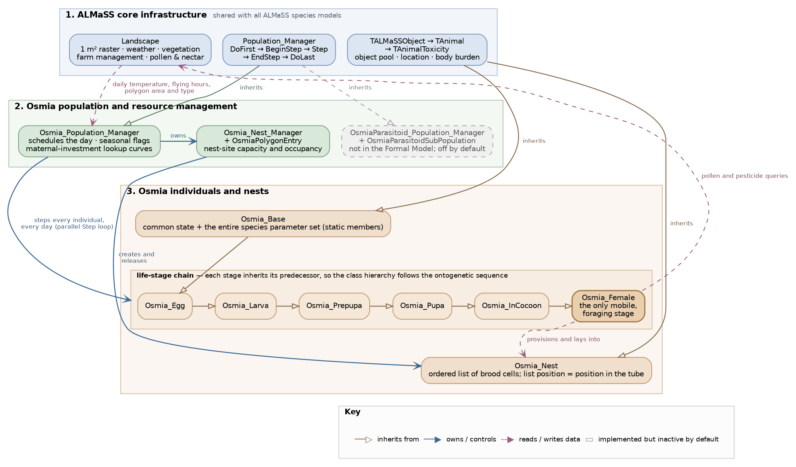

# *Osmia bicornis* Population Model: MIDox Implementation Documentation   {#Osmia_page}

**Authors: Christopher John Topping, Elzbieta Ziolkowska, Xiaodong Duan**

## Abstract

This document provides comprehensive implementation documentation for an agent-based population model of the red mason bee (*Osmia bicornis*) developed within the ALMaSS (Animal Landscape and Man Simulation System) framework. The model simulates individual bee life cycles from egg through adult, incorporating temperature-dependent development, resource-limited provisioning behaviour, and overwintering physiology. Implementation follows the MIDox (Model Implementation Documentation with Doxygen) standard, providing detailed parameter documentation, biological rationale for design decisions, and explicit assessment of uncertainties. The model serves multiple research purposes: evaluating landscape management effects on solitary bee populations, assessing pesticide risks to pollinator communities, and exploring climate change impacts on bee phenology. Complete interactive documentation with full code cross-references is available at the GitHub Pages and Zenodo repositories listed in Section 10.

**Keywords:** agent-based model, *Osmia bicornis*, solitary bee, pollinator, ALMaSS, MIDox, implementation documentation, Doxygen

---

## 1. Introduction

### 1.1 Context and Motivation

The decline of wild pollinator populations across Europe and North America has raised concerns about pollination service stability and crop production resilience. Solitary bees, including mason bees (*Osmia* spp.), contribute substantially to crop pollination and wild plant reproduction, yet remain under-studied compared to managed honeybees. Understanding how landscape structure, agricultural management, and environmental stressors affect solitary bee populations requires mechanistic models that capture individual-level processes whilst scaling to landscape patterns.

This document describes the implementation of an agent-based population model for *Osmia bicornis* (Linnaeus, 1758), the red mason bee, a common and economically important solitary bee species across temperate Europe. The model represents individual bees as autonomous agents progressing through life stages, making behavioural decisions based on local conditions, and experiencing mortality from multiple sources. Population dynamics emerge from these individual-level processes operating within spatially-explicit agricultural landscapes.

### 1.2 The MIDox Framework

This documentation follows the MIDox (Model Implementation Documentation with Doxygen) standard proposed for ecological simulation models. MIDox addresses a persistent challenge in ecological modelling: the gap between formal model descriptions (mathematical specifications of processes) and actual implementations (working computer code). This gap impedes model reuse, validation, and extension whilst reducing research transparency.

MIDox bridges this gap through three complementary elements:

1. **Enhanced source code** with comprehensive biological documentation embedded as Doxygen comments
2. **Interactive HTML documentation** generated automatically from annotated code, providing searchable cross-references
3. **Narrative documentation** (this document) explaining design decisions, parameter sources, and implementation trade-offs

Together, these elements create a complete audit trail from formal model through implementation to validation, enabling:
- **Reproducibility**: Other researchers can understand and replicate the implementation
- **Maintainability**: Developers can modify code confidently, understanding biological intent
- **Transparency**: Reviewers can assess implementation fidelity to formal specifications
- **Extensibility**: New features can be added consistently with existing design patterns

### 1.3 Three-Paper Publication Sequence

This MIDox documentation is the second in a three-paper sequence:

1. **Formal Model** (Ziółkowska et al. 2023, Food and Ecological Systems Modelling Journal): Conceptual specification using mathematical notation and structured natural language, describing model purpose, scope, entities, processes, and equations without implementation details

2. **MIDox Implementation** (FESMJ article ref): Complete technical specification of the working model, documenting all classes, methods, parameters, and design decisions with biological justification

3. **Testing and Calibration** (in preparation): Validation against empirical data, sensitivity analyses, and parameter estimation procedures

This sequence separates concerns: the formal model establishes biological validity; the MIDox ensures implementation fidelity; testing confirms empirical adequacy. Each paper serves distinct audiences whilst maintaining coherence through explicit cross-references.

### 1.4 Document Structure

This document comprises ten sections:

- **Section 2** (Model Overview): High-level architecture, emergent properties, and spatial/temporal scales
- **Section 3** (Scheduling and Workflow): Daily execution sequence and seasonal transitions  
- **Section 4** (Implementation Details): Detailed component descriptions with code cross-references
- **Section 5** (Parameters): Organization, empirical sources, and uncertainty assessments
- **Section 6** (Calibration): Target patterns, fitting procedure, results and their status
- **Section 7** (Inputs): Required data, formats, and preprocessing requirements
- **Section 8** (Outputs): Generated data, formats, and interpretation guidance
- **Section 9** (Implementation Discussion): Design trade-offs, limitations, and future directions
- **Section 10** (Documentation Access): Links to interactive documentation and archived code

**Appendix A** tabulates all 103 configuration variables with both the calibrated and the a priori values.

Throughout, we use Doxygen `@ref` tags (e.g., [Osmia_Female](@ref Osmia_Female)) to link narrative text to specific code elements. These hyperlinks function in the HTML version, allowing readers to navigate seamlessly between conceptual explanation and implementation detail.

---

## 2. Model Overview

### 2.1 Model Purpose and Scope

The *Osmia bicornis* model simulates population dynamics of a univoltine (one generation per year) solitary bee species across agricultural landscapes. The model addresses three primary research questions:

1. **Landscape effects**: How do landscape composition (flower availability, nesting habitat) and configuration (patch size, connectivity) affect population persistence and abundance?

2. **Management impacts**: What are the consequences of agricultural intensification (pesticide use, mowing timing, hedgerow removal) for bee populations?

3. **Climate change**: How will altered temperature regimes affect phenology, voltinism, and population viability?

The model scope encompasses:
- Complete life cycle (egg, larva, prepupa, pupa, overwintering adult, active adult)
- Individual-level heterogeneity (body size, age, reproductive state)
- Resource-limited reproduction (pollen availability constrains provisioning)
- Temperature-dependent development (degree-day accumulation)
- Spatially-explicit behaviour (foraging, dispersal, nest-site selection)
- Multiple mortality sources (development, background, overwintering, parasitism)

The model deliberately excludes:
- Males (implicit in fertilization and sex ratio assumptions; computational efficiency)
- Detailed flower species preferences (aggregated pollen/nectar availability)
- Within-nest social interactions (solitary species; minimal overlap)
- Detailed parasitoid biology (optional mechanistic extension available; base model uses probability-based parasitism)

### 2.2 Model Architecture

The implementation is organised in three layers (Figure 1). The lowest is generic ALMaSS infrastructure, shared with every other species model in the framework (Topping et al. 2003; Topping 2022): the landscape, supplying the raster land cover, weather, vegetation, farm management and floral resources; the population manager base class, defining the daily scheduling contract; and the object chain `TALMaSSObject`, `TAnimal` and `TAnimalToxicity`, providing object recycling, spatial position and pesticide body burden. Nothing here is specific to *O. bicornis*, so the model gains a dynamic landscape without implementing one, at the cost of accepting the framework's fixed scheduling sequence (Section 3.1). Above this sit the *Osmia*-specific managers, and above them the individual bees and their nests.

State is managed in two registers. Within a stage, behaviour is a state machine over [TTypeOfOsmiaState](@ref TTypeOfOsmiaState), evaluated in each class's `Step` method. Between stages, transition is not a change of state in place but the construction of a new object: the individual copies its state into a [struct_Osmia](@ref struct_Osmia) record, [Osmia_Population_Manager::CreateObjects](@ref Osmia_Population_Manager::CreateObjects) builds the successor, the pointer held by the brood cell is replaced so the cell keeps its position in the tube, and the old object is killed and returned to the object pool. Any attribute absent from `struct_Osmia` is lost at every transition, making that class the definitive statement of what an individual is. Species parameters are static members of [Osmia_Base](@ref Osmia_Base), one copy shared by the whole population; this keeps the per-individual footprint small enough for landscape-scale runs, but prevents a single simulation holding two parameter sets.

Data flow follows the same layering. The landscape is read once daily by the population manager and cached into the static members every individual sees; individuals query it directly only for pollen and pesticide while foraging. Individuals write to their nest, nests to their polygon's occupancy, and polygons back to the nest-finding probability constraining the next day's search — the model's principal density-dependent feedback. As the population is stepped in parallel, mortality and recruitment counters accumulate per thread, and nest operations take a dedicated per-polygon lock rather than the landscape lock used for foraging.



**Figure 1.** Architecture of the ALMaSS *O. bicornis* implementation, simplified from the generated class documentation. Layer 1 is generic ALMaSS infrastructure; layer 2 the *Osmia*-specific managers; layer 3 the individuals and their nests. The life-stage classes form a chain in which each stage inherits its predecessor, so the hierarchy follows the ontogenetic sequence. Solid brown arrows denote inheritance, solid blue arrows ownership or control, and dashed arrows the flow of data. The parasitoid population classes, shown greyed, extend beyond the Formal Model and are inactive by default.

#### 2.2.1 Agent Types and Life Stages

The model implements an agent-based architecture where individual bees are autonomous entities (agents) progressing through discrete life stages. Six agent classes represent developmental stages:

- [Osmia_Egg](@ref Osmia_Egg): From laying to hatching (temperature-dependent duration)
- [Osmia_Larva](@ref Osmia_Larva): Feeding and cocoon construction (resource-dependent growth)
- [Osmia_Prepupa](@ref Osmia_Prepupa): Summer diapause (time-based, weakly temperature-dependent)
- [Osmia_Pupa](@ref Osmia_Pupa): Metamorphosis to adult form (temperature-dependent duration)
- [Osmia_InCocoon](@ref Osmia_InCocoon): Fully-developed adult within cocoon (includes overwintering)
- [Osmia_Female](@ref Osmia_Female): Free-living reproductive female (foraging, nesting, dispersal)

The six stages are not siblings under a common base but form a **chain**: [Osmia_Egg](@ref Osmia_Egg) derives from [Osmia_Base](@ref Osmia_Base), and each subsequent stage derives from its predecessor, so that [Osmia_Female](@ref Osmia_Female) is, in C++ terms, a descendant of [Osmia_Egg](@ref Osmia_Egg). The class hierarchy thus mirrors the ontogenetic sequence rather than a taxonomy of stage types. [Osmia_Base](@ref Osmia_Base) provides the common attributes (age, mass, location) and methods (mortality checking, temperature access), and state and behaviour accumulate along the chain, so a stage overrides only what changes: for the three degree-day stages, little more than the thermal constants and the mortality test. The cost is that later stages carry members meaningful only earlier, and that a reused member may change meaning — [Osmia_Egg::m_AgeDegrees](@ref Osmia_Egg::m_AgeDegrees) holds degree-days in the egg, larval and pupal stages, normalised development days in [Osmia_Prepupa](@ref Osmia_Prepupa), and overwintering degree-days in [Osmia_InCocoon](@ref Osmia_InCocoon).

Males are not explicitly modelled. This design decision reflects biological reality (*Osmia bicornis* females are sole provisioners) and computational efficiency (modelling males would double agent count without substantially affecting female behaviour or population dynamics). Male abundance and mating success are implicit: females are assumed mated, and sex ratios emerge from maternal provisioning decisions.

#### 2.2.2 Population Manager

The [Osmia_Population_Manager](@ref Osmia_Population_Manager) orchestrates the simulation, handling:

- **Initialization**: Reading configuration parameters, constructing lookup tables, creating starting population
- **Scheduling**: Coordinating daily execution order (environmental updates, agent actions, cleanup)
- **Spatial infrastructure**: Maintaining density grids, nest management, resource maps
- **Global calculations**: Weather integration (foraging hours), seasonal transitions (overwintering triggers)

The population manager follows the ALMaSS framework's standard Population_Manager pattern, providing *Osmia*-specific implementations of core scheduling hooks ([DoFirst()](@ref Osmia_Population_Manager::DoFirst), [DoBefore()](@ref Osmia_Population_Manager::DoBefore), [DoAfter()](@ref Osmia_Population_Manager::DoAfter), [DoLast()](@ref Osmia_Population_Manager::DoLast)) whilst delegating agent behaviour to individual classes.

#### 2.2.3 Nest Management

*Osmia bicornis* nests in pre-existing cavities (hollow stems, beetle holes, artificial nest boxes). The [Osmia_Nest_Manager](@ref Osmia_Nest_Manager) maintains polygon-level nest availability, tracking:

- Suitable nesting habitat (derived from land-use classification)
- Nest capacity (maximum nests per polygon based on substrate availability)
- Active nests (currently occupied by provisioning females)
- Nest lifecycle (creation when female claims cavity, release when abandoned or offspring emerge)

Individual nests (modelled by [Osmia_Nest](@ref Osmia_Nest)) contain linearly-arranged cells, each provisioned sequentially by the founding female. Nest structures persist across years (perennial nesting sites), though individual nest occupancy is annual (single reproductive season).

Holding the nesting resource in a manager rather than on the bees makes nest-site limitation a property of the landscape rather than of any individual. A third manager, [OsmiaParasitoid_Population_Manager](@ref OsmiaParasitoid_Population_Manager), represents parasitoids as continuous densities on a coarse grid. This extends beyond the Formal Model (Ziółkowska et al. 2023), which states that parasitoid populations will not be modelled explicitly and that open-cell parasitism risk will instead scale with the time a cell stays open. Both are implemented and selected by [cfg_UsingMechanisticParasitoids](@ref cfg_UsingMechanisticParasitoids), the Formal Model's exposure-time formulation being the default. See Section 4.4.

### 2.3 Spatial and Temporal Scales

#### 2.3.1 Spatial Resolution

The model operates within the ALMaSS framework's landscape representation:

- **Base resolution**: Polygon-based land-use map (fields, hedgerows, woodlands, etc.)
- **Pollen map**: 10 m × 10 m grid storing flower availability (quality and quantity)
- **Female density grid**: 1 km × 1 km grid tracking local female abundance
- **Movement**: Continuous coordinates (meters) for individual locations

This multi-resolution approach balances biological realism (bees perceive resources at meter scales) against computational efficiency (large landscapes require coarse-grained tracking structures). The 1 km² density grid provides ecologically meaningful local density measures whilst avoiding excessive spatial resolution that would dominate runtime.

Typical simulation extent: 10-100 km² landscapes (agricultural regions). Minimum viable extent: ~5 km² (sufficient to contain resources and nesting habitat whilst allowing dispersal). Maximum practical extent: ~500 km² (limited by computation time and data availability).

#### 2.3.2 Temporal Resolution

The model executes with daily time steps, appropriate for *Osmia bicornis* biology:

- Development: Occurs gradually (degree-day accumulation over days/weeks)
- Behaviour: Females forage and provision daily (weather permitting)
- Mortality: Applied as daily probabilities
- Phenology: Seasonal transitions (emergence, diapause, overwintering) occur over weeks

Finer temporal resolution (hourly) would add computational cost without substantially improving biological realism. Coarser resolution (weekly) would miss critical short-term dynamics (weather effects on provisioning, rapid parasitism risk accumulation).

Typical simulation duration: 1-10 years. Single-year runs explore seasonal dynamics; multi-year runs assess population persistence and inter-annual variability. Initialization typically starts with overwintering adults (mid-lifecycle) to generate realistic first-year emergence phenology without requiring full-cycle spin-up.

### 2.4 Key Processes and Emergent Properties

#### 2.4.1 Core Processes

Five fundamental processes drive model dynamics:

**1. Temperature-Dependent Development**
Developmental stages accumulate degree-days above threshold temperatures (lower developmental thresholds). Eggs, larvae, and pupae follow standard linear degree-day models. The prepupal stage uses a modified rate-based approach due to non-linear temperature responses during summer diapause (see Section 4.1.2 for detailed rationale). Overwintering adults accumulate degree-days above a low threshold through the winter, and the accumulated total then sets how long they wait before emerging in spring (Section 4.1.3).

**2. Resource-Limited Reproduction**  
Female provisioning behaviour creates the link between landscape resources and population dynamics. Females search for pollen-rich flower patches within foraging range, collect pollen during available weather hours, and provision nest cells sequentially. Insufficient resources lead to abandoned nests, reduced egg production, or smaller offspring. This resource limitation creates density dependence and landscape sensitivity.

**3. Phenological Synchronization**
The prepupal summer diapause and overwintering adult stage create synchronized spring emergence despite variation in larval development rates. Diapause acts as a "waiting room" where fast-developing individuals pause, allowing slower individuals to catch up. This synchronization ensures temporal overlap between flowering periods and adult activity, critical for resource acquisition.

**4. Size-Structured Life History**
Maternal provisioning mass determines offspring body size, which in turn affects fecundity (larger females lay more eggs), sex ratio decisions (larger females produce more female-biased broods), and potentially survival. This creates transgenerational links where environmental conditions experienced by provisioning females affect offspring fitness.

**5. Spatial Processes**
Females exhibit philopatry (preference for natal area), searching locally for nest sites before dispersing to distant areas if unsuccessful. Foraging occurs within species-specific ranges (hundreds of meters). Dispersal between nesting areas enables colonization and gene flow. These spatial behaviours create landscape-scale patterns from individual movement rules.

#### 2.4.2 Emergent Properties

Population-level patterns emerge from individual-level processes without explicit specification:

**Population Growth and Regulation**
Population growth emerges from birth-death dynamics: fecundity depends on resource acquisition; mortality depends on development, background hazards, overwintering, and parasitism. Density-dependent regulation emerges implicitly through resource depletion (more females → less pollen per capita → reduced provisioning → lower fecundity) rather than explicit crowding effects.

**Spatial Distribution**
Bee distribution patterns emerge from habitat selection and resource tracking. Females cluster in areas with abundant flowers and nest sites, creating spatial heterogeneity even in uniform landscapes. Source-sink dynamics emerge when some patches produce surplus individuals (sources) whilst others rely on immigration (sinks).

**Phenological Patterns**
Emergence timing, peak abundance, and seasonal decline emerge from accumulated environmental history (temperature, resource availability) and individual variation (body size, development rates). Years with warm springs produce early emergence; years with abundant spring flowers support larger populations; years with poor late-season resources show early population decline.

**Sex Ratio Variation**
Population-level sex ratios emerge from individual maternal decisions based on body size, age, and provisioned mass. Optimal sex ratio theory predicts that mothers in good condition should produce female-biased broods (larger, more valuable offspring), whilst mothers in poor condition shift toward males (cheaper offspring). The model implements these decision rules at the individual level; population sex ratios emerge as aggregate outcomes.

### 2.5 Model Validation and Uncertainty

Model validation follows standard agent-based modelling approaches:

**Pattern-Oriented Modelling**: The model reproduces multiple empirical patterns simultaneously (emergence phenology, fecundity distributions, development durations, sex ratios, spatial distributions). Matching multiple patterns increases confidence that model mechanisms are biologically realistic.

**Sensitivity Analysis**: Key uncertainties identified through systematic parameter perturbation. Parameters with large effects on population dynamics prioritized for refinement; parameters with minor effects use literature values without extensive calibration.

**Uncertainty Propagation**: Monte Carlo simulations with parameter distributions (rather than point values) characterize prediction uncertainty. Outputs reported with confidence intervals acknowledging parameter uncertainty.

Major sources of uncertainty include:
- Prepupal development (laboratory-field extrapolation difficult; see Section 9.3)
- Parasitism rates (field measurements sparse; wide variation)
- Foraging thresholds (species-specific data limited)
- Overwintering mortality (temperature dependence poorly characterized)

These uncertainties are explicitly documented in parameter descriptions (Section 5) with CONFIDENCE ratings (HIGH/MEDIUM/LOW) guiding interpretation and future research priorities, and in the Status column of Appendix A, which distinguishes values taken from the literature from values that are outputs of the fitting exercise.

## 3. Scheduling and Workflow

### 3.1 Daily Execution Sequence

The model executes with daily time steps following the ALMaSS framework's standardized scheduling pattern. Each day proceeds through four phases coordinated by the [Osmia_Population_Manager](@ref Osmia_Population_Manager):

#### Phase 1: DoFirst() - Environmental Updates

Implemented in [Osmia_Population_Manager::DoFirst](@ref Osmia_Population_Manager::DoFirst).

```
FOR each day:
    // Update global environmental state
    temperature_today = landscape.GetTemperature()
    Osmia_Base.SetTemp(temperature_today)  // Distribute to all agents
    
    // Calculate weather-limited foraging hours, daylight only
    foraging_hours = 0
    FOR each hour in [sunrise .. sunset]:
        IF (temp[hour] >= min_flight_temp AND
            wind[hour] <= max_flight_wind AND  
            precip[hour] <= max_flight_precip):
            foraging_hours++
    population_manager.m_FlyingWeather = foraging_hours
    
    // Update prepupal development rate from today's temperature
    prepupal_rate_today = q(T_opt) / (A*temp^2 + B*temp + C)
    
    // Update nest manager status
    nest_manager.UpdateOsmiaNesting()  // Check for abandoned nests
    
    // Clear the female density grid
    FOR each grid_cell:
        grid_cell.female_count = 0
```

This phase sets up shared environmental state that all agents will access during their individual updates. Calculations performed once per day rather than per agent yields substantial computational savings (O(1) vs. O(N) operations).

Three details are easy to get wrong. Foraging hours are counted between sunrise and sunset only, not over the whole 24 hours, so day length enters the model implicitly. The prepupal rate is evaluated from the quadratic directly (Section 4.1.2); an earlier implementation used a lookup table indexed on temperature rounded to the nearest degree, and that table no longer exists. And the density grid is cleared here but **never repopulated** — the line that would add each female to it is commented out in [Osmia_Female::BeginStep](@ref Osmia_Female::BeginStep), so the grid reads as empty all season and nothing currently depends on it.

#### Phase 2: Individual BeginStep() - Agent Pre-Processing

Declared on [Osmia_Base::BeginStep](@ref Osmia_Base::BeginStep) and overridden by each life-stage class.

```
FOR each life_stage IN [Egg, Larva, Prepupa, Pupa, InCocoon, Female]:
    FOR each individual IN life_stage:
        individual.BeginStep()
```

`BeginStep()` in this model does much less than the name suggests. It handles **pesticide exposure only** — decay of the body burden, and the threshold-, damage- and background-based mortality responses, each gated by its own configuration switch and skipped entirely when the pesticide engine is disabled. For the adult female it additionally calls `CheckManagement()`, which tests for a farm operation at her location.

```
FOR each individual:
    IF pesticide engine enabled:
        doDecay(decay_rate)
        IF threshold response enabled AND body burden >= threshold:
            die with probability effect_prob
        IF damage response enabled:  ... TKTD mortality
        IF background response enabled: ... exposure-proportional mortality
    (Osmia_Female only) CheckManagement()
```

Development accumulation, the ageing and lifespan tests, overwintering degree-days and emergence all happen in Phase 3, inside the state handlers called from `Step()`. In a pesticide-free run this phase is close to a no-op, which is why the population can be stepped in parallel without contention here.

#### Phase 3: Individual Step() - Main Agent Actions

Declared on [Osmia_Base::Step](@ref Osmia_Base::Step) and overridden by each life-stage class.

```
FOR each life_stage IN [Egg, Larva, Prepupa, Pupa, InCocoon, Female]:
    FOR each individual IN life_stage:
        individual.Step()
```

This phase implements stage-specific behaviour. For developmental stages (Egg through InCocoon), Step() applies mortality and signals transitions. For [Osmia_Female](@ref Osmia_Female), Step() executes the behavioural state machine:

```
WHILE state != DONE:
    SWITCH current_state:
        CASE st_Develop:  // Pre-nesting maturation
            IF rand < background_mortality: current_state = st_Die
            IF ++emerge_age > maximum_lifespan: current_state = st_Die
            IF forage_hours >= 1 AND ++flying_counter > prenesting_period:
                current_state = st_ReproductiveBehaviour
        
        CASE st_Dispersal:  // One long-distance move, then straight back
            move (8-direction wheel, Beta-distributed distance)
            emerge_age++                      // dispersal costs a day of lifespan
            current_state = st_Develop        // always; dispersal cannot kill
        
        CASE st_ReproductiveBehaviour:  // Core provisioning loop
            IF forage_hours < 1: current_state = st_Develop   // grounded today
            IF no_current_nest:
                IF FindNestLocation():        // one spiral search
                    create_nest(); PlanEggsPerNest()
                ELSE:
                    current_state = st_Dispersal    // a single failure disperses her
            ELSE:  // Have active nest
                Forage for pollen/nectar
                Provision current cell
                IF cell complete:
                    LayEgg()
                    IF no eggs remaining:  current_state = st_Die
                    ELSE IF nest complete: release nest
```

Three transitions differ from what a reader might assume. After pre-nesting a female goes to **reproduction**, not dispersal — dispersal is entered only from a failed nest search. That search is a single spiral (Section 4.2.1), so **one** failure is enough to trigger dispersal; there is no attempt counter, and [cfg_OsmiaFemaleFindNestAttemptNo](@ref cfg_OsmiaFemaleFindNestAttemptNo) counts rings within one search rather than searches. And `st_Dispersal` always returns to `st_Develop`: it has no failure branch and cannot kill the female directly, though the lifespan cost makes repeated dispersal fatal in the end.

Ageing, background mortality and the lifespan test all live in `st_Develop`, so a female accrues age only on days when she is not actively provisioning. Foraging weather gates both transitions: on a day with less than one flyable hour she neither matures nor provisions.

#### Phase 4: DoLast() - End-of-Day Processing

Implemented in [Osmia_Population_Manager::DoLast](@ref Osmia_Population_Manager::DoLast).

```
// Update seasonal flags based on temperature history
IF day > September AND NOT pre_wintering_ended:
    Check for sustained autumn temperature drop
    IF (three consecutive days < 13°C) AND (declining trend):
        pre_wintering_ended = TRUE
        
IF day == March_1:
    overwintering_ended = TRUE

// Reset flags after emergence season
IF day == June_1:
    pre_wintering_ended = FALSE
    overwintering_ended = FALSE

// Optional: Record statistics for validation
IF testing_mode_enabled:
    Record stage durations, egg production, etc.
```

### 3.2 Seasonal Transitions

The annual cycle comprises distinct phases with characteristic processes:

**Winter (January-February)**: Overwintering adults accumulate chilling requirements. No activity. Mortality applied based on accumulated winter degree-days.

**Spring Emergence (March-May)**: Adults emerge from cocoons once sufficient chilling accumulated and temperatures rise. Emergence stochastic, creating phenological spread. Mating occurs (implicit). Females begin pre-nesting maturation and dispersal.

**Reproduction (April-June)**: Peak female activity. Foraging, nest construction, provisioning, egg-laying. Weather variation creates day-to-day fluctuations in provisioning rates. Resource availability declines through season as flowers senesce and bee populations grow.

**Development (May-August)**: Eggs hatch, larvae feed and construct cocoons, prepupae enter summer diapause. Temperature drives developmental rates. Mortality from parasitoids, weather extremes, resource limitation.

**Metamorphosis (August-September)**: Prepupae transform to pupae, pupae to adults. Adults remain in cocoons (adult-in-cocoon stage). Pre-wintering flag triggers onset of overwintering physiology.

**Pre-Winter (September-November)**: Adults in cocoons undergo physiological changes preparing for winter dormancy. Mortality applied based on cocoon mass (resource stores). Pre-wintering end detected from sustained temperature drop.

### 3.3 Parallelization Strategy

The model supports parallel execution using OpenMP:

```cpp
#pragma omp parallel
FOR each individual IN population:
    individual.Step()
```

Thread safety ensured through:
- **Read-only global state**: Temperature, weather, resource maps accessed but not modified
- **Local agent state**: Each agent modifies only its own attributes
- **Synchronized nest access**: Cell-level locks prevent concurrent modification
- **Atomic density updates**: Grid operations use atomic increments

Performance scaling typically sublinear: 4 cores yield ~3× speedup, 16 cores yield ~8-10× speedup. Diminishing returns reflect synchronization overhead and memory bandwidth limits.

---

## 4. Implementation Details

This section describes key implementation components with extensive cross-references to source code. All code elements are hyperlinked in the HTML documentation; readers can navigate directly from narrative explanation to implementation.

### 4.1 Development and Mortality   {#osmia_sec4_1}

All developmental stages inherit core development and mortality processes from [Osmia_Base](@ref Osmia_Base). Stage-specific implementations (e.g., [Osmia_Egg::Step](@ref Osmia_Egg::Step), [Osmia_Larva::Step](@ref Osmia_Larva::Step)) customize these processes whilst reusing infrastructure.

#### 4.1.1 Degree-Day Development Model

Egg, larval, and pupal stages use standard linear degree-day accumulation:

```cpp
// Simplified from Osmia_Egg::st_Develop() (and similarly for Larva, Pupa)
double DD = m_TempToday - m_OsmiaEggDevelThreshold;
if (DD > 0) m_AgeDegrees += DD;
if (m_AgeDegrees > m_OsmiaEggDevelTotalDD) return toOsmias_NextStage;
return toOsmias_Develop;
```

A stage does not transform itself. Returning `toOsmias_NextStage` causes the population manager to build the successor object from a [struct_Osmia](@ref struct_Osmia) record and replace the pointer held by the brood cell (Section 2.2).

**Parameters** (calibrated values, with the a priori values of the Formal Model in brackets; see Section 6 and Appendix A):

| Member | Config-file key | Calibrated | Formal Model |
|:---|:---|---:|---:|
| [Osmia_Base::m_OsmiaEggDevelThreshold](@ref Osmia_Base::m_OsmiaEggDevelThreshold) | `OSMIA_EGGDEVELTHRESHOLD` | 0.353 °C | 13.8 °C |
| [Osmia_Base::m_OsmiaEggDevelTotalDD](@ref Osmia_Base::m_OsmiaEggDevelTotalDD) | `OSMIA_EGGDEVELDD` | 103.566 DD | 37.0 DD |
| [Osmia_Base::m_OsmiaLarvaDevelThreshold](@ref Osmia_Base::m_OsmiaLarvaDevelThreshold) | `OSMIA_LARVADEVELTHRESHOLD` | 4.653 °C | 8.5 °C |
| [Osmia_Base::m_OsmiaLarvaDevelTotalDD](@ref Osmia_Base::m_OsmiaLarvaDevelTotalDD) | `OSMIA_LARVADEVELDD` | 457.672 DD | 422.4 DD |
| [Osmia_Base::m_OsmiaPupaDevelThreshold](@ref Osmia_Base::m_OsmiaPupaDevelThreshold) | `OSMIA_PUPADEVELTHRESHOLD` | 2.242 °C | 13.2 °C |
| [Osmia_Base::m_OsmiaPupaDevelTotalDD](@ref Osmia_Base::m_OsmiaPupaDevelTotalDD) | `OSMIA_PUPADEVELDD` | 552.351 DD | 272.3 DD |

**Implementation Difference from Formal Model**: the egg and pupal base temperatures are far below the laboratory values (13.8 °C → 0.353 °C for eggs, 13.2 °C → 2.242 °C for pupae). This is not a cosmetic adjustment: at the published thresholds no cohort completes in-nest development at either calibration site, and the calibration identifies a collapse boundary between 10 and 12 °C beyond which no adjustment of the degree-day requirements can rescue the parameterisation. The fitted thresholds are best read as intercepts of a linear approximation rather than as physiological developmental zeros. See Section 6.2 and Section 9.3.

Values compiled into the source as declaration defaults (0.0 and 86 for the egg, 1.1 and 570 for the pupa, 4.5 and 422 for the larva) belong to neither parameter set. They are intermediate working state from an incomplete calibration, are superseded, and should not be quoted.

#### 4.1.2 Prepupal Development (Modified Approach)

The prepupal stage represents summer diapause, a period of developmental arrest with weak temperature dependence. Unlike other stages, prepupal development uses a time-based model with temperature-dependent rates:

```cpp
// Once per day, for the whole population, in Osmia_Population_Manager::DoFirst()
m_PrePupalDevelDaysToday = m_PrePupalRateQOpt /
        (m_PrePupalRateA * temp * temp + m_PrePupalRateB * temp + m_PrePupalRateC);

// Simplified from Osmia_Prepupa::st_Develop()
m_AgeDegrees += m_OurPopulationManager->GetPrePupalDevelDays();
if (m_AgeDegrees > m_myOsmiaPrepupaDevelTotalDays) return toOsmias_NextStage;
```

The stage therefore accumulates *normalised development days* rather than degree-days. The target is not the configured value directly: each prepupa draws its own `m_myOsmiaPrepupaDevelTotalDays` at construction, uniformly within ±10% of it, so cohort emergence is spread rather than synchronous. The quadratic q(T) is the thermal performance curve of Radmacher & Strohm (2011), normalised by its value at the stated optimum ([cfg_OsmiaPrepupalRateTOpt](@ref cfg_OsmiaPrepupalRateTOpt), 22 °C), so a day at the optimum contributes 1.0 and a day at any other temperature contributes less. Development is complete once the accumulated total exceeds the stage duration at the optimum. The coefficients are checked at initialisation to guarantee that q(T) is strictly positive at every temperature, so no clamping is needed.

**Rationale**: the formal model specifies a quadratic temperature-development relationship because the prepupal temperature response is non-monotonic — unlike the other three in-nest stages, prepupae develop more slowly at both low and high temperatures. This is the only stage in the model that departs from linear degree-day accumulation; that asymmetry is discussed in Section 6.4 and Section 9.3.

**Parameters**:
- [Osmia_Base::m_OsmiaPrepupalDevelTotalDays](@ref Osmia_Base::m_OsmiaPrepupalDevelTotalDays) (`OSMIA_PREPUPADEVELDAYS`): 20.814 days calibrated, 24.3 days in the Formal Model — the duration at the thermal optimum, not an average field duration
- Quadratic coefficients [cfg_OsmiaPrepupalRateA](@ref cfg_OsmiaPrepupalRateA), [cfg_OsmiaPrepupalRateB](@ref cfg_OsmiaPrepupalRateB), [cfg_OsmiaPrepupalRateC](@ref cfg_OsmiaPrepupalRateC), and the normalising optimum [cfg_OsmiaPrepupalRateTOpt](@ref cfg_OsmiaPrepupalRateTOpt); unchanged between the two parameter sets

#### 4.1.3 Overwintering Development   {#osmia_sec4_1_3}

The [Osmia_InCocoon](@ref Osmia_InCocoon) stage implements complex overwintering physiology with three sub-phases:

**Phase 1: Pre-wintering** (late summer/autumn)
Adults in cocoons undergo physiological preparation for winter dormancy. No development accumulation. Transition to Phase 2 triggered by sustained autumn temperature drop (detected by population manager; see [Osmia_Population_Manager::DoLast](@ref Osmia_Population_Manager::DoLast)).

**Phase 2: Overwintering** (from the end of pre-wintering to 1 March)
Degree-days accumulate **above** a low temperature threshold, so the quantity carried into spring is the warmth experienced through the winter, not a chilling sum:
```cpp
// Simplified from Osmia_InCocoon::st_Develop()
double DD = m_TempToday - m_OsmiaInCocoonOverwinteringTempThreshold;
if (DD > 0) m_AgeDegrees += DD;
```
No threshold total has to be reached for the individual to proceed; the accumulated total is used in Phase 3 to set the emergence date.

**Phase 3: Spring pre-emergence** (from 1 March)
On 1 March each individual is given a countdown of days to wait. The countdown is a linear function of the overwintering degree-days accumulated in Phase 2, plus an individual draw from [cfg_OsmiaEmergenceProbArgs](@ref cfg_OsmiaEmergenceProbArgs) and a delay depending on the aspect of the nest:
```cpp
// Simplified from Osmia_InCocoon::st_Develop()
if (first day of March)
    m_emergencecounter = int(m_OsmiaInCocoonEmergCountConst
                             + m_OsmiaInCocoonEmergCountSlope * m_AgeDegrees)
                         + m_emergenceday.Geti() + m_OurNest->GetAspectDelay();
else if (m_TempToday >= m_OsmiaInCocoonEmergenceTempThreshold)
    if (--m_emergencecounter < 1) {
        if (WinterMortality()) return toOsmias_Die;   // once-only test
        else return toOsmias_NextStage;               // emerge as Osmia_Female
    }
```
The countdown decrements only on days at or above the emergence temperature threshold, so a cold spring delays emergence even for an individual whose countdown has almost expired. The slope is negative, so a warmer winter shortens the wait: at the calibrated value, roughly three days earlier per 100 overwintering degree-days. The overwintering mortality test is applied once, at the moment of emergence, rather than daily through the winter.

**Parameters** (calibrated, with the Formal Model value in brackets):
- [Osmia_Base::m_OsmiaInCocoonOverwinteringTempThreshold](@ref Osmia_Base::m_OsmiaInCocoonOverwinteringTempThreshold) (`OSMIA_INCOCOONOVERWINTERINGTEMPTHRESHOLD`): 6.216 °C (0.0 °C)
- [Osmia_Base::m_OsmiaInCocoonEmergenceTempThreshold](@ref Osmia_Base::m_OsmiaInCocoonEmergenceTempThreshold) (`OSMIA_INCOCOONEMERGENCETEMPTHRESHOLD`): 6.064 °C (12.0 °C)
- [Osmia_Base::m_OsmiaInCocoonEmergCountConst](@ref Osmia_Base::m_OsmiaInCocoonEmergCountConst) (`OSMIA_INCOCOONEMERGENCECOUNTERCONST`): 33.0185 days (39.4819 days)
- [Osmia_Base::m_OsmiaInCocoonEmergCountSlope](@ref Osmia_Base::m_OsmiaInCocoonEmergCountSlope) (`OSMIA_INCOCOONEMERGENCECOUNTERSLOPE`): −0.03043 days per degree-day (−0.0147)
- [Osmia_Base::m_OsmiaInCocoonPrewinteringTempThreshold](@ref Osmia_Base::m_OsmiaInCocoonPrewinteringTempThreshold) (`OSMIA_INCOCOONPREWINTERINGTEMPTHRESHOLD`): 15.0 °C, unchanged between the two sets

#### 4.1.4 Mortality Processes   {#osmia_sec4_1_4}

Multiple mortality sources operate simultaneously:

**Developmental Mortality** (daily probabilities during development):
```cpp
if (g_rand_uni() < m_DailyDevelopmentMortEggs) {
    mortality_flag = TRUE;
}
```

Applied to eggs, larvae, prepupae, pupae. Rates from formal model specification:
- Eggs: 0.0014 per day (Radmacher & Strohm 2011)
- Larvae: 0.0014 per day
- Prepupae: 0.003 per day
- Pupae: 0.003 per day

**Overwintering Mortality** (a single test at emergence, driven by autumn warmth):
```cpp
// Osmia_InCocoon::WinterMortality(), called once when the emergence countdown expires
if (g_random_fnc(100) < (m_OsmiaInCocoonWinterMortSlope * m_DDPrewinter
                         + m_OsmiaInCocoonWinterMortConst)) return true;
```

Two features of this implementation should be read carefully, because both differ from what the equation's provenance might suggest. First, the driver is `m_DDPrewinter` — degree-days accumulated during the **pre-wintering** period, that is the warmth of the autumn *before* winter begins. This follows Sgolastra et al. (2011), whose result for *Osmia lignaria* is that a long warm autumn depletes metabolic reserves and reduces wintering survival; it is not a cold-stress relationship, and a colder winter does not increase mortality here. Second, **cocoon mass does not enter the calculation**. The relationship between body size and overwintering survival, although well supported in the literature, is not implemented.

The comparison is against a uniform draw on 0–100, so the constant and slope are on a percentage scale: at the distributed values ([cfg_OsmiaInCocoonWinterMortConst](@ref cfg_OsmiaInCocoonWinterMortConst) = −4.63, [cfg_OsmiaInCocoonWinterMortSlope](@ref cfg_OsmiaInCocoonWinterMortSlope) = 0.05, unchanged between the two parameter sets) mortality is zero below about 93 pre-wintering degree-days and rises by one percentage point per 20 degree-days above it.

Transfer from *O. lignaria* to *O. bicornis* is assumed on grounds of phylogenetic proximity and similar overwintering biology, and is not validated.

**Adult Background Mortality** (daily):
Reproductive females experience constant daily mortality from predation, disease, accidents:
```cpp
if (g_rand_uni() < m_OsmiaFemaleBckMort) {  // Default 0.02 per day
    mortality_flag = TRUE;
}
```

Rate 0.02 per day yields mean adult lifespan ~50 days, matching field observations. It is applied within a hard maximum lifespan of 60 days ([cfg_OsmiaFemaleLifespan](@ref cfg_OsmiaFemaleLifespan)), and each dispersal event costs a day of that budget.

**Parasitism** (applied at egg laying):
Parasitism risk increases with cell open time. See Section 4.4 for detailed parasitism implementation.

### 4.2 Female Provisioning Behaviour   {#osmia_sec4_2}

The [Osmia_Female](@ref Osmia_Female) class implements resource-limited reproductive behaviour, the core link between landscape resources and population dynamics.

#### 4.2.1 Nest Finding and Creation   {#osmia_sec4_2_1}

Females search for nest sites within the typical homing distance ([cfg_OsmiaTypicalHomingDistance](@ref cfg_OsmiaTypicalHomingDistance), 660 m) of their current location:

```cpp
// Simplified from Osmia_Female::FindNestLocation()
IF nest possible at the current location: RETURN success
movedist = R50 * Beta(10, 5)            // one outer radius, drawn once
step     = movedist / n_rings           // n_rings = OSMIA_FEMALEFINDNESTATTEMPTNO
FOR r IN 1..n_rings:                    // inner ring outward
    radius = r * step
    FOR each of the 8 compass directions (wheel randomly rotated per ring):
        IF polygon at (x, y) has room AND a nest is possible there:
            move there, create the nest, RETURN success
RETURN failure                          // caller then enters st_Dispersal
```

The search is a **spiral**, not a set of independent random attempts: a single outer radius is drawn, divided into equal rings, and the rings are probed from the inside out, so a female settles in the nearest available cavity rather than the first one sampled. [cfg_OsmiaFemaleFindNestAttemptNo](@ref cfg_OsmiaFemaleFindNestAttemptNo) (20) is the number of concentric rings searched, not a count of failures tolerated. The outer radius is scaled by the typical homing distance [cfg_OsmiaTypicalHomingDistance](@ref cfg_OsmiaTypicalHomingDistance) (660 m), so a search rarely extends beyond about that distance.

Whether a nest is possible in a polygon is `(current nests < maximum) && (random draw < habitat probability)`: nesting habitat suitability is read from the landscape classification, and a maximum nest density per polygon prevents unrealistic crowding. Suitable polygons include hedgerows, woodland edges, gardens and areas with hollow-stemmed plants.

If the whole spiral fails, the female enters `st_Dispersal` (Section 4.3.2).

#### 4.2.2 Provisioning Dynamics   {#osmia_sec4_2_2}

Once nest acquired, female provisions cells sequentially:

**Step 1: Plan eggs for this nest**
```cpp
// Simplified from Osmia_Female::PlanEggsPerNest()
int shift = (g_rand_uni_fnc() > 0.55) ? 2 : 0;
return shift + MinEggsPerNest
     + int(floor((0.5 + MaxEggsPerNest + m_BeeSizeScore1 - MinEggsPerNest)
                 * m_eggspernestdistribution.Get()));
```
The draw is from a **BETA** distribution ([cfg_OsmiaEggsPerNestProbArgs](@ref cfg_OsmiaEggsPerNestProbArgs), calibrated to BETA(2.277, 5.940); BETA(1.8, 5.0) in the Formal Model) scaled onto the range between [cfg_OsmiaMinNoEggsInNest](@ref cfg_OsmiaMinNoEggsInNest) (3) and [cfg_OsmiaMaxNoEggsInNest](@ref cfg_OsmiaMaxNoEggsInNest) (30), shifted by the female's own size score. The distribution is right-skewed, so most nests are small and a few are large, matching the empirical distribution (Ivanov 2006, 352 nests); a uniform draw over the same bounds would not. Female mass explains only about 15% of the observed variation in cells per nest, so the BETA parameters are phenomenological — they absorb unmodelled variation in cavity size and are not a statement about female reproductive decisions (Section 6.2.3).

**Step 2: Forage for pollen**
The female scans a square window around her nest, half-width [cfg_OsmiaMaxHalfWidthForageMask](@ref cfg_OsmiaMaxHalfWidthForageMask) (600 m), sampled every [cfg_OsmiaForageMaskStep](@ref cfg_OsmiaForageMaskStep) (50 m), and moves to the location with the **most** pollen rather than the nearest acceptable one (Section 4.3.1):

```cpp
FOR each patch IN foraging_mask (nearest first):
    pollen_available = GetPollenFromMap(patch)
    IF (pollen_available > threshold_quantity AND
        pollen_quality > threshold_quality):
        pollen_collected = min(daily_capacity, pollen_available)
        BREAK  // Use this patch
```

Daily pollen collection capacity depends on:
- Available foraging hours (weather-limited; see Section 3.1)
- Female age, through a fitted efficiency curve `21.643 / (1 + exp((ln(age) − ln(18.888)) × 3.571))` mg pollen per hour (Seidelmann 2006). As implemented this **declines monotonically** from 21.6 mg h⁻¹ on day 1, passing its half-maximum at day 18.9; 18.888 is the half-maximum age, not a peak. A source comment describes it as peaking in the third week, which the coded curve does not do
- Patch quality (pollen density)

**Step 3: Accumulate provision mass**
```cpp
current_cell_mass += pollen_collected_today
```

**Step 4: Check cell completion**
Target provision mass depends on planned offspring sex (determined by maternal age and mass; see Section 4.2.3). The targets are not configured directly: the minimum female target is derived by inverting the provision-to-adult-mass relation at the minimum viable female mass,

```cpp
m_FemaleMinTargetProvisionMass = (m_FemaleMinMass - m_OsmiaFemaleMassFromProvMassConst)
                                 / m_OsmiaFemaleMassFromProvMassSlope;
m_MaleMinTargetProvisionMass   = m_FemaleMinTargetProvisionMass * 0.95;
```

so that at the calibrated parameters ([cfg_OsmiaFemaleMassMin](@ref cfg_OsmiaFemaleMassMin) = 25 mg, slope 0.2324, constant 0.0) the minimum female provision is about 108 mg and the minimum male provision about 102 mg. Changing either mass-conversion parameter therefore moves both provisioning targets, which is one reason the two conversions have to be fitted against a common dataset (Section 6.4). Note that `OSMIA_MALEMINTARGETPROVISIONMASS` is declared but never read — the male target is always derived from the female one.

When current mass exceeds target:
```cpp
IF current_cell_mass >= target_provision_mass:
    LayEgg(sex_determined_by_mass)
    current_cell_mass = 0
    eggs_laid++
```

**Step 5: Check nest completion**
```cpp
IF eggs_laid >= eggs_this_nest OR eggs_remaining == 0:
    CloseNest()
    release_nest_pointer
```

This provisioning loop continues until female exhausts her egg load or dies. Weather variation (affecting foraging hours) creates day-to-day fluctuations in provisioning rates, with cascading effects on cell open time (parasitism risk) and seasonal fecundity.

#### 4.2.3 Sex Allocation

*Osmia* females control offspring sex through fertilization: fertilized eggs become females (diploid), unfertilized eggs become males (haploid). Females assess provision mass and decide whether to fertilize based on whether provisioning exceeds female minimum threshold.

Sex allocation strategy emerges from two interacting effects:

**1. Maternal age and mass effect** (declining female bias):
The planned proportion of female cells is read from a pre-calculated table ([Osmia_Population_Manager::m_EggSexRatioEqns](@ref Osmia_Population_Manager::m_EggSexRatioEqns)) indexed by mass class then age. The value is a logistic in age whose upper asymptote scales linearly with maternal mass:

```
p(female | mass, age) = min + (0.0055·mass − 0.1025 − min) / (1 + exp(−k·(age − x0)))
    min = 0.09141,  x0 = 14.903,  k = −0.39213
```

Because k is negative, the curve **starts near its mass-dependent maximum and falls with age** towards a floor of about 9% female. At the distributed mass range the maximum is about 3.5% female for a 25 mg female and about 100% for a 200 mg female, so maternal mass, not age, is what separates a female-biased brood from a male-biased one; age erodes whatever bias mass confers, reaching the 9% floor by around day 40.

**2. Provision mass effect** (threshold rule):
```cpp
// Osmia_Female::LayEgg(), simplified
if (m_NestProvisioningPlanSex[0] && m_CurrentProvisioning > m_FemaleMinTargetProvisionMass)
    lay a fertilised (female) egg;
else
    lay an unfertilised (male) egg;
```

Both conditions must hold: the cell must have been *planned* female by the table above, and the provision actually accumulated must exceed the female minimum. The threshold is a single static value shared by the whole population (Section 4.2.2) — it does not vary with the mother's age or mass — so a female planned as female but under-provisioned becomes male. Resource shortage therefore biases the realised sex ratio towards males relative to the planned one (Seidelmann et al. 2010).

### 4.3 Spatial Processes   {#osmia_sec4_3}

#### 4.3.1 Foraging Range and Resource Assessment   {#osmia_sec4_3_1}

Females search for flower patches within species-specific foraging range. Implementation uses two data structures:

**Neither pre-calculated mask class is used.** [OsmiaForageMask](@ref OsmiaForageMask) (20 rings on 8 bearings, ring spacing [cfg_OsmiaForageMaskStepSZ](@ref cfg_OsmiaForageMaskStepSZ)) and [OsmiaForageMaskDetailed](@ref OsmiaForageMaskDetailed) (1 m resolution out to the typical homing distance) are both constructed once at initialisation and never read. The four configuration variables that size them — [cfg_OsmiaForageSteps](@ref cfg_OsmiaForageSteps), [cfg_OsmiaForageMaskStepSZ](@ref cfg_OsmiaForageMaskStepSZ), [cfg_OsmiaDetailedMaskStep](@ref cfg_OsmiaDetailedMaskStep) and, for the detailed mask, [cfg_OsmiaTypicalHomingDistance](@ref cfg_OsmiaTypicalHomingDistance) — therefore have no effect on foraging behaviour. The classes are retained because the Formal Model specifies a distance-ordered search and a future implementation is expected to need them.

**What the code does instead.** [Osmia_Female::Forage](@ref Osmia_Female::Forage) asks the landscape for a square window around the current location, half-width [cfg_OsmiaMaxHalfWidthForageMask](@ref cfg_OsmiaMaxHalfWidthForageMask) (600 m), and scans it at [cfg_OsmiaForageMaskStep](@ref cfg_OsmiaForageMaskStep) (50 m) for the location with the **highest** pollen score, not the nearest acceptable one. This is a global-maximum rule within the window rather than the nearest-acceptable-patch rule the Formal Model describes, and it means travel cost does not enter patch choice at all.

The maximum homing distance [cfg_OsmiaMaxHomingDistance](@ref cfg_OsmiaMaxHomingDistance) (1430 m) plays no part in foraging; it scales dispersal only (Section 4.3.2). The effective daily foraging range is the 600 m window half-width.

Resource assessment queries pollen map (10 m resolution) at patch centroids:
```cpp
double pollen_score = pollen_map->GetPollenAvailability(x, y);
double pollen_mg    = pollen_score * PollenScoreToMg;   // capped at OSMIA_MAXPOLLEN
```

[cfg_PollenScoreToMg](@ref cfg_PollenScoreToMg) (0.8) is a fitting constant converting the landscape's pollen score into milligrams collectable per bee per day, not a measured conversion.

**Interspecific competition is not active.** The Formal Model names [cfg_OsmiaDensityDependentPollenRemovalConst](@ref cfg_OsmiaDensityDependentPollenRemovalConst) (0.5) as the mechanism representing pollen removal by other bee species, and the value is read into the model, but the single line that would apply it in `Osmia_Female::st_ReproductiveBehaviour` is commented out. Competition for pollen from other pollinators is therefore absent from the current implementation whatever value is configured.

#### 4.3.2 Dispersal

Females exhibit philopatry (local nest-site fidelity) but will disperse after repeated local nest-finding failures. Dispersal implemented as single long-distance movement:

```cpp
// Simplified from Osmia_Female::st_Dispersal()
int movedist = int(m_OsmiaFemaleR90distance * m_dispersalmovementdistances.Get());
unsigned dir = m_Location_x & 7;          // one of 8 compass directions
m_Location_x += g_vector_x[dir] * movedist;
m_Location_y += g_vector_y[dir] * movedist;
m_EmergeAge++;                            // dispersal costs a day of lifespan
```

The distance is drawn from BETA(10, 5) ([cfg_OsmiaDispersalMovementProbArgs](@ref cfg_OsmiaDispersalMovementProbArgs)) scaled by the maximum homing distance [cfg_OsmiaMaxHomingDistance](@ref cfg_OsmiaMaxHomingDistance) (1430 m). The distribution is **left-skewed** with mean 2/3, so a typical dispersal event is around 950 m and the maximum is 1430 m — hundreds of metres to about 1.4 km, not kilometres.

Two implementation details are worth recording. Direction is taken as `m_Location_x & 7`, the low three bits of the bee's x coordinate, rather than a random draw; this is deterministic given position, so bees at the same easting always disperse the same way. Movement is on an 8-direction wheel, so the model cannot produce an isotropic dispersal kernel. Both are candidates for revision (Section 9.4).

### 4.4 Parasitism   {#osmia_sec4_4}

Two parasitism implementations available (selected by configuration):

**1. Probability-based** (default): parasitism risk increases linearly with cell open time, and is evaluated once when the cell is sealed:
```cpp
// Simplified from Osmia_Female::CalcParaistised()
if (g_rand_uni_fnc() < (a_daysopen * (m_ParasitismProbToTimeCellOpen * 24)))
    return (g_rand_uni_fnc() < m_BombylidProbability)
           ? topara_Bombylid : topara_Cleptoparasite;
```

[cfg_OsmiaParasitismProbToTimeCellOpen](@ref cfg_OsmiaParasitismProbToTimeCellOpen) (0.0075) is a rate **per hour**, multiplied by 24 in use, so the daily risk is 0.18 and a cell left open the maximum four days ([cfg_MaximumCellConstructionTime](@ref cfg_MaximumCellConstructionTime)) carries a 72% chance of parasitism. The linear form saturates at about 5.5 days open, beyond which parasitism is certain. This is the mechanism by which poor foraging weather translates into brood loss, and it is strong: the parameter is among the most consequential in the model.

Simple, few parameters, computationally cheap. Adequate for landscape-scale questions where parasitoid spatial dynamics are not central.

**2. Mechanistic** (optional): Explicit parasitoid population with spatial dynamics, dispersal, reproduction. Parasitism emerges from local parasitoid density:
```cpp
double local_parasitoids = parasitoid_manager->GetDensity(x, y);
double attack_prob = PerCapitaAttackRate × local_parasitoids × days_cell_open;
if (g_rand_uni() < attack_prob) {
    parasitised = TRUE;
}
```

More realistic spatial patterns, but requires extensive additional parameterization (parasitoid mortality, dispersal, reproduction rates). Useful for questions about parasitoid management or landscape effects on parasitism.

The mechanistic path is **not recommended for use in its current state**. The parasitoid sub-populations have no reproduction term, `OSMIA_PARAS_DAILYMORT` is applied as a survival multiplier rather than a mortality probability despite its name, and the dispersal routine does not conserve numbers. It is retained because it extends beyond the Formal Model, which specifies only the exposure-time formulation, and because the machinery is needed for later work on parasitoid management.

Both approaches assign parasitism status when the cell is sealed. Parasitised individuals develop normally until the parasitoid emerges (timing species-specific), then die.

## 5. Parameters

### 5.1 Parameter Organization

Model parameters fall into five categories based on their biological role and data sources:

**1. Development Parameters** - Degree-day requirements and thresholds
**2. Mortality Parameters** - Daily probabilities and survival functions
**3. Provisioning Parameters** - Resource conversion factors and behavioral thresholds
**4. Spatial Parameters** - Movement distances and habitat suitability
**5. Environmental Parameters** - Weather thresholds and seasonal transitions

All parameters are defined as configuration variables in the C++ source code (see [Osmia.cpp](@ref Osmia.cpp) and [Osmia_Population_Manager.cpp](@ref Osmia_Population_Manager.cpp)), allowing modification without recompilation.

Three distinct sets of values exist and must not be confused:

- the **Formal Model** set (`Osmia_FormalModel.cfg`), the a priori specification assembled from the literature and peer-reviewed independently of any simulation result (Ziółkowska et al. 2023);
- the **calibrated** set (`Osmia_Calibrated.cfg`), the values the model is distributed to run on, produced by the fitting described in Section 6; and
- the **declaration defaults** compiled into the source, which are intermediate working state from an incomplete calibration, are superseded, and should not be quoted.

The two `.cfg` files differ in exactly fifteen rows and agree on the other eighty-eight. The tables in this section give the calibrated value; **Appendix A lists every one of the 103 configuration variables** with both sets side by side, together with units, symbols, provenance and a Status term distinguishing measured values from fitted ones.

### 5.2 Development Parameters

| Parameter | Calibrated value | Units | Source | Confidence | Description |
|-----------|------------------|-------|--------|------------|-------------|
| **Egg Stage** ||||||
| OSMIA_EGGDEVELTHRESHOLD | 0.353 | °C | Calibrated (Section 6) | LOW | Lower developmental threshold. **Formal Model 13.8 °C**, a laboratory value; the fitted number is the intercept of a linear approximation, not a physiological developmental zero |
| OSMIA_EGGDEVELDD | 103.566 | DD | Calibrated (Section 6) | LOW | Degree-days required for hatching. **Formal Model 37.0.** Meaningful only paired with the threshold above; the two are jointly identified |
| OSMIA_EGGDAILYMORT | 0.0014 | day⁻¹ | Formal Model | MEDIUM | Daily mortality probability during egg development. Applied only once the nest is closed; before that the cell's risk is open-cell parasitism instead |
| **Larval Stage** ||||||
| OSMIA_LARVADEVELTHRESHOLD | 4.653 | °C | Calibrated (Section 6) | LOW | Lower developmental threshold. **Formal Model 8.5 °C.** The calibration finds this parameter close to irrelevant: relaxing it alone changes neither survival nor stage duration appreciably |
| OSMIA_LARVADEVELDD | 457.672 | DD | Calibrated (Section 6) | MEDIUM | Degree-days for larval development and cocoon construction. **Formal Model 422.4** — the smallest relative change of the six development parameters |
| OSMIA_LARVADAILYMORT | 0.0014 | day⁻¹ | Formal Model | MEDIUM | Daily mortality probability during larval feeding |
| **Prepupal Stage** ||||||
| OSMIA_PREPUPADEVELDAYS | 20.814 | days | Calibrated (Section 6) | LOW | Stage duration **at the thermal optimum**, not an average field duration. **Formal Model 24.3** |
| OSMIA_PREPUPALRATE_A, _B, _C | 0.01494, −0.66792, 8.46163 | — | Radmacher & Strohm (2011) | MEDIUM | Coefficients of the quadratic thermal performance curve; unchanged by calibration |
| OSMIA_PREPUPALRATE_TOPT | 22.0 | °C | Radmacher & Strohm (2011) | MEDIUM | Temperature at which the rate function is normalised to 1.0. The analytic vertex of the parabola is at 22.35 °C; 22 °C is the published rounded optimum |
| OSMIA_PREPUPADAILYMORT | 0.003 | day⁻¹ | Formal Model | MEDIUM | Daily mortality during diapause |
| **Pupal Stage** ||||||
| OSMIA_PUPADEVELTHRESHOLD | 2.242 | °C | Calibrated (Section 6) | LOW | Lower developmental threshold. **Formal Model 13.2 °C.** This is the single most consequential change in the calibration: it is the only individual parameter whose relaxation restores population persistence |
| OSMIA_PUPADEVELDD | 552.351 | DD | Calibrated (Section 6) | LOW | Degree-days for metamorphosis. **Formal Model 272.3** — a doubling, and the largest change of any development parameter |
| OSMIA_PUPADAILYMORT | 0.003 | day⁻¹ | Formal Model | MEDIUM | Daily mortality during pupation |
| **Overwintering and emergence** ||||||
| OSMIA_INCOCOONPREWINTERINGTEMPTHRESHOLD | 15.0 | °C | Formal Model | LOW | Base temperature for accumulating pre-wintering degree-days **above** it; these drive overwintering mortality. It does not set when pre-wintering ends, which is a hard-coded temperature rule. Unchanged by calibration |
| OSMIA_INCOCOONOVERWINTERINGTEMPTHRESHOLD | 6.216 | °C | Calibrated (Section 6) | LOW | Threshold **above** which degree-days accumulate through the winter. **Formal Model 0.0 °C** |
| OSMIA_INCOCOONEMERGENCETEMPTHRESHOLD | 6.064 | °C | Calibrated (Section 6) | LOW | Minimum temperature on which the spring emergence countdown decrements. **Formal Model 12.0 °C** |
| OSMIA_INCOCOONEMERGENCECOUNTERCONST | 33.0185 | days | Calibrated (Section 6) | LOW | Days to wait from 1 March at zero overwintering degree-days. **Formal Model 39.4819** |
| OSMIA_INCOCOONEMERGENCECOUNTERSLOPE | −0.03043 | days DD⁻¹ | Calibrated (Section 6) | LOW | Reduction in the wait per overwintering degree-day; negative, so a warmer winter advances emergence. **Formal Model −0.0147** |

There is no configured chilling requirement. Earlier descriptions of this model referred to one; the implementation has never contained it (Section 4.1.3).

**Key Uncertainty: Prepupal Development**

The prepupal stage presents the highest structural uncertainty, though not the largest calibration change. Laboratory studies (Radmacher & Strohm 2011) provide a quadratic temperature-development relationship at constant temperatures, and the implementation uses that quadratic directly, normalised at its stated optimum (Section 4.1.2). The coefficients were not refitted; only the stage duration at the optimum was, and it moved by about 14%.

The uncertainty is therefore about form rather than value. The quadratic is extrapolated from constant-temperature laboratory conditions to fluctuating field regimes without validation, and it is the only stage in the model with a non-linear rate function — a difference that reflects the availability of laboratory data rather than a biological argument that the other three stages respond linearly. The calibration finds the opposite: linear degree-day accumulation describes the egg and pupal stages poorly near their thresholds, which is why their fitted base temperatures are not credible as physiological zeros (Section 6.4).

Future model improvements should include:
- Field measurements of prepupal development across natural temperature regimes
- Non-linear rate functions for the egg, larval and pupal stages, so that the treatment is consistent across the four in-nest stages
- Individual variation in diapause duration beyond the current uniform ±10% draw, ideally with a mechanistic basis
- Photoperiod effects on diapause termination

See Section 9.3 for extended discussion.

### 5.3 Mortality Parameters

| Parameter | Calibrated value | Units | Source | Confidence | Description |
|-----------|------------------|------|--------|------------|-------------|
| OSMIA_FEMALEBACKMORT | 0.02 | day⁻¹ | No empirical source recorded | LOW | Daily adult mortality from predation, disease, accidents. Yields ~50 day mean lifespan; unchanged by calibration |
| OSMIA_LIFESPAN | 60 | days | No empirical source recorded | LOW | Hard maximum adult lifespan, independent of the daily rate above |
| OSMIA_INCOCOONWINTERMORTCONST | −4.63 | percentage points | Sgolastra et al. (2011) | MEDIUM | Intercept of the overwintering mortality equation. Negative, so mortality is zero below about 93 pre-wintering degree-days |
| OSMIA_INCOCOONWINTERMORTSLOPE | 0.05 | percentage points DD⁻¹ | Sgolastra et al. (2011) | MEDIUM | Rise in mortality per pre-wintering degree-day: one percentage point per 20 degree-days |

**Overwintering Mortality Function:**

Mortality is a single test applied at the moment of emergence, on a percentage scale:

```
P(mortality), % = CONST + SLOPE × prewintering_DD
```

Two points, both easy to misread. The driver is **pre-wintering** degree-days — the warmth of the autumn before winter — following the Sgolastra et al. (2011) result that a long warm autumn depletes metabolic reserves. A cold winter does not increase mortality in this model. And **cocoon mass does not enter the equation**: the size-survival relationship is not implemented, although it is well supported in the literature and would be a natural extension.

Transfer from *Osmia lignaria* to *O. bicornis* is assumed on grounds of similar overwintering biology. Confidence MEDIUM because species differ in cold tolerance; validation against *O. bicornis* field data is desirable. Neither parameter was changed by calibration.

### 5.4 Provisioning and Reproduction Parameters

| Parameter | Default | Units | Source | Confidence | Description |
|-----------|---------|-------|--------|------------|-------------|
| **Resource Conversion** ||||||
| OSMIAS_PROVISIONINGTOCOCOON | 3.247 | mg provision per mg cocoon | Seidelmann (2006) | HIGH | Provision mass required per unit of cocoon mass, i.e. a conversion efficiency of about 31% |
| OSMIAS_COCOONTOPROVISIONING | 0.30798 | mg cocoon per mg provision | Seidelmann (2006) | HIGH | The reciprocal of the row above. The two member names and the two config-file keys read in opposite directions; check the direction before using either |
| OSMIA_FEMALEMASSFROMPROVMASSSLOPE | 0.2324 | mg mg⁻¹ | Calibrated (Section 6) | LOW | Slope of adult female body mass on provision mass. **Formal Model 0.25.** Also sets the provisioning targets (Section 4.2.2) |
| OSMIA_FEMALEMASSFROMPROVMASSCONST | 0.0 | mg | Calibrated (Section 6) | LOW | Intercept of the same relation. **Formal Model 4.00.** Fitted by regression on 601 paired cocoon and adult mass records |
| OSMIA_POLLENSCORETOMG | 0.8 | mg·score⁻¹ | Fitting constant, no empirical source | LOW | Conversion from landscape pollen availability score to mg collectable per bee per day |
| **Provisioning Behavior** ||||||
| OSMIA_EGGSPERNESTPROBARGS | 2.277, 5.940 | — | Calibrated (Section 6) | LOW | BETA shape parameters for planned cells per nest, fitted to Ivanov (2006). **Formal Model 1.8, 5.0.** Phenomenological: female mass explains only ~15% of observed variation |
| OSMIA_MINNOEGGSINNEST | 3 | eggs | Ivanov (2006) | MEDIUM | Lower bound of the BETA draw, not a mean |
| OSMIA_MAXNOEGGSINNEST | 30 | eggs | Ivanov (2006) | MEDIUM | Upper bound of the BETA draw |
| OSMIA_TOTALNESTSPOSSIBLE | 4 | nests | Calibrated (Section 6) | LOW | Maximum nests per female. **Formal Model 5.** The joint fit returns 3.50; the parameter is an integer, and lifetime egg production scales linearly with it |
| OSMIA_MALEMINTARGETPROVISIONMASS | 10.0 | mg | — | — | **Declared but never read.** The male target is derived as 95% of the female target (Section 4.2.2), so setting this has no effect |
| OSMIA_MINCELLCONSTRUCTTIME | 1 | days | Field observations | — | **Declared but never read** |
| OSMIA_MAXCELLCONSTRUCTTIME | 4 | days | Seidelmann (2006) | HIGH | Maximum time before abandoning a cell. At the parasitism rate in Section 4.4 a cell held open this long carries a 72% chance of parasitism |
| OSMIA_LIFETIMECOCOONMASSLOSS | 30.0 | mg | Fitted assumption | MEDIUM | Total decline in provision mass from first to last offspring. Distinct from OSMIATOTALCOCOONMASSLOSS (15.0), the within-nest decline |
| **Sex Allocation** ||||||
| OSMIA_SEXRATIOVSMOTHERSAGELOGISTIC | [4 params] | - | Seidelmann et al. (2010) | HIGH | Logistic equation parameters for age-dependent sex ratio |
| OSMIA_SEXRATIOVSMOTHERSMASSLINEAR | [2 params] | - | Seidelmann et al. (2010) | HIGH | Linear relationship between maternal mass and sex ratio adjustment |
| OSMIA_FEMALECOCOONMASSVSMOTHERSAGELOGISTIC | [4 params] | - | Seidelmann et al. (2010) | HIGH | Logistic equation for age-dependent female offspring mass |
| OSMIA_FEMALECOCOONMASSVSMOTHERSMASSLINEAR | 0.3, 65.1 | mg⁻¹ | Calibrated | MEDIUM | Linear relationship maternal mass → offspring mass. Adjusted from the laboratory values 0.46, 63.85 before the Formal Model was published, so both `.cfg` files carry the adjusted pair |

**Sex Allocation Implementation:**

Sex ratio determination combines maternal age and mass effects through pre-calculated lookup tables (see [Osmia_Population_Manager::m_EggSexRatioEqns](@ref Osmia_Population_Manager::m_EggSexRatioEqns)). The table is indexed `[mass class][age]` and is built over maternal age 0–60 days and maternal mass from [cfg_OsmiaFemaleMassMin](@ref cfg_OsmiaFemaleMassMin) (25 mg) to [cfg_OsmiaFemaleMassMax](@ref cfg_OsmiaFemaleMassMax) (200 mg) in steps of [cfg_OsmiaAdultMassCategoryStep](@ref cfg_OsmiaAdultMassCategoryStep) (10 mg) — eighteen mass classes, not a fine grid. It stores:

```
sex_ratio[massclass][age] = BASE + (ADJUSTED_MAX - BASE) / (1 + exp(-K × (age - AGE_50)))
where ADJUSTED_MAX = LINEAR_SLOPE × mass + LINEAR_INTERCEPT
```

With the distributed parameters this gives a surface where large young females produce strongly female-biased broods and small ones do not — the mass-driven maximum runs from about 3.5% female at 25 mg to about 100% at 200 mg — and where every female, whatever her mass, converges on about 9% female with age. The direction of both effects matches empirical observation and optimal sex allocation theory (Seidelmann et al. 2010); the magnitudes at the extremes of the mass range have not been checked against data.

**Calibration Note:** The linear relationship between maternal and offspring mass was adjusted from laboratory-derived values (slope 0.46, intercept 63.85) to values producing better matches to field offspring size distributions (slope 0.30, intercept 65.1). Laboratory conditions may over-predict resource allocation efficiency relative to field conditions with weather interruptions and predation risk. This adjustment predates the Formal Model, which carries the adjusted pair, and the 2025 calibration did not revisit it.

**A related warning.** The model contains two independent routes from an individual to its provision mass — the measured cocoon-to-provision multiplier above, and the provision-to-adult-mass relation. Applied to the same 601 field females the two disagreed by 12.4%, with a correlation of 0.967 between them: a systematic scale-and-offset discrepancy rather than noise. It produced no collapse and no obviously wrong output, and surfaced only when both conversions were applied to the same measured individuals. Any future change to one of these parameters must be evaluated against the other (Section 6.4).

### 5.5 Spatial Parameters

| Parameter | Default | Units | Source | Confidence | Description |
|-----------|---------|-------|--------|------------|-------------|
| OSMIA_TYPICALHOMINGDISTANCE | 660 | m | Literature review | MEDIUM | Distance at which 50% of released bees fail to return. Scales the nest-search radius |
| OSMIA_MAXHOMINGDISTANCE | 1430 | m | Literature review | MEDIUM | Distance at which 90% fail to return. Scales dispersal distance, **not** the foraging mask |
| OSMIA_MAX_HALF_WIDTH_FORAGE_MASK | 600 | m | Design choice | — | Half-width of the coarse foraging mask, the true limit on daily foraging range |
| OSMIA_FORAGE_MASK_STEP | 50 | m | Design choice | — | Sampling step of the coarse foraging mask |
| OSMIA_FEMALEFINDNESTATTEMPTNO | 20 | rings | No empirical source recorded | LOW | Number of concentric rings searched outward in the nest-site spiral (Section 4.2.1). Not a count of failures tolerated before dispersal |
| OSMIA_DISPMOVPROBARGS | 10, 5 | — | No empirical source recorded | LOW | BETA shape parameters for dispersal distance. Left-skewed with mean 2/3, so a typical move is about 950 m and the maximum is 1430 m |
| OSMIA_GENMOVPROBARGS | 10, 5 | — | No empirical source recorded | LOW | BETA shape parameters for the nest-search outer radius, scaled by the typical homing distance |
| Density grid resolution (not configurable) | 1000 | m | Design choice | — | Grid cell size for tracking female density (1 km²) |
| Pollen map resolution (landscape input) | 10 | m | Landscape data | — | Resolution of input pollen availability maps |

**Foraging Range Justification:**

Solitary bee foraging distances are poorly documented compared with social species. The two homing distances are expressed as the radii at which 50% and 90% of released bees fail to return, drawing on allometric relationships (Greenleaf et al. 2007) and scattered *Osmia* spp. observations. Uncertainty is MEDIUM because species-specific *O. bicornis* data are limited; validation against genetic or mark-recapture studies is desirable.

Note that the routine foraging range is set by the mask half-width (600 m), not by either homing distance, and that the two are coupled only loosely. A reader changing the homing distances to reflect new field data will change dispersal and the nest-search radius but not the daily foraging range.

### 5.6 Environmental Parameters

| Parameter | Default | Units | Source | Confidence | Description |
|-----------|---------|-------|--------|------------|-------------|
| OSMIA_MIN_TEMP_FOR_FLYING | 6.0 | °C | Field observations | HIGH | Minimum temperature for flight activity |
| OSMIA_MAX_WIND_SPEED_FOR_FLYING | 8.0 | m·s⁻¹ | Field observations | HIGH | Maximum wind speed permitting flight |
| OSMIA_MAX_PRECIP_FOR_FLYING | 0.1 | mm·h⁻¹ | Field observations | HIGH | Maximum precipitation permitting flight (effectively prohibits flying in rain) |
| OSMIA_POLLENGIVEUPTHRESHOLD | 0.75 | proportion | No empirical source recorded | LOW | Proportional depletion triggering patch abandonment |
| OSMIA_POLLENGIVEUPRETURN | 0.75 | landscape pollen score | No empirical source recorded | LOW | Minimum acceptable pollen gain per foraging bout. Compared **before** the score-to-mg conversion, so it is in score units despite the name |
| OSMIADENSITYDENPENDENTPOLLENREMOVALCONST | 0.5 | proportion | Formal Model | — | Intended as the proportion of pollen removed by competing bee species. **Declared and read, but never applied** — the line using it is commented out, so interspecific competition is inactive (Section 4.3.1) |

**Weather Threshold Sources:**

Flight activity thresholds derived from field observations of *Osmia* spp. under various weather conditions. Temperature threshold (6°C) conservative relative to some observations (flight at 8-10°C) to account for microclimate warming (sun-heated surfaces). Wind threshold (8 m/s) reflects small body size vulnerability to gusts. Precipitation threshold (0.1 mm/h) effectively prohibits flight during any measurable rain, matching observed behaviour.

**Foraging Thresholds:**

Give-up thresholds implement optimal foraging theory: bees should leave patches when gain rate falls below landscape average. Values calibrated to produce realistic patch residence times, but uncertainty HIGH because species-specific foraging behaviour data limited. Sensitivity analyses indicate population dynamics relatively robust to these parameters (reproductive output more constrained by total resource availability than fine-scale foraging efficiency).

### 5.7 Parasitism Parameters

| Parameter | Default | Units | Source | Confidence | Description |
|-----------|---------|-------|--------|------------|-------------|
| **Probability-Based Model** (default) ||||||
| OSMIA_PARASITISMPROBTOTIMECELLOPEN | 0.0075 | **hour⁻¹** | No empirical source recorded | LOW | Parasitism risk accumulation rate. It is multiplied by 24 in use, so the daily risk is 0.18 and a 4-day cell open time gives a **72%** risk, saturating at about 5.5 days |
| OSMIA_BOMBYLIDPROB | 0.5 | proportion | Field surveys | LOW | Proportion of parasitism events from Bombyliidae (bee flies) vs. other taxa |
| **Mechanistic Model** (optional) ||||||
| OSMIA_PERCAPITAPARASITATIONCHANCE | [0.00001, 0.00002] | day⁻¹ | Fitted | LOW | Per-capita attack rates for different parasitoid types |
| OSMIA_PARAS_DAILYMORT | [array] | day⁻¹ | Literature | LOW | Monthly parasitoid mortality rates |
| OSMIA_PARAS_DISPERSAL | [value] | m·day⁻¹ | Literature | LOW | Parasitoid movement rate across landscape |

**Parasitism Uncertainty:**

Parasitism parameters have universally LOW confidence because:
1. Field parasitism rates highly variable (5-50% across sites/years)
2. Parasitoid community composition varies spatially
3. Attack rates rarely measured directly (inferred from outcomes)
4. Parasitoid spatial dynamics poorly understood

Probability-based model adequate for landscape-scale questions where parasitism acts as an aggregate mortality source. The mechanistic model is not recommended for use in its current state (Section 4.4).

Calibration typically inverse: adjust parameters until simulated parasitism rates match observed ranges for study system. Model serves as hypothesis-generating tool for understanding landscape effects on parasitism rather than predictive tool for absolute rates.

### 5.8 Parameter Sensitivity and Uncertainty Propagation

**High-Sensitivity Parameters** (large effects on population dynamics):
- Development thresholds, especially the pupal one — the calibration shows this parameter alone determines whether the population persists at all (Section 6.2.1)
- Female background mortality (directly affects adult lifespan and fecundity)
- Pollen score to mg conversion (links landscape resources to reproduction)
- The parasitism rate, which converts poor foraging weather into brood loss
- The maximum number of nests per female, on which lifetime egg production depends linearly
- Overwintering mortality parameters (determine overwinter survival)

**Low-Sensitivity Parameters** (minor effects):
- Foraging give-up thresholds (affect patch choice, minimal population impact)
- Nest size range (min/max eggs per nest; average matters more than bounds)
- Sex allocation equation parameters (population sex ratio relatively stable)

**Uncertainty Propagation:**

Model predictions incorporate parameter uncertainty through Monte Carlo simulation:
1. Define probability distributions for uncertain parameters
2. Draw parameter sets from distributions (Latin Hypercube sampling)
3. Run model ensemble (typically 100-1000 replicates)
4. Report summary statistics (median, 5th/95th percentiles) acknowledging uncertainty

This approach quantifies how parameter uncertainty translates to prediction uncertainty, essential for risk assessment and management evaluation. The sensitivity analysis for this model has not yet been run; the design is described in the accompanying calibration and sensitivity paper, and the ratings above are qualitative judgements informed by the calibration, not results of a systematic perturbation study.

---

## 6. Calibration   {#osmia_sec6}

Calibration follows the pattern-oriented approach of Grimm et al. (2005): the model must reproduce several independent patterns simultaneously, under a parameter set defensible against each pattern individually. A parameterisation that matches one pattern well and others poorly is weaker than one that matches all of them moderately.

Two principles govern the procedure. First, **calibration starts from the Formal Model** (Ziółkowska et al. 2023). That parameterisation is the model's a priori specification: assembled from the published literature, documented and peer-reviewed independently of any simulation result, and it is the optimiser's starting point rather than an arbitrary point in the search space. Second, **parameters are fitted in stages with restricted subsets** rather than by joint optimisation over the whole space, since a simultaneous fit of some twenty free parameters against several pattern classes would be under-determined and would produce compensating errors.

The values previously carried as compiled defaults in the operational source were intermediate working state — revisions made informally during development and recorded only as trailing comments — and are superseded by the work reported here. They are not used as a comparator. Where the implementation departed structurally from the specification, that is documented in Section 9 (Implementation Discussion).

Full method, diagnostics and provenance are given in the accompanying calibration and sensitivity paper; this section states the patterns, the results and their status.

### 6.1 The Three Target Patterns

All target data were extracted programmatically from the project workbooks into version-controlled files, each record carrying a reference to its originating sheet and cell. No target value is entered by hand.

| Pattern | Quantity fitted | Data | Records |
|:---|:---|:---|:---|
| **1. In-nest stage durations** | Duration of the egg, larval, prepupal and pupal stages under field temperatures | Poznań 2000 (Giejdasz & Wilkaniec 2002) and Regensburg 2008 (Radmacher & Strohm 2011), with seven constant-temperature laboratory records spanning 17.5–30 °C | 2 field series, 7 laboratory |
| **2. Adult emergence phenology** | Emergence **onset** only | Lusignan 1971 (Tasei & Picart 1973), a seasonal activity curve; Würzburg 2015 (Kehrberger & Holzschuh 2019) retained as an independent bound | 11 observations |
| **3. Eggs per nest** | Distribution of cells per completed nest, pooled over all nests of all females | Ivanov (2006) | 352 nests |

Two points about what is and is not fitted are needed to read the results.

**Only emergence onset is fitted for Pattern 2.** The Lusignan series counts active females through the season, so its spread confounds emergence timing with adult lifespan and detectability; fitting the spread would fit the wrong quantity. Onset is taken as the 1st percentile of the modelled emergence distribution rather than its minimum, which over thousands of draws is an unstable extreme value.

**The two Pattern 1 field records are mutually inconsistent**, and there is no basis for preferring one, so the fit balances errors approximately equally between them. Neither records the temperature under which it was collected in a form usable for degree-day fitting, so site temperature is reconstructed from the weather series for the stated study year.

### 6.2 Results

#### 6.2.1 The A Priori Parameterisation Does Not Sustain the Population

Evaluated against Pattern 1 with the implementation reconciled to the specification, the Formal Model parameterisation collapses: no cohort completes in-nest development before the 31 December cull at either site, under any of the three weather series tested. Aggregate error is nRMSE 1.497 with zero survival.

The pupal stage is the locus of failure — 297.7 days at Regensburg against a target of 36, and at Poznań the stage does not complete at all. Relaxing each parameter individually to its calibrated value while holding the others at their published values isolates the cause: **the pupal base temperature is the only single change that restores persistence**, taking survival from 0% to 60% and 73% at the two sites. Neither the pupal degree-day requirement nor the prepupal speed does so, and the larval threshold is essentially irrelevant.

Repeating the fit under a series of imposed lower bounds on every developmental threshold shows a **collapse boundary between 10 and 12 °C**, beyond which no adjustment of degree-day requirements can rescue the parameterisation. The Formal Model's egg (13.8 °C) and pupal (13.2 °C) base temperatures lie beyond that boundary, which explains the collapse structurally rather than parametrically.

#### 6.2.2 The Calibrated Parameterisation

| | Poznań egg | Poznań larva | Regensburg egg | Regensburg larva | Regensburg prepupa | Regensburg pupa | Onset (DOY) |
|:---|---:|---:|---:|---:|---:|---:|---:|
| Target | 7.6 | 39.1 | 7.0 | 34.0 | 25.0 | 36.0 | 104 |
| Formal Model | 11.6 | 51.4 | 18.5 | 39.7 | 29.8 | 297.7 | 138 |
| **Calibrated** | **7.0** | **38.5** | **7.7** | **35.4** | **25.2** | **35.9** | **103** |

Aggregate error falls from nRMSE 1.497 to **0.041**, and survival from 0%/0% to **100%/100%**. Emergence onset falls within the independent Würzburg window of DOY 100–106, which was not used in fitting.

Errors are distributed in both directions across the two sites — the egg stage runs short at Poznań and long at Regensburg — which is the intended behaviour given that the two datasets are mutually inconsistent. No target is fitted at the expense of another.

#### 6.2.3 Pattern 3 — A Provisional Fit

Fitting the eggs-per-nest distribution against Ivanov (2006), with a consistency constraint between the model's two independent routes to egg number, gives a close match across the whole distribution: pooled mean 7.69 against an observed 7.75, SD 4.24 against 4.42, Wasserstein distance 0.329 against 2.728 as configured. The fit also identifies [cfg_TotalNestsPossible](@ref cfg_TotalNestsPossible), an acknowledged placeholder on which total reproductive output depends linearly.

Two caveats attach. Female mass explains only about 15% of the observed variation in cells per nest; the remainder is supplied by the BETA draw in [Osmia_Female::PlanEggsPerNest](@ref Osmia_Female::PlanEggsPerNest), which is absorbing unmodelled cavity heterogeneity. The BETA parameters are therefore phenomenological, and the fitted shape must not be read as a statement about female reproductive decisions. More importantly, the fit matches *planned* nest size against *achieved* cell counts; if the planned-to-achieved loss reported in earlier testing is real, these values do not stand. They are reported as provisional for that reason.

### 6.3 Calibrated Parameter Set

Fifteen parameters differ from the Formal Model. All other values are unchanged. The development and emergence parameters were fitted against Patterns 1 and 2 as described above; the eggs-per-nest pair against Pattern 3; and the two mass parameters by regression on paired cocoon and adult mass records, reported in the calibration paper.

| Parameter | Units | Formal Model | Calibrated |
|:---|:---|---:|---:|
| [cfg_OsmiaEggDevelThreshold](@ref cfg_OsmiaEggDevelThreshold) | °C | 13.8 | **0.353** |
| [cfg_OsmiaEggDevelTotalDD](@ref cfg_OsmiaEggDevelTotalDD) | degree-days | 37.0 | **103.566** |
| [cfg_OsmiaLarvaDevelThreshold](@ref cfg_OsmiaLarvaDevelThreshold) | °C | 8.5 | **4.653** |
| [cfg_OsmiaLarvaDevelTotalDD](@ref cfg_OsmiaLarvaDevelTotalDD) | degree-days | 422.4 | **457.672** |
| [cfg_OsmiaPrepupaDevelTotalDays](@ref cfg_OsmiaPrepupaDevelTotalDays) | days | 24.3 | **20.814** |
| [cfg_OsmiaPupaDevelThreshold](@ref cfg_OsmiaPupaDevelThreshold) | °C | 13.2 | **2.242** |
| [cfg_OsmiaPupaDevelTotalDD](@ref cfg_OsmiaPupaDevelTotalDD) | degree-days | 272.3 | **552.351** |
| [cfg_OsmiaInCocoonOverwinteringTempThreshold](@ref cfg_OsmiaInCocoonOverwinteringTempThreshold) | °C | 0.0 | **6.216** |
| [cfg_OsmiaInCocoonEmergenceTempThreshold](@ref cfg_OsmiaInCocoonEmergenceTempThreshold) | °C | 12.0 | **6.064** |
| [cfg_OsmiaInCocoonEmergCountConst](@ref cfg_OsmiaInCocoonEmergCountConst) | days | 39.4819 | **33.0185** |
| [cfg_OsmiaInCocoonEmergCountSlope](@ref cfg_OsmiaInCocoonEmergCountSlope) | days per degree-day | −0.0147 | **−0.03043** |
| [cfg_OsmiaEggsPerNestProbArgs](@ref cfg_OsmiaEggsPerNestProbArgs) | — | 1.8, 5.0 | **2.277, 5.940** |
| [cfg_TotalNestsPossible](@ref cfg_TotalNestsPossible) | nests | 5 | **4** |
| [cfg_OsmiaFemaleMassFromProvMassSlope](@ref cfg_OsmiaFemaleMassFromProvMassSlope) | mg mg⁻¹ | 0.25 | **0.2324** |
| [cfg_OsmiaFemaleMassFromProvMassConst](@ref cfg_OsmiaFemaleMassFromProvMassConst) | mg | 4.00 | **0.0** |

One rounding should be recorded: the joint fit for Pattern 3 returns 3.50 nests per female, and [cfg_TotalNestsPossible](@ref cfg_TotalNestsPossible) is an integer parameter, so the distributed value is 4. The distinction matters because lifetime egg production scales linearly with it.

The full set is distributed as `Osmia_Calibrated.cfg`, with the a priori set as `Osmia_FormalModel.cfg`; the two differ in exactly the rows above. Parameter definitions, units and provenance are in Appendix A.

### 6.4 Status and Interpretation

**Base temperature is a fitting constant, not a physiological threshold.** The calibrated values of 0.353 °C for the egg and 2.242 °C for the pupa are not credible as developmental zeros. In a linear degree-day formulation the base temperature and the degree-day requirement are strongly correlated and jointly identified: the same observed durations are reproduced by a continuum of pairs, and the fitted threshold is the intercept of a linear approximation to a response that is not linear near its lower limit. The project's own base-temperature scan does not identify a single value — the two source series minimise at 11.6 °C and 0 °C respectively — which is consistent with that reading.

The structural implication is that **linear degree-day accumulation is a poor description of development near the threshold**. The model already concedes this for the prepupa, which uses a quadratic rate function because its temperature response is non-monotonic. The asymmetry of one non-linear stage and three linear ones is not biologically motivated, and extending the non-linear treatment is a candidate for the next revision of the Formal Model rather than a change made here.

**Parameters describing one relationship cannot be sourced independently.** This section contains two independent instances of the same failure: the pupal threshold and its degree-day requirement, which manifested as population collapse, and the two mass conversions, which did not. The second is the more instructive. The model contained two routes from an individual to its provision mass — a measured cocoon-to-provision multiplier and the provision-to-adult-mass relation — and on the same 601 field females they disagreed by 12.4%, with a correlation of 0.967 between them. That is a systematic scale-and-offset discrepancy rather than noise, yet it produced no collapse and no obviously wrong output; it surfaced only when both conversions were applied to the same measured individuals. Wherever two or more parameters jointly determine one observable relationship, they should be evaluated against a common dataset.

**These results are provisional.** The development and emergence results were produced by a standalone reimplementation of the in-nest development and emergence code, which reads only the daily temperature supply and static configuration values and never the landscape. The extraction is therefore exact in principle, and is validated against the C++ semantics by a dedicated test suite, but it has not been cross-checked against a full ALMaSS run, and the parameterisation reported here has therefore never been run in the complete model. Emergence spread is not fitted, and fitting onset alone is known to admit degenerate solutions. Foraging and provisioning, population-level consistency, cross-country transfer and the sensitivity analysis are all outstanding, so no claim is made here about population-level behaviour or about transferability between countries.

---

## 7. Inputs

### 7.1 Required Input Data

The model requires four categories of input data:

#### 7.1.1 Landscape Data

**Land-Use Classification Map**
- **Format**: Polygon shapefile or raster
- **Resolution**: Polygon-based (field/habitat boundaries) or 10-50 m raster
- **Content**: Land-use type for each spatial unit (arable, grassland, hedgerow, woodland, urban, etc.)
- **Source**: Digitized field boundaries, national land-cover datasets, remote sensing classification
- **Preprocessing**: Convert to ALMaSS polygon format with unique ID, centroid coordinates, area, land-use code

**Nesting Habitat Suitability**
- **Format**: Lookup table (CSV or configuration file)
- **Content**: Maximum nest density and nesting probability per land-use type
- **Example**:
```
LandUseCode, MaxNestsPerHa, NestingProbability
HEDGE,       100,           0.8
WOODLAND,    50,            0.6
GARDEN,      200,           0.9
ARABLE,      0,             0.0
```
- **Source**: Field surveys of nest abundance, habitat characteristics (hollow stem abundance, dead wood availability)
- **Preprocessing**: Expert assessment if empirical data unavailable

#### 7.1.2 Resource Data

**Pollen Availability Maps**
- **Format**: Monthly raster grids (January-December)
- **Resolution**: 10 m × 10 m
- **Content**: Pollen availability score (unitless, typically 0-100) combining quantity and quality
- **Calculation**:
```
PollenScore = Σ (flowerCover[species] × pollenProduction[species] × quality[species])
```
- **Source**: Vegetation surveys, flower cover mapping, pollen production databases
- **Preprocessing**: 
  - Field surveys → species cover estimates → pollen production multiplication
  - Remote sensing (if sufficient spectral resolution for flower detection)
  - Crop flowering calendars for agricultural landscapes

**Nectar Availability Maps** (optional, for extension to energetics)
- **Format**: As pollen maps
- **Content**: Nectar availability score or sugar concentration (mg sugar/L) and quantity (mL/m²)
- **Usage**: Currently informational only; model uses pollen as sole reproductive constraint

**Monthly Resource Thresholds**
- **Format**: Configuration array (12 months × 4 values)
- **Content**: Minimum acceptable pollen quantity, pollen quality, nectar quantity, nectar quality per month
- **Usage**: Females reject patches below thresholds
- **Calibration**: Iterative adjustment until foraging behaviour realistic

#### 7.1.3 Weather Data

**Daily Weather Time Series**
- **Format**: CSV file or database connection
- **Required Variables**:
  - Date (YYYY-MM-DD)
  - Daily mean temperature (°C)
  - Hourly temperatures (°C, 24 values) OR daily min/max with interpolation
  - Hourly wind speeds (m/s, 24 values) OR daily mean
  - Hourly precipitation (mm/h, 24 values) OR daily total
- **Source**: Meteorological stations, gridded climate datasets (e.g., E-OBS), reanalysis products
- **Spatial Coverage**: Ideally multiple stations across landscape; alternatively single representative station
- **Temporal Extent**: Minimum 1 year; multi-year runs require continuous series

**Preprocessing Requirements**:
- Gap-filling for missing data (interpolation, station averaging)
- Quality control (outlier detection, consistency checks)
- Format conversion to ALMaSS weather file structure

#### 7.1.4 Initial Population

**Starting Population Specification**
- **Format**: Configuration parameters
- **Required**:
  - Total population size (number of overwintering females)
  - Size distribution (minimum/maximum female mass)
  - Spatial distribution (uniform across suitable habitat OR specified polygon list)
  - Overwintering progress (accumulated degree-days at simulation start)
- **Default Approach**: Generate N females randomly distributed across nesting habitat with uniform size distribution and partial overwintering progress (320 DD default)
- **Alternative**: Read explicit population from file if continuing previous simulation

### 7.2 Data Format Specifications

#### 7.2.1 ALMaSS Landscape Format

The model operates within ALMaSS framework requiring specific landscape file structure:

**Polygon Definition File** (.alm format):
```
[HEADER]
NumberOfPolygons: XXXX
NumberOfFieldTypes: YY

[POLYGONS]
PolyID, CentroidX, CcentroidY, Area, FieldType, [additional attributes]
1,      500000,    6200000,    25000, HEDGE, ...
2,      500100,    6200050,    180000, ARABLE, ...
...
```

**Field Type Definition File** (.fdt format):
```
[FIELDTYPES]
TypeID, TypeName,    ManagementSequence
1,      HEDGE,       Hedge_Management.txt
2,      ARABLE,      Winter_Wheat.txt
3,      GRASSLAND,   Permanent_Grass.txt
...
```

Conversion tools available for common GIS formats (shapefiles, GeoTIFF) to ALMaSS format.

#### 7.2.2 Pollen Map Format

Monthly pollen maps stored as binary rasters or ASCII grids:

**ASCII Grid Format**:
```
NCOLS         1000
NROWS         1000
XLLCORNER     500000
YLLCORNER     6200000
CELLSIZE      10
NODATA_VALUE  -9999
45.2 38.7 52.1 ...
67.8 71.2 65.4 ...
...
```

12 files required: pollen_january.asc through pollen_december.asc

**Binary Format**: More efficient for large landscapes; requires header file specifying dimensions and georeferencing.

### 7.3 Data Preparation Workflows

#### 7.3.1 Creating Pollen Maps from Field Surveys

**Step 1: Conduct Vegetation Surveys**
- Stratified random sampling across landscape
- Record flower cover by species (%, visual estimation or quadrats)
- Monthly surveys March-September (flowering period)

**Step 2: Assign Pollen Production Values**
- Literature lookup: pollen grains per flower, flower density
- Expert assessment: relative attractiveness to *Osmia*
- Create species-level pollen production database

**Step 3: Spatial Interpolation**
- Kriging or inverse distance weighting from survey points
- Incorporate land-use as covariate (crop types have known flower abundance)
- Generate 10 m resolution rasters

**Step 4: Quality Adjustment**
- Weight by *Osmia* preferences (if known)
- Adjust for flower accessibility (some plant species produce abundant pollen but flowers inaccessible to short-tongued bees)

**Step 5: Validation**
- Compare maps to independent foraging observations
- Adjust scoring function until bee distribution matches flower distribution

#### 7.3.2 Processing Weather Station Data

**Step 1: Data Acquisition**
- Download from national meteorological services
- Ensure hourly resolution (or daily min/max for interpolation)
- Verify data completeness and quality flags

**Step 2: Gap-Filling**
- Linear interpolation for short gaps (<6 hours)
- Regression with nearby stations for longer gaps
- Climate normals for persistent missing data

**Step 3: Spatial Interpolation** (if multiple stations available)
- Inverse distance weighting or thin-plate splines
- Elevation adjustment for temperature (lapse rate correction)
- Generate landscape-wide gridded weather OR assign stations to landscape zones

**Step 4: Format Conversion**
- Convert to ALMaSS weather file format
- Calculate derived variables (degree-days, flying hours) if not automated in model

### 7.4 Data Quality Requirements

**Minimum Viable Data Quality:**
- **Landscape**: Complete land-use classification; nesting habitat estimates even if coarse
- **Resources**: Pollen maps for April-June (peak provisioning); other months can use defaults
- **Weather**: Complete daily temperature series; hourly data preferred but daily min/max acceptable
- **Initial Population**: Population size can be arbitrary (model explores relative dynamics)

**Preferred Data Quality:**
- **Landscape**: Field-validated habitat classification; nest density measurements
- **Resources**: Monthly pollen AND nectar maps from multi-year surveys
- **Weather**: Multi-station networks with hourly data; validation against local microclimate
- **Initial Population**: Size distribution from field-collected cocoons; spatial distribution from nest surveys

**Data Limitations and Alternatives:**

When empirical data insufficient:
- Use land-use proxies (crop-specific flowering calendars)
- Adopt parameter values from similar systems (other solitary bee models)
- Run sensitivity analyses to quantify uncertainty from missing data
- Focus on relative predictions (management comparisons) rather than absolute abundance

## 8. Outputs

### 8.1 Output Data Organization

This section describes what the implementation actually writes. It is deliberately shorter than a reader might expect: the model's output layer is thin, and several analyses described elsewhere in this document require post-processing of the standard ALMaSS outputs rather than a dedicated file.

Three kinds of output exist.

#### 8.1.1 Standard ALMaSS Population Output

Stage counts are exposed to the framework's standard population reporting through [Osmia_Population_Manager::m_ListNames](@ref Osmia_Population_Manager::m_ListNames), in the fixed order `Egg`, `Larva`, `Prepupa`, `Pupa`, `In Cocoon`, `Female`. This order matches the [TTypeOfOsmiaLifeStages](@ref TTypeOfOsmiaLifeStages) enumeration and the internal list indices; changing one without the other silently mislabels every subsequent output.

[Osmia_Population_Manager::TheAOROutputProbe](@ref Osmia_Population_Manager::TheAOROutputProbe) is overridden to probe **adult females only**. Area-of-occupancy output therefore describes the active adult population, not the total population, and cannot be compared directly with a whole-population occupancy measure from another ALMaSS species model.

Formats, file naming and probe configuration for these outputs are properties of the ALMaSS framework rather than of this model, and are documented with it.

#### 8.1.2 Population Dynamics File (optional)

Enabled by [cfg_OsmiaStorePopulationDynamics](@ref cfg_OsmiaStorePopulationDynamics), written to the name given by [cfg_OsmiaPopulationDynamicsFile](@ref cfg_OsmiaPopulationDynamicsFile) (default `OsmiaPopulationDynamics.txt`). Tab-separated, one row per day, with this header:

```
Year  Day
EggNewborn  LarvaeNewborn  PrepupaeNewborn  PupaeNewborn  InCocoonNewborn  FemaleNewborn
EggDeath    LarvaeDeath    PrepupaeDeath    PupaeDeath    InCocoonDeath    FemaleDeath
EggDeathPesticide  LarvaeDeathPesticide  PrepupaeDeathPesticide  PupaeDeathPesticide
InCocoonDeathPesticide  FemaleDeathPesticide
```

Twenty columns in all: year, day in year, then recruitment, total deaths and pesticide-attributed deaths for each of the six stages. The counters are accumulated per thread during the parallel step and summed at write time, then reset, so each row is a daily total rather than a running sum. These are **flow** quantities; standing stock by stage comes from the standard population output above.

#### 8.1.3 Testing Outputs

Four further files are written only when the model is compiled with `__OSMIATESTING`. They are calibration and regression aids, not analysis products, and none has a header row.

| File | Written | Content |
|:---|:---|:---|
| `OsmiaStageLengths.txt` | End of each year (day 364) | Mean duration in days of the egg, larval, prepupal, pupal and in-cocoon stages, as labelled text lines under a `Year:` heading |
| `EggsDistributions.txt` | End of run | A 30-row, 4-column histogram of eggs per nest |
| `OsmiaFemaleWeights.txt` | Appended annually | A 21-column histogram of adult female mass in 10 mg classes |
| `eggsfirstnest.txt` | During the run | Eggs recorded in each female's first nest |

A fifth group — `osmia_overspray.txt`, `osmia_contact.txt` and `osmia_pest_intake.txt` — is written only under `__OSMIA_PESTICIDE_STORE` and records per-female pesticide exposure events.

#### 8.1.4 Outputs the Analyses in This Document Would Require

Several analyses described elsewhere here — female age structure, per-female lifetime fecundity, sex ratio time series, provisioning efficiency by age class, spatial density and nest maps — have no corresponding output file. They are recoverable in principle from the model state but are not currently written. This gap is recorded here rather than in Section 9 because it affects what a user can do with the model today, and closing it is a prerequisite for the population-level validation that Section 6.4 lists as outstanding.

### 8.2 Output File Naming

Output file names are fixed in the source rather than derived from the run configuration; only the population dynamics file name is configurable. Runs that must not overwrite each other therefore need separate working directories.

### 8.3 Output Interpretation Guidelines

#### 8.3.1 Assessing Population Viability

**Annual Growth Rate**:
```
λ = N(spring, year t+1) / N(spring, year t)
```
- λ > 1: Population increasing
- λ = 1: Population stable
- λ < 1: Population declining

**Extinction Risk**: For stochastic simulations (Monte Carlo with parameter/weather uncertainty), calculate:
```
P(extinction) = proportion of replicates with N < threshold within T years
```
Typical threshold: 50-100 females (quasi-extinction rather than true extinction due to Allee effects not modelled)

#### 8.3.2 Landscape Comparisons

When comparing alternative landscapes or management scenarios:

**Effect Size Calculation**:
```
Relative Effect = (N_treatment - N_baseline) / N_baseline × 100%
```

**Statistical Significance**: Use resampling or Monte Carlo to generate confidence intervals:
- Run 100+ replicates per scenario with stochastic weather and parameters
- Compare distributions using Mann-Whitney U test or bootstrap confidence intervals
- Report median difference and 95% CI

**Meaningful Difference**: Biological significance threshold ~10-20% change in abundance (ecological rule of thumb; smaller changes may be statistically detectable but ecologically trivial)

#### 8.3.3 Phenological Metrics

**Emergence Timing**:
- First emergence: Date when first female emerges (10th percentile of emergence distribution)
- Peak emergence: Date of maximum female abundance
- Emergence spread: Days between 10th and 90th percentile

**Reproductive Period**:
- Start: Date of first egg laying
- End: Date of last egg laying
- Duration: Days with active provisioning

**Synchrony with Resources**:
- Overlap: Proportion of active female days with pollen availability > threshold
- Mismatch: Days when females present but pollen scarce (resource-limited days)

### 8.4 Post-Processing and Visualization

#### 8.4.1 Recommended Visualization Approaches

**Population Dynamics**:
- Stacked area plot showing all life stages over time
- Faceted plots comparing multiple years or scenarios
- Annotate with weather events (cold snaps, droughts)

**Spatial Patterns**:
- Heatmaps of female density overlaid on land-use
- Network diagrams showing dispersal connectivity
- Before/after comparisons for management interventions

**Reproductive Output**:
- Violin plots of fecundity distributions by scenario
- Survival curves (Kaplan-Meier) for age-specific mortality
- Sex ratio surfaces (age × mass) validated against empirical data

#### 8.4.2 R Scripts for Standard Analyses

Example processing script structure:

```R
# Load population time series
pop_data <- read.csv("Osmia_Population_2024.csv")

# Calculate annual metrics
spring_females <- pop_data %>%
    filter(month(Date) == 4) %>%
    summarise(mean_females = mean(Females),
              peak_females = max(Females),
              emergence_start = Date[which(Females > 10)[1]])

# Plot seasonal dynamics
ggplot(pop_data, aes(x = Date)) +
    geom_area(aes(y = Females), fill = "orange", alpha = 0.7) +
    geom_area(aes(y = InCocoon), fill = "brown", alpha = 0.5) +
    labs(title = "Osmia bicornis Population Dynamics",
         y = "Abundance", x = "Date") +
    theme_minimal()
```

Repository includes complete R scripts for standard visualizations.

---

## 9. Implementation Discussion

### 9.1 Design Principles and Trade-offs

The *Osmia bicornis* model embodies several fundamental design decisions that balance biological realism against computational tractability:

#### 9.1.1 Agent-Based vs. Stage-Structured Approaches

**Decision**: Implement as individual-based model (IBM) rather than matrix population model or ordinary differential equations (ODE).

**Rationale**: 
- Individual heterogeneity matters: Body size affects fecundity, sex ratios, survival
- Spatial processes explicit: Foraging range, dispersal, habitat selection
- Stochasticity natural: Individual-level demographic and environmental stochasticity
- Mechanistic behaviour: Provisioning emerges from weather × resources × female state

**Trade-offs**:
- Computational cost O(N) vs. O(1) for ODE approaches
- Requires more parameters (individual-level processes)
- Stochastic outcomes require ensemble runs

**When Alternative Appropriate**: If questions concern only total abundance or simple spatial patterns, stage-structured matrix models sufficient and orders of magnitude faster.

#### 9.1.2 Daily vs. Finer Temporal Resolution

**Decision**: Daily time steps for all processes.

**Rationale**:
- Development occurs gradually (degree-days accumulated daily)
- Weather varies daily (foraging hours calculation)
- Behavioural decisions daily (forage, provision, disperse)
- Matches empirical data resolution (field observations typically daily)

**Trade-offs**:
- Sub-daily provisioning dynamics aggregated (realistic for small bees with limited daily pollen loads)
- Hourly weather variation flattened to "foraging hours available"
- Cannot resolve diurnal rhythms (early morning peak foraging)

**When Finer Resolution Needed**: If studying thermal biology (thermoregulation), predator-prey interactions with diurnal cycles, or competition dynamics at flower patches.

#### 9.1.3 Polygon-Based Landscape vs. Grid

**Decision**: Hybrid approach: polygon land-use with overlaid grids for resources (10 m pollen map) and density (1 km aggregation).

**Rationale**:
- Polygons match management units (fields, hedgerows)
- Resource grids provide fine-scale heterogeneity
- Density grids balance realism vs. computational cost

**Trade-offs**:
- Multiple spatial representations require coordinate transformations
- Grid resolution choices affect patterns (modifiable areal unit problem)
- Cannot resolve within-field variation below 10 m

**Sensitivity to Resolution**: Tests with 5 m vs. 20 m pollen grids showed minor population dynamic effects (<5% abundance change) but substantial runtime differences (4× slower at 5 m). Current 10 m choice balances accuracy and speed.

### 9.2 Model Limitations and Boundaries

#### 9.2.1 Biological Simplifications

**Males Not Modelled**
- Justification: Females are sole provisioners; male abundance/quality doesn't constrain female reproduction in non-resource-limited populations
- Limitation: Cannot explore sex ratio evolution, male-male competition, sperm limitation
- Acceptable for: Landscape management questions, resource effects
- Problematic for: Mating system evolution, Allee effects from mate-finding

**Static Flower Phenology**
- Implementation: Monthly pollen maps fixed across years
- Limitation: Ignores inter-annual variation in flowering phenology, climate change effects on flower timing
- Extension path: Dynamic vegetation model coupling or phenology models

**No Explicit Pesticide Pharmacokinetics**
- Base model: Optional pesticide module with simple toxicodynamics
- Limitation: Crude approximation of exposure pathways, sublethal effects
- Extension: GUTS toxicity models or DEBtox energetics for refined risk assessment

**Simplified Parasitism**
- Probability model: Time-based risk, no spatial dynamics
- Mechanistic model: Available but poorly parameterized
- Limitation: Cannot realistically assess parasitoid management strategies
- Extension path: Empirical parasitoid field data, coupled parasitoid population model

#### 9.2.2 Spatial Scale Limitations

**Minimum Viable Extent**: ~5 km² landscapes
- Smaller areas: Edge effects dominate, dispersal losses unrealistic
- Closed-population assumption violated

**Maximum Practical Extent**: ~500 km² landscapes
- Runtime: Days to weeks for multi-year, multi-replicate simulations
- Data requirements: Fine-resolution pollen maps difficult to produce at large extents

**Optimal Range**: 10-100 km² (agricultural catchments, nature reserves)

#### 9.2.3 Temporal Scale Limitations

**Spin-Up Requirements**: 
- 1-year spin-up recommended (start with overwintering adults, run through one cycle)
- Ensures realistic age/size distributions before experimental treatments

**Climate Change Applications**:
- Model assumes temperature affects development rates only
- Ignores: CO₂ effects on plant quality, phenological mismatches with novel flowering, extreme event impacts beyond current weather variation
- Appropriate for: Moderate warming scenarios (<2°C), near-term projections
- Questionable for: Extreme scenarios (>3°C), long-term evolution

### 9.3 Major Uncertainties and Research Priorities

#### 9.3.1 Prepupal Development: The Critical Knowledge Gap

**The Problem**:
Laboratory studies (Radmacher & Strohm 2011) provide a quadratic rate relationship for prepupal development at constant temperatures. Extrapolating it to field temperature regimes with daily fluctuations and occasional extremes is unvalidated, and the calibration could not test it independently: the prepupal stage duration is fitted jointly with the other three in-nest stages against total development time, so an error in the shape of the curve is absorbed by the duration parameter.

**Hypothesized Mechanisms**:
1. **Thermal performance curve shape**: Laboratory constant temperatures may not capture non-linear responses to fluctuating regimes
2. **Photoperiod interactions**: Diapause termination may require photoperiod cues not captured by temperature alone
3. **Moisture effects**: Cocoon water content affects metabolic rates; field moisture more variable than laboratory
4. **Individual variation**: Natural populations more heterogeneous than laboratory colonies

**Current Implementation**:
The published quadratic is evaluated directly at each day's temperature and normalised at its stated optimum (Section 4.1.2). The coefficients were not refitted; only the duration at the optimum was, moving from 24.3 to 20.814 days. An earlier lookup-table implementation, indexed on temperature rounded to the nearest degree, has been replaced — descriptions of this model referring to a lookup table are out of date.

**Research Priority**: HIGH
- Field experiments with replicated temperature treatments under natural photoperiod/moisture
- Fine-scale temperature logging inside nests (cocoon microenvironment)
- Individual-level development tracking with temperature history recording
- Comparative studies across latitudes (if photoperiod involved, should vary predictably)

**Impact on Model Predictions**:
Phenology sensitivity analyses show ±10 day emergence shift produces ±15-20% abundance changes (resource-phenology mismatch effects). Prepupal parameter uncertainty thus propagates substantially to management predictions.

#### 9.3.2 Overwintering Mortality

**Current Implementation**: 
Equation from *Osmia lignaria* assumed transferable to *O. bicornis*. Mortality rises with **pre-wintering** degree-days — the warmth of the autumn before winter — and is tested once, at emergence (Section 4.1.4).

**Uncertainties**:
- **Cocoon mass is not in the equation.** The size-survival relationship is well supported in the literature and is absent from the implementation; adding it is the single clearest improvement available here
- Species differences in metabolic rate and cold tolerance (*lignaria* North American; *bicornis* European)
- Winter cold has no effect on survival in the current formulation, which is a strong assumption
- Fungal pathogen effects (moisture-dependent, not modelled)
- Extreme event impacts (sudden temperature fluctuations)

**Research Priority**: MEDIUM
- Multi-year field studies: cocoon mass measurement → overwintering → spring emergence
- Experimental cold exposures with *O. bicornis* specifically
- Pathogen screening of dead vs. surviving cocoons

**Interim Solution**: 
Sensitivity analyses bracketing mortality parameters ±50% to encompass the plausible range, reporting predictions with confidence intervals that reflect this uncertainty. This analysis has not yet been run; it is part of the outstanding work listed in Section 6.4.

#### 9.3.3 Foraging Behaviour Parameterization

**Poorly Constrained Parameters**:
- Give-up thresholds (when to abandon patch)
- Pollen score to mg conversion (landscape map units → actual collection rates)
- Competition effects (other bee species pollen removal)

**Research Priority**: MEDIUM-LOW
- Individual-level foraging observations with pollen load measurements
- Experimental resource manipulations (enrichment/depletion)
- Community-level competition experiments

**Sensitivity**: Moderate
- Population dynamics relatively robust to foraging details (total landscape pollen matters more than fine-scale efficiency)
- Spatial distribution sensitive (clustering vs. dispersion affected)

### 9.4 Future Development Priorities

#### 9.4.1 Short-Term Enhancements (1-2 years)

**Priority 1: Improved Prepupal Parameterization**
- Collaborate with thermal biologists for field development experiments
- Implement photoperiod × temperature interaction if supported by data
- Validate against multi-site, multi-year emergence data

**Priority 2: Pesticide Submodule Refinement**
- Implement GUTS (General Unified Threshold model of Survival) toxicodynamics
- Add sublethal effects (reduced foraging efficiency, provisioning impairment)
- Parameterize for common agricultural insecticides

**Priority 3: Landscape Optimization Tool**
- Genetic algorithm or simulated annealing for habitat configuration optimization
- Objective: maximize population viability given constraints (agricultural production, cost)
- Output: actionable management recommendations (where to place flower strips, nesting habitat)

#### 9.4.2 Medium-Term Extensions (3-5 years)

**Priority 1: Coupled Multi-Species Model**
- Add honeybees (managed competition)
- Add bumblebees (wild competition)
- Add other *Osmia* species (guild dynamics)
- Enables: Community-level predictions, pollination service stability

**Priority 2: Dynamic Vegetation Module**
- Replace static monthly pollen maps with growing degree-day driven phenology
- Couple to individual plant models (flowering response to temperature, water)
- Enables: Climate change scenarios with phenological shifts

**Priority 3: Evolutionary Extensions**
- Genetic algorithm for sex allocation strategy evolution
- Adaptive dynamics for dispersal kernel shape
- Enables: Long-term adaptation predictions, evolutionary rescue potential

#### 9.4.3 Long-Term Research Agenda (5-10 years)

**Priority 1: Full Lifecycle Genetics**
- Explicit diploid/haploid genetics (currently implicit)
- Marker-based neutral variation (validate dispersal predictions)
- Quantitative genetics for body size (selection response)

**Priority 2: Pathogen-Parasite Module**
- Explicit microsporidian (*Nosema*) infection dynamics
- Mite parasitism (*Chaetodactylus*)
- Fungal pathogens
- Enables: Disease outbreak predictions, spillover to managed bees

**Priority 3: Global Change Integration**
- Couple to Earth system models (downscaled climate scenarios)
- Multi-decadal projections under RCP pathways
- Range shift predictions (northern expansion, local extinctions)

### 9.5 Software Engineering and Maintenance

#### 9.5.1 Code Quality Practices

**Documentation Standards** (implemented in this MIDox):
- Doxygen comments for all public methods
- Biological rationale for all parameters
- Explicit uncertainty assessments
- Implementation differences from formal model noted

**Version Control**:
- Git repository with tagged releases
- Semantic versioning (MAJOR.MINOR.PATCH)
- Changelog documenting modifications

**Testing Framework**:
- Unit tests for core calculations (degree-day accumulation, sex ratio lookup)
- Integration tests for lifecycle completion (egg → adult)
- Regression tests preventing unintended behaviour changes

**Continuous Integration**:
- Automated compilation testing across platforms (Linux, Windows, macOS)
- Nightly runs of validation scenarios
- Performance benchmarking (runtime, memory)

#### 9.5.2 Portability and Dependencies

**Current Dependencies**:
- ALMaSS framework (C++ base classes, landscape infrastructure)
- Standard Template Library (STL containers, algorithms)
- OpenMP (parallelization)
- Optional: MPI (multi-node parallelization, not standard)

**Portability Status**:
- Tested: Linux (Ubuntu, CentOS), Windows (Visual Studio), macOS
- Compilers: GCC 9+, Clang 10+, MSVC 2019+
- Minimal external dependencies (improves long-term maintainability)

**Future-Proofing**:
- Avoid compiler-specific extensions
- Document platform-specific workarounds
- Maintain compatibility with ALMaSS framework updates (annual review)

---

## 10. Documentation Access

Complete interactive documentation with full code cross-references and searchable API details is available online through two complementary repositories:

**Interactive documentation:** https://[username].github.io/osmia-bicornis-model/  
The GitHub Pages site provides:
- Complete API documentation automatically generated by Doxygen
- Searchable class and method references with inheritance diagrams
- Call graphs showing function dependencies
- Cross-referenced source code with syntax highlighting
- Detailed parameter tables with biological justification
- Navigation between this narrative and code implementation via `@ref` links

**Archived version with DOI:** [](https://doi.org/10.5281/zenodo.XXXXXXX)  
The Zenodo archive provides:
- Permanent, citable snapshot of model version 1.0
- Long-term preservation with DOI for reproducibility
- Complete source code, documentation, and example input files
- Versioned releases for tracking model evolution

**Source code repository:** https://github.com/[username]/osmia-bicornis-model  
The GitHub repository includes:
- Current model source code (C++ files with enhanced Doxygen comments)
- Example configuration files and parameter sets
- Sample input data (landscape, pollen maps, weather)
- Compilation instructions and system requirements
- Automated testing framework
- Issue tracking for bug reports and feature requests

For compilation instructions, system requirements (compiler versions, dependencies), configuration examples, and troubleshooting guidance, see README.md in the source repository.

**Citation:** When using this model in research publications, please cite both the formal model paper and this MIDox documentation:

> Ziółkowska E, Bednarska AJ, Laskowski R, Topping CJ (2023). The Formal Model for the solitary bee *Osmia bicornis* L. agent-based model. Food and Ecological Systems Modelling Journal 4: e102102. https://doi.org/10.3897/fmj.4.102102

> [AUTHOR NAMES TO BE ADDED] (2025). *Osmia bicornis* Population Model: MIDox Implementation Documentation. Food and Ecological Systems Modelling Journal [Volume TBD]. DOI: [TBD]

---

## References

**Core Model Development and Formal Specification**

Ziółkowska E, Bednarska AJ, Laskowski R, Topping CJ (2023). The Formal Model for the solitary bee *Osmia bicornis* L. agent-based model. Food and Ecological Systems Modelling Journal 4: e102102. https://doi.org/10.3897/fmj.4.102102

**Empirical Biology and Parameterization**

Giejdasz K, Wilkaniec Z (2002). Individual development of the red mason bee (*Osmia rufa* L., Megachilidae) under natural and laboratory conditions. Journal of Apicultural Science, 46(2), 51-57.

Ivanov SP (2006). The nesting of *Osmia rufa* (L.) (Hymenoptera, Megachilidae) in the Crimea: structure and composition of nests. Entomological Review, 86(5), 524-533. https://doi.org/10.1134/S0013873806050046

Kehrberger S, Holzschuh A (2019). Warmer temperatures advance flowering in a spring plant more strongly than emergence of two solitary spring bee species. PLOS ONE, 14(6), e0218824. https://doi.org/10.1371/journal.pone.0218824

Radmacher S, Strohm E (2011). Effects of constant and fluctuating temperatures on the development of the solitary bee *Osmia bicornis* (Hymenoptera: Megachilidae). Apidologie, 42(6), 711-720. https://doi.org/10.1007/s13592-011-0078-9

Seidelmann K (2006). Open-cell parasitism shapes maternal investment patterns in the Red Mason bee *Osmia rufa*. Behavioral Ecology, 17(5), 839-848.

Seidelmann K, Ulbrich K, Mielenz N (2010). Conditional sex allocation in the Red Mason bee, *Osmia rufa*. Behavioral Ecology and Sociobiology, 64(3), 337-347.

Sgolastra F, Kemp WP, Buckner JS, Pitts-Singer TL, Maini S, Bosch J (2011). The long summer: pre-wintering temperatures affect metabolic expenditure and wintering survival of the solitary bee *Osmia lignaria*. Journal of Insect Physiology, 57(12), 1651-1659.

Tasei J-N, Picart M (1973). Observations sur le développement d'*Osmia cornuta* Latr. et *Osmia rufa* L. (Hymenoptera Megachilidae). Apidologie, 4(4), 295-315. https://doi.org/10.1051/apido:19730402

**Foraging and Spatial Behaviour**

Greenleaf SS, Williams NM, Winfree R, Kremen C (2007). Bee foraging ranges and their relationship to body size. Oecologia, 153(3), 589-596.

**MIDox Methodology**

[MIDox editorial paper reference - TO BE ADDED upon publication]

**ALMaSS Framework**

Topping CJ, Dalby L, Skov F (2016). Landscape structure and management alter the outcome of a pesticide ERA: Evaluating impacts of endocrine disruption using the ALMaSS European Brown Hare model. Science of the Total Environment, 541, 1477-1488.

Topping CJ, Hansen TS, Jensen TS, Jepsen JU, Nikolajsen F, Odderskær P (2003). ALMaSS, an agent-based model for animals in temperate European landscapes. Ecological Modelling, 167(1-2), 65-82.

Topping CJ (2022). The Animal Landscape and Man Simulation System (ALMaSS): a history, design, and philosophy. Research Ideas and Outcomes, 8, e89919.

**Toxicology and Risk Assessment** (for pesticide extensions)

Jager T, Albert C, Preuss TG, Ashauer R (2011). General unified threshold model of survival - a toxicokinetic-toxicodynamic framework for ecotoxicology. Environmental Science & Technology, 45(7), 2529-2540.

**Climate Change and Phenology**

Forrest JRK, Thomson JD (2011). An examination of synchrony between insect emergence and flowering in Rocky Mountain meadows. Ecological Monographs, 81(3), 469-491.

**Optimal Foraging Theory**

Stephens DW, Krebs JR (1986). Foraging Theory. Princeton University Press, Princeton, New Jersey.

**Population Modelling Methods**

Grimm V, Railsback SF (2005). Individual-Based Modeling and Ecology. Princeton University Press, Princeton, New Jersey.

Grimm V, Revilla E, Berger U, Jeltsch F, Mooij WM, Railsback SF, Thulke H-H, Weiner J, Wiegand T, DeAngelis DL (2005). Pattern-oriented modeling of agent-based complex systems: lessons from ecology. Science, 310(5750), 987-991. https://doi.org/10.1126/science.1116681

Stillman RA, Railsback SF, Giske J, Berger U, Grimm V (2015). Making predictions in a changing world: The benefits of individual-based ecology. BioScience, 65(2), 140-150.

---

## Appendix A. Parameter tables

Every configuration variable declared in the _O. bicornis_ source is listed exactly once —
**103 parameters** in 14 groups — with the values of the calibrated parameter set
(`Osmia_Calibrated.cfg`) alongside the a priori values of the Formal Model (`Osmia_FormalModel.cfg`).

The groups follow the implementation sections of this document, so a reader arriving from
[Section 4.1 (Development and Mortality)](@ref osmia_sec4_1) or [Section 4.2.2 (Provisioning Dynamics)](@ref osmia_sec4_2_2) finds the corresponding parameters
under the same heading. Two groups have no implementation section at present and are flagged in
[A.3 (Coverage and open items)](@ref osmia_secA3).

### A.1 Table structure and conventions

| Column | Content | Convention |
|:---|:---|:---|
| **Configuration variable** | The name as declared in the source, as a Doxygen link | `[cfg_Name](@ref cfg_Name)` — resolves to the declaration and its full documentation |
| **Config-file key** | The token used in the `.cfg` file | Back-quoted, exactly as it must be typed |
| **Symbol** | Mathematical notation where the parameter appears in an equation | `—` where the parameter is a switch, a file name or a distribution family |
| **Description** | One sentence: what the parameter represents | Biological or physical meaning, not the code mechanism |
| **Units** | Explicit units | `—` only for genuinely dimensionless switches and strings; never left blank |
| **Calibrated value** | The value in `Osmia_Calibrated.cfg` | **Bold**, because this is the value the model runs on |
| **Formal Model** | The a priori value in `Osmia_FormalModel.cfg` | `=` where it equals the calibrated value; the numeric value where it differs |
| **Range** | Plausible minimum–maximum | `—` where no range has yet been established |
| **Source** | Citation or method | `No empirical source stated` where the parameter is documented but its provenance is not; `Not documented in the source` where it carries no documentation block at all |
| **Status** | Controlled vocabulary, below | One term per row |
| **Notes** | Caveats, couplings, sensitivity | `—` if none |

**Status vocabulary.** One of six terms, so that a reader can tell at a glance how much weight a value
carries:

| Term | Meaning | Count |
|:---|:---|---:|
| **Literature** | Value taken from a published measurement or from the Formal Model's literature review | 25 |
| **Field data** | Value derived from the authors' own field or laboratory data | 6 |
| **Calibrated** | Value fitted to model output; carries no independent empirical support | 18 |
| **Assumed** | A modelling assumption with no empirical source stated | 24 |
| **Technical** | I/O, switches and numerical settings with no biological content | 18 |
| **Undocumented** | Provenance not yet recorded anywhere — requires attention | 12 |

The distinction that matters for a risk-assessment reader is **Calibrated** versus everything else: a
calibrated value is an output of the model-fitting exercise, not evidence about the bee.

### A.2 The two parameter sets

Fifteen of the 103 parameters differ between the a priori and calibrated sets; the remaining 88 are
identical. Those fifteen, the procedure that produced them and their interpretation are given in
[Section 6 (Calibration)](@ref osmia_sec6) and are not repeated here. The **Formal Model** column below lets any individual
row be read against its a priori value without turning to that section.

Values previously compiled into the source as declaration defaults are neither of these two sets. They
were intermediate working state from an incomplete calibration, are superseded, and are deliberately
not tabulated here.

### A.3 Coverage and open items   {#osmia_secA3}

| Finding | Count | Status |
|:---|---:|:---|
| Parameters declared in the source | 103 | All listed below |
| **Parameters declared but never read** | **6** | `OSMIA_PPP_KILL_RATE`, `OSMIA_PPP_RECOVERY_RATE`, `OSMIA_MALEMINTARGETPROVISIONMASS`, `OSMIA_MINCELLCONSTRUCTTIME`, `OSMIA_FORAGESTEPS`, `OSMIADENSITYDENPENDENTPOLLENREMOVALCONST` — setting them has no effect |
| **Parameters absent from the distributed `.cfg` files** | **2** | `OSMIA_PPP_ABSORPTION_RATE_Contact`, `OSMIA_PPP_ABSORPTION_RATE_Overspray` — they fall back to a declaration default of 0.1 |
| Parameters with no **Range** established | ~91 | The least complete column |

**Parameters that do nothing.** Six configuration variables are read into the model and then never
used. `OSMIADENSITYDENPENDENTPOLLENREMOVALCONST` is the most consequential: the Formal Model names it
as the mechanism for competition from other pollinators, but the line applying it in
`Osmia_Female::st_ReproductiveBehaviour` is commented out, so interspecific competition for pollen is
inactive whatever value is configured. Listing a parameter implies it is a control on the model, so
these should either be wired up or removed.

**The pesticide block.** Seventeen parameters govern pesticide exposure and effect. They have no
implementation section in this document, and the Formal Model states that the first version of the
model would not include specific pesticide handling processes. All seventeen carry inert values —
probabilities of 0.0, body surfaces of 0.0, thresholds of 10000.0 — so the machinery is present but
switched off.

**Ranges.** A plausible minimum–maximum has been established for only a minority of parameters. Ranges
cannot be inferred from the code, and `—` marks the gap rather than filling it with a guess.

---

### A.4 Parameter tables

#### A1. General — 2 parameters

| **Configuration variable** | **Config-file key** | **Symbol** | **Description** | **Units** | **Calibrated value** | **Formal Model** | **Range** | **Source** | **Status** | **Notes** |
|:---|:---|:---|:---|:---|:---|:---|:---|:---|:---|:---|
| [cfg_OsmiaFemaleLifespan](@ref cfg_OsmiaFemaleLifespan) | `OSMIA_LIFESPAN` | L<sub>max</sub> | Maximum lifespan | day | **60** | = | — | No empirical source stated | Assumed | Also sizes the age-related foraging efficiency table and bounds the age index into the maternal investment curves. |
| [cfg_OsmiaStartNo](@ref cfg_OsmiaStartNo) | `OSMIA_STARTNOS` | N<sub>0</sub> | Starting number of cocooned adults | count of overwintering cocoons | **50000** | = | — | No empirical source stated | Assumed | — |

#### A2. Development in the nest — 11 parameters  
See [Section 4.1 (Development and Mortality)](@ref osmia_sec4_1).

| **Configuration variable** | **Config-file key** | **Symbol** | **Description** | **Units** | **Calibrated value** | **Formal Model** | **Range** | **Source** | **Status** | **Notes** |
|:---|:---|:---|:---|:---|:---|:---|:---|:---|:---|:---|
| [cfg_OsmiaEggDevelTotalDD](@ref cfg_OsmiaEggDevelTotalDD) | `OSMIA_EGGDEVELDD` | DD<sub>egg</sub> | Number of degree days (above the developmental threshold) needed for egg to hatch | degree day | **103.566** | 37.0 | 37 - 104 across the parameterisations that appear here | Calibration; see [Section 6 (Calibration)](@ref osmia_sec6) | Calibrated | Differs from the Formal Model value. Sensitivity: Medium. Only meaningful together with [cfg_OsmiaEggDevelThreshold](@ref cfg_OsmiaEggDevelThreshold). The pairs (86.0, 0.0) and (37.0, 13.8) are alternative fits to the same data and must not be mixed. |
| [cfg_OsmiaEggDevelThreshold](@ref cfg_OsmiaEggDevelThreshold) | `OSMIA_EGGDEVELTHRESHOLD` | T<sub>0,egg</sub> | Temperature developmental threshold for egg development | °C | **0.353** | 13.8 | 0.0 - 13.8 across the parameterisations here | Calibration; see [Section 6 (Calibration)](@ref osmia_sec6) | Calibrated | Differs from the Formal Model value. |
| [cfg_OsmiaLarvaDevelTotalDD](@ref cfg_OsmiaLarvaDevelTotalDD) | `OSMIA_LARVADEVELDD` | DD<sub>lar</sub> | Number of degree days (above the developmental threshold) needed for larva to develop into prepupa | degree day | **457.672** | 422.4 | — | Literature based, see Ziółkowska et al. (2023) | Calibrated | Differs from the Formal Model value. Sensitivity: Medium. |
| [cfg_OsmiaLarvaDevelThreshold](@ref cfg_OsmiaLarvaDevelThreshold) | `OSMIA_LARVADEVELTHRESHOLD` | T<sub>0,lar</sub> | Temperature developmental threshold for larva development | °C | **4.653** | 8.5 | 4.5 - 8.5 across the parameterisations here | Calibration; see [Section 6 (Calibration)](@ref osmia_sec6) | Calibrated | Differs from the Formal Model value. |
| [cfg_OsmiaPrepupaDevelTotalDays](@ref cfg_OsmiaPrepupaDevelTotalDays) | `OSMIA_PREPUPADEVELDAYS` | D<sub>opt</sub> | Maximal (reached at optimal temperature) developmental speed (in days) for prepupal stage | day | **20.814** | 24.3 | — | Literature based, see Ziółkowska et al. (2023) | Calibrated | Differs from the Formal Model value. |
| [cfg_OsmiaPrepupalRateA](@ref cfg_OsmiaPrepupalRateA) | `OSMIA_PREPUPALRATE_A` | a<sub>q</sub> | Squared-term coefficient of the prepupal development rate quadratic | °C<sup>-2</sup> | **0.0149431912** | = | — | Derived from Ziółkowska et al. (2023), Fig. 3C | Literature | — |
| [cfg_OsmiaPrepupalRateB](@ref cfg_OsmiaPrepupalRateB) | `OSMIA_PREPUPALRATE_B` | b<sub>q</sub> | Linear-term coefficient of the prepupal development rate quadratic | °C<sup>-1</sup> | **-0.6679153638** | = | — | Derived from Ziółkowska et al. (2023), Fig. 3C | Literature | — |
| [cfg_OsmiaPrepupalRateC](@ref cfg_OsmiaPrepupalRateC) | `OSMIA_PREPUPALRATE_C` | c<sub>q</sub> | Constant term of the prepupal development rate quadratic | dimensionless | **8.4616334666** | = | — | Derived from Ziółkowska et al. (2023), Fig. 3C | Literature | Only the ratios a:b:c are identified, since the function is normalised at the optimum; changing one coefficient alone rescales the whole curve. |
| [cfg_OsmiaPrepupalRateTOpt](@ref cfg_OsmiaPrepupalRateTOpt) | `OSMIA_PREPUPALRATE_TOPT` | T<sub>opt</sub> | Temperature at which the prepupal rate function is normalised to 1.0 | °C | **22.0** | = | — | Stated optimum, Ziółkowska et al. (2023) | Literature | — |
| [cfg_OsmiaPupaDevelTotalDD](@ref cfg_OsmiaPupaDevelTotalDD) | `OSMIA_PUPADEVELDD` | DD<sub>pup</sub> | Number of degree days (above the developmental threshold) needed for pupa to develop into cocooned adult | degree day | **552.351** | 272.3 | 272 - 570 across the parameterisations here | Calibration; see [Section 6 (Calibration)](@ref osmia_sec6) | Calibrated | Differs from the Formal Model value. |
| [cfg_OsmiaPupaDevelThreshold](@ref cfg_OsmiaPupaDevelThreshold) | `OSMIA_PUPADEVELTHRESHOLD` | T<sub>0,pup</sub> | Temperature developmental threshold for pupa development | °C | **2.242** | 13.2 | — | Calibration; see [Section 6 (Calibration)](@ref osmia_sec6) | Calibrated | Differs from the Formal Model value. |

#### A3. Overwintering — 3 parameters  
See [Section 4.1.3 (Overwintering Development)](@ref osmia_sec4_1_3).

| **Configuration variable** | **Config-file key** | **Symbol** | **Description** | **Units** | **Calibrated value** | **Formal Model** | **Range** | **Source** | **Status** | **Notes** |
|:---|:---|:---|:---|:---|:---|:---|:---|:---|:---|:---|
| [cfg_OsmiaInCocoonOverwinteringTempThreshold](@ref cfg_OsmiaInCocoonOverwinteringTempThreshold) | `OSMIA_INCOCOONOVERWINTERINGTEMPTHRESHOLD` | T<sub>ow</sub> | Temperature developmental threshold for overwintering development | °C | **6.216** | 0.0 | — | No empirical source stated | Calibrated | Differs from the Formal Model value. |
| [cfg_OsmiaInCocoonPrewinteringTempThreshold](@ref cfg_OsmiaInCocoonPrewinteringTempThreshold) | `OSMIA_INCOCOONPREWINTERINGTEMPTHRESHOLD` | T<sub>pre</sub> | Temperature threshold for end of pre-wintering / onset of overwintering | °C | **15.0** | = | — | Literature based, see Ziółkowska et al. (2023) | Literature | Sensitivity: High. |
| [cfg_OsmiaOverwinterDegreeDaysInitialSimu](@ref cfg_OsmiaOverwinterDegreeDaysInitialSimu) | `OSMIA_OVERWINTER_DEGREE_DAYS_INITIAL_SIMU` | — | Overwintering day-degrees given to each cocoon of the starting cohort | degree-days | **320** | = | — | Not documented in the source | Undocumented | Applies only to the starting cohort. Cocoons created during a run must receive 0. |

#### A4. Emergence from the nest — 5 parameters  
See [Section 4.1.3 (Overwintering Development)](@ref osmia_sec4_1_3).

| **Configuration variable** | **Config-file key** | **Symbol** | **Description** | **Units** | **Calibrated value** | **Formal Model** | **Range** | **Source** | **Status** | **Notes** |
|:---|:---|:---|:---|:---|:---|:---|:---|:---|:---|:---|
| [cfg_OsmiaEmergenceProbArgs](@ref cfg_OsmiaEmergenceProbArgs) | `OSMIA_EMERGENCEPROBARGS` | — | Parameters for the mergence distribution | relative weights (unnormalised counts) | **8 7 9 24 20 8 6 5 5 4 4** | = | delay of 0 - 10 days | Based on field data, see Ziółkowska et al. (2023) | Field data | — |
| [cfg_OsmiaEmergenceProbType](@ref cfg_OsmiaEmergenceProbType) | `OSMIA_EMERGENCEPROBTYPE` | — | Type of the emergence distribution | — (distribution family) | **DISCRETE** | = | — | Based on field data, see Ziółkowska et al. (2023) | Field data | — |
| [cfg_OsmiaInCocoonEmergCountConst](@ref cfg_OsmiaInCocoonEmergCountConst) | `OSMIA_INCOCOONEMERGENCECOUNTERCONST` | a<sub>em</sub> | Constant term in emergence counter (counting days left to emergence) equation for cocooned adult | days | **33.0185** | 39.4819 | 33 - 39.5 across the parameterisations here | Calibration; see [Section 6 (Calibration)](@ref osmia_sec6) | Calibrated | Differs from the Formal Model value. |
| [cfg_OsmiaInCocoonEmergCountSlope](@ref cfg_OsmiaInCocoonEmergCountSlope) | `OSMIA_INCOCOONEMERGENCECOUNTERSLOPE` | b<sub>em</sub> | Coefficient in emergence counter (counting days left to emergence) equation for cocooned adult | days per degree-day | **-0.03043** | -0.0147 | — | Literature based, see Ziółkowska et al. (2023) | Calibrated | Differs from the Formal Model value. Sensitivity: High. |
| [cfg_OsmiaInCocoonEmergenceTempThreshold](@ref cfg_OsmiaInCocoonEmergenceTempThreshold) | `OSMIA_INCOCOONEMERGENCETEMPTHRESHOLD` | T<sub>em</sub> | Temperature threshold for counting days left to emergence | °C | **6.064** | 12.0 | 5.0 - 12.0 across the parameterisations here | Literature based, see Ziółkowska et al. (2023) | Calibrated | Differs from the Formal Model value. Sensitivity: High. |

#### A5. Osmia mass — 9 parameters  
See [Section 4.2.2 (Provisioning Dynamics)](@ref osmia_sec4_2_2).

| **Configuration variable** | **Config-file key** | **Symbol** | **Description** | **Units** | **Calibrated value** | **Formal Model** | **Range** | **Source** | **Status** | **Notes** |
|:---|:---|:---|:---|:---|:---|:---|:---|:---|:---|:---|
| [cfg_OsmiaCocoonMassFromProvMass](@ref cfg_OsmiaCocoonMassFromProvMass) | `OSMIAS_COCOONTOPROVISIONING` | k<sub>cp</sub> | Scaling parameter to recalculate cocoon mass from provision mass | mg cocoon per mg provision (dimensionless) | **0.30797659** | = | — | Literature based, see Ziółkowska et al. (2023) | Literature | Passed to Osmia_Female::SetProvisionToCocoonMass, not to SetCocoonToProvisionMass, despite the apparent name match. The member and configuration names use opposite "X to Y" conventions; check the call site in Osmia_Population_Manager::Init before changing either. |
| [cfg_OsmiaProvMassFromCocoonMass](@ref cfg_OsmiaProvMassFromCocoonMass) | `OSMIAS_PROVISIONINGTOCOCOON` | k<sub>pc</sub> | Scaling parameter to recalculate provision mass from target cocoon mass | mg provision per mg cocoon (dimensionless) | **3.247** | = | — | Literature based, see Ziółkowska et al. (2023) | Literature | — |
| [cfg_OsmiaAdultMassCategoryStep](@ref cfg_OsmiaAdultMassCategoryStep) | `OSMIA_ADULTMASSCLASSSTEP` | ΔM | The size class step for female mass | mg | **10.0** | = | — | No empirical source stated | Assumed | — |
| [cfg_OsmiaFemaleMassFromProvMassConst](@ref cfg_OsmiaFemaleMassFromProvMassConst) | `OSMIA_FEMALEMASSFROMPROVMASSCONST` | a<sub>m</sub> | Constant term in equation for calculation of adult mass from mass of provisions | mg | **0.0** | 4.00 | — | Literature based, see Ziółkowska et al. (2023) | Calibrated | Differs from the Formal Model value. |
| [cfg_OsmiaFemaleMassFromProvMassSlope](@ref cfg_OsmiaFemaleMassFromProvMassSlope) | `OSMIA_FEMALEMASSFROMPROVMASSSLOPE` | b<sub>m</sub> | Coefficient in equation for calculation of adult mass from mass of provisions | mg body mass per mg provision (dimensionless) | **0.2324** | 0.25 | — | Literature based, see Ziółkowska et al. (2023) | Calibrated | Differs from the Formal Model value. Sensitivity: High. |
| [cfg_OsmiaFemaleMassMax](@ref cfg_OsmiaFemaleMassMax) | `OSMIA_MAXFEMALEMASS` | M<sub>max</sub> | Maximum possible mass for an adult female | mg | **200.0** | = | — | No empirical source stated | Assumed | Also sets the number of mass classes in the maternal investment lookup tables. A female at exactly this mass produces a class index one past the last row. |
| [cfg_OsmiaMaleMassMax](@ref cfg_OsmiaMaleMassMax) | `OSMIA_MAXMALEMASS` | M<sub>max,m</sub> | Maximum possible mass for an adult male | mg | **105.0** | = | — | Based on field data, see Ziółkowska et al. (2023) | Field data | — |
| [cfg_OsmiaFemaleMassMin](@ref cfg_OsmiaFemaleMassMin) | `OSMIA_MINFEMALEMASS` | M<sub>min</sub> | Minimum possible mass for an adult female | mg | **25.0** | = | — | Based on field data, see Ziółkowska et al. (2023) | Field data | Osmia_Female::Init terminates the simulation if a female is created outside [this, [cfg_OsmiaFemaleMassMax](@ref cfg_OsmiaFemaleMassMax)]. |
| [cfg_OsmiaMaleMassMin](@ref cfg_OsmiaMaleMassMin) | `OSMIA_MINMALEMASS` | M<sub>min,m</sub> | Minimum possible mass for an adult male | mg | **88** | = | — | Based on field data, see Ziółkowska et al. (2023) | Field data | — |

#### A6. Movement — 9 parameters  
See [Section 4.3 (Spatial Processes)](@ref osmia_sec4_3).

| **Configuration variable** | **Config-file key** | **Symbol** | **Description** | **Units** | **Calibrated value** | **Formal Model** | **Range** | **Source** | **Status** | **Notes** |
|:---|:---|:---|:---|:---|:---|:---|:---|:---|:---|:---|
| [cfg_OsmiaDispersalMovementProbArgs](@ref cfg_OsmiaDispersalMovementProbArgs) | `OSMIA_DISPMOVPROBARGS` | — | Parameters for dispersal movement distribution | dimensionless BETA shape parameters (alpha beta) | **10 5** | = | — | No empirical source stated | Assumed | — |
| [cfg_OsmiaDispersalMovementProbType](@ref cfg_OsmiaDispersalMovementProbType) | `OSMIA_DISPMOVPROBTYPE` | — | Type of dispersal movement distribution | — (distribution family) | **BETA** | = | — | No empirical source stated | Assumed | — |
| [cfg_OsmiaGenerallMovementProbArgs](@ref cfg_OsmiaGenerallMovementProbArgs) | `OSMIA_GENMOVPROBARGS` | — | Parameters for general movement distribution | dimensionless BETA shape parameters (alpha beta) | **10 5** | = | — | No empirical source stated | Assumed | — |
| [cfg_OsmiaGeneralMovementProbType](@ref cfg_OsmiaGeneralMovementProbType) | `OSMIA_GENMOVPROBTYPE` | — | Type of general movement distribution | — (distribution family) | **BETA** | = | — | No empirical source stated | Assumed | — |
| [cfg_OsmiaMaxHomingDistance](@ref cfg_OsmiaMaxHomingDistance) | `OSMIA_MAXHOMINGDISTANCE` | R<sub>90</sub> | Maximum distance for dispersal | m | **1430** | = | — | Literature based, see Ziółkowska et al. (2023) | Literature | The source comment records that reducing this to 715 produced negative values in the pollen mask, so the two are coupled through the mask geometry. Check the mask before changing it. |
| [cfg_OsmiaMaxPrecipForFlying](@ref cfg_OsmiaMaxPrecipForFlying) | `OSMIA_MAX_PRECIP_FOR_FLYING` | P<sub>fly</sub> | Maximum hourly precipitation at which an adult female will fly. - | mm per hour | **0.1** | = | — | Not documented in the source | Assumed | |
| [cfg_OsmiaMaxWindSpeedForFlying](@ref cfg_OsmiaMaxWindSpeedForFlying) | `OSMIA_MAX_WIND_SPEED_FOR_FLYING` | W<sub>fly</sub> | Maximum hourly wind speed at which an adult female will fly. - | m/s | **8** | = | — | Not documented in the source | Undocumented | |
| [cfg_OsmiaMinTempForFlying](@ref cfg_OsmiaMinTempForFlying) | `OSMIA_MIN_TEMP_FOR_FLYING` | T<sub>fly</sub> | Minimum hourly temperature at which an adult female will fly | degrees Celsius (C) | **6** | = | — | Not documented in the source | Undocumented | Sensitivity: High. |
| [cfg_OsmiaTypicalHomingDistance](@ref cfg_OsmiaTypicalHomingDistance) | `OSMIA_TYPICALHOMINGDISTANCE` | R<sub>50</sub> | Maximum distance for short-range movements | m | **660** | = | — | Ziółkowska et al. (2023) | Literature | — |

#### A7. Nesting — 5 parameters  
See [Section 4.2.1 (Nest Finding and Creation)](@ref osmia_sec4_2_1).

| **Configuration variable** | **Config-file key** | **Symbol** | **Description** | **Units** | **Calibrated value** | **Formal Model** | **Range** | **Source** | **Status** | **Notes** |
|:---|:---|:---|:---|:---|:---|:---|:---|:---|:---|:---|
| [cfg_OsmiaFemaleFindNestAttemptNo](@ref cfg_OsmiaFemaleFindNestAttemptNo) | `OSMIA_FEMALEFINDNESTATTEMPTNO` | n<sub>try</sub> | Number of nest finding attempts | count of search rings | **20** | = | — | No empirical source stated | Assumed | Sensitivity: Medium. |
| [cfg_OsmiaMaxNoEggsInNest](@ref cfg_OsmiaMaxNoEggsInNest) | `OSMIA_MAXNOEGGSINNEST` | N<sub>max</sub> | Maximum number of eggs planned for a nest | count of cells | **30** | = | — | Literature based, see Ziółkowska et al. (2023) | Literature | — |
| [cfg_OsmiaMinNoEggsInNest](@ref cfg_OsmiaMinNoEggsInNest) | `OSMIA_MINNOEGGSINNEST` | N<sub>min</sub> | Mimimum number of eggs planned for a nest | count of cells | **3** | = | — | Literature based, see Ziółkowska et al. (2023) | Literature | — |
| [cfg_OsmiaFemalePrenestingDuration](@ref cfg_OsmiaFemalePrenestingDuration) | `OSMIA_PRENESTINGDURATION` | D<sub>pre</sub> | Duration of prenesting | day | **2** | = | — | Literature based, see Ziółkowska et al. (2023) | Literature | — |
| [cfg_TotalNestsPossible](@ref cfg_TotalNestsPossible) | `OSMIA_TOTALNESTSPOSSIBLE` | N<sub>nests</sub> | Maximum number of nests possible for a bee | count of nests | **4** | 5 | — | No empirical source stated | Calibrated | Differs from the Formal Model value. |

#### A8. Reproduction — 9 parameters  
See [Section 4.2 (Female Provisioning Behaviour)](@ref osmia_sec4_2).

| **Configuration variable** | **Config-file key** | **Symbol** | **Description** | **Units** | **Calibrated value** | **Formal Model** | **Range** | **Source** | **Status** | **Notes** |
|:---|:---|:---|:---|:---|:---|:---|:---|:---|:---|:---|
| [cfg_OsmiaTotalCocoonMassLoss](@ref cfg_OsmiaTotalCocoonMassLoss) | `OSMIATOTALCOCOONMASSLOSS` | ΔC<sub>nest</sub> | The assumed decline in female cocoon mass from the first to the last female cell of a nest | mg (cocoon mass) | **15.0** | = | 10.0 - 20.0 given the +/- OSMIATOTALCOCOONMASSLOSSRANGE spread applied per nest | No empirical source stated | Assumed | Sensitivity: Not established. |
| [cfg_OsmiaTotalCocoonMassLossRange](@ref cfg_OsmiaTotalCocoonMassLossRange) | `OSMIATOTALCOCOONMASSLOSSRANGE` | δC<sub>nest</sub> | Half-width of the uniform variation applied around [cfg_OsmiaTotalCocoonMassLoss](@ref cfg_OsmiaTotalCocoonMassLoss) per nest | mg (cocoon mass) | **5.0** | = | 0.0 (no between-nest variation) to [cfg_OsmiaTotalCocoonMassLoss](@ref cfg_OsmiaTotalCocoonMassLoss) | No empirical source stated | Assumed | Setting this larger than [cfg_OsmiaTotalCocoonMassLoss](@ref cfg_OsmiaTotalCocoonMassLoss) allows a negative total mass loss, i.e. daughters increasing in mass through the nest, which reverses the modelled investment pattern. |
| [cfg_OsmiaEggsPerNestProbArgs](@ref cfg_OsmiaEggsPerNestProbArgs) | `OSMIA_EGGSPERNESTPROBARGS` | — | Parameters for the probability distribution for number of eggs in the first nest | dimensionless BETA shape parameters (alpha beta) | **2.277 5.940** | 1.8 5.0 | — | No empirical source stated | Calibrated | Differs from the Formal Model value. Osmia_Female::PlanEggsPerNest's explanatory comment quotes BETA(1.8, 5), which is neither this default nor what the code uses. |
| [cfg_OsmiaEggsPerNestProbType](@ref cfg_OsmiaEggsPerNestProbType) | `OSMIA_EGGSPERNESTPROBYPE` | — | Type of the probability distribution for number of eggs in the first nest | — (distribution family) | **BETA** | = | — | No empirical source stated | Assumed | — |
| [Cfg_OsmiaFemaleCocoonMassVsMotherAgeLogistic](@ref Cfg_OsmiaFemaleCocoonMassVsMotherAgeLogistic) | `OSMIA_FEMALECOCOONMASSVSMOTHERSAGELOGISTIC` | — | Array of parameters for the Osmia female cocoon mass vs mothers age logistic equation | x0 in days; min and max in mg cocoon mass; k per day | **18.04087868 104.19820591 133.74150303 -0.17686981** | = | — | Ziółkowska et al. (2023) | Literature | — |
| [Cfg_OsmiaFemaleCocoonMassVsMotherMassLinear](@ref Cfg_OsmiaFemaleCocoonMassVsMotherMassLinear) | `OSMIA_FEMALECOCOONMASSVSMOTHERSMASSLINEAR` | — | Array of parameters for the Osmia female first cocoon mass vs mothers mass linear equation | a in mg cocoon per mg mother; b in mg | **0.3 65.1** | = | — | Calibration; see [Section 6 (Calibration)](@ref osmia_sec6) | Calibrated | — |
| [cfg_Osmia_LifetimeCocoonMassLoss](@ref cfg_Osmia_LifetimeCocoonMassLoss) | `OSMIA_LIFETIMECOCOONMASSLOSS` | ΔC<sub>life</sub> | Total difference in cocoon mass from first to last cocoon | mg cocoon mass | **30.0** | = | — | Literature based, see Ziółkowska et al. (2023) | Literature | Distinct from [cfg_OsmiaTotalCocoonMassLoss](@ref cfg_OsmiaTotalCocoonMassLoss) (default 15.0), which is the within-nest decline. This one is used only to place the **first** daughter half of it above the mother's average, when the cocoon mass curves are built. The two are easy to confuse. |
| [cfg_OsmiaSexRatioVsMotherAgeLogistic](@ref cfg_OsmiaSexRatioVsMotherAgeLogistic) | `OSMIA_SEXRATIOVSMOTHERSAGELOGISTIC` | — | Array of parameters for the Osmia sex ratio vs mothers age logistic equation | x0 in days; min and max as proportion female; k per day | **14.90257909 0.09141286 0.6031729 -0.39213001** | = | — | Literature based, see Ziółkowska et al. (2023) | Literature | Sensitivity: High. |
| [cfg_OsmiaSexRatioVsMotherMassLinear](@ref cfg_OsmiaSexRatioVsMotherMassLinear) | `OSMIA_SEXRATIOVSMOTHERSMASSLINEAR` | — | Array of parameters for the Osmia sex ratio vs mothers mass linear equation | a in proportion female per mg; b dimensionless | **0.0055 -0.1025** | = | — | Literature based, see Ziółkowska et al. (2023) | Literature | Not clamped to [0,1]: masses above about 200 mg give an asymptotic proportion female above 1. |

#### A9. Provisioning — 13 parameters  
See [Section 4.2.2 (Provisioning Dynamics)](@ref osmia_sec4_2_2).

| **Configuration variable** | **Config-file key** | **Symbol** | **Description** | **Units** | **Calibrated value** | **Formal Model** | **Range** | **Source** | **Status** | **Notes** |
|:---|:---|:---|:---|:---|:---|:---|:---|:---|:---|:---|
| [cfg_OsmiaDetailedMaskStep](@ref cfg_OsmiaDetailedMaskStep) | `OSMIA_DETAILEDMASKSTEP` | — | Step size for the detailed forage mask. Step is each step out from the centre (min 1) | m | **1** | = | 1 - 100 | Not documented in the source | Technical | |
| [cfg_OsmiaForageMaskStepSZ](@ref cfg_OsmiaForageMaskStepSZ) | `OSMIA_FORAGEMASKSTEPSZ` | — | Distance between successive rings of the coarse forage mask. - | m | **34** | = | — | Not documented in the source | Technical | Its default is evaluated from other configuration variables at static initialisation time, so it depends on their initialisation order and will not pick up values supplied in a parameter file. |
| [cfg_OsmiaForageSteps](@ref cfg_OsmiaForageSteps) | `OSMIA_FORAGESTEPS` | — | Number of steps between nest and maximum foraging distance | count of steps | **20** | = | — | No empirical source stated | Assumed | OsmiaForageMask::m_mask has a fixed first dimension of 20. Values above 20 write past the end of that array. |
| [cfg_OsmiaForageMaskStep](@ref cfg_OsmiaForageMaskStep) | `OSMIA_FORAGE_MASK_STEP` | — | The incremental for searching resource mask | m | **50** | = | — | Not documented in the source | Technical | |
| [cfg_MaleMinTargetProvisionMass](@ref cfg_MaleMinTargetProvisionMass) | `OSMIA_MALEMINTARGETPROVISIONMASS` | — | Minimum amount of pollen needed to provision a male cell | mg | **10.0** | = | — | Based on field data, see Ziółkowska et al. (2023) | Field data | Declared but never read. Osmia_Base::SetParameterValues derives the minimum male target as 95% of the minimum female target instead, so this configuration variable has no effect. Remove it or wire it up. |
| [cfg_MaximumCellConstructionTime](@ref cfg_MaximumCellConstructionTime) | `OSMIA_MAXCELLCONSTRUCTTIME` | D<sub>cell,max</sub> | Maximum time allowed to construct a cell | day | **4** | = | — | No empirical source stated | Assumed | Sensitivity: Medium. |
| [cfg_OsmiaMaxPollen](@ref cfg_OsmiaMaxPollen) | `OSMIA_MAXPOLLEN` | P<sub>max</sub> | Cap on the amount of pollen provision possible to bring back to the nest (per foraging hour) | mg | **2.5** | = | — | Calibration; see [Section 6 (Calibration)](@ref osmia_sec6) | Calibrated | Sensitivity: High. |
| [cfg_OsmiaMaxHalfWidthForageMask](@ref cfg_OsmiaMaxHalfWidthForageMask) | `OSMIA_MAX_HALF_WIDTH_FORAGE_MASK` | — | Half width of the maximum square that a female can search for pollen | m | **600** | = | — | Not documented in the source | Technical | |
| [cfg_MinimumCellConstructionTime](@ref cfg_MinimumCellConstructionTime) | `OSMIA_MINCELLCONSTRUCTTIME` | D<sub>cell,min</sub> | Minimum time to construct a cell | day | **1** | = | — | No empirical source stated | Assumed | — |
| [cfg_OsmiaSugarPerDay](@ref cfg_OsmiaSugarPerDay) | `OSMIA_NECTAR_PER_DAY` | S<sub>day</sub> | Sugar an adult female consumes per day for her own maintenance | mg sugar per female per day | **20** | = | — | Not documented in the source | Undocumented | Not an energy budget: a female who cannot obtain this sugar suffers no consequence. It is used only to scale nectar-borne pesticide intake. |
| [cfg_OsmiaPollenGiveUpReturn](@ref cfg_OsmiaPollenGiveUpReturn) | `OSMIA_POLLENGIVEUPRETURN` | θ<sub>abs</sub> |  | landscape pollen score (dimensionless) | **0.75** | = | 0 - 50 | No empirical source stated | Assumed | — |
| [cfg_OsmiaPollenGiveUpThreshold](@ref cfg_OsmiaPollenGiveUpThreshold) | `OSMIA_POLLENGIVEUPTHRESHOLD` | θ<sub>rel</sub> | Change in proportion pollen before a new patch is selected | proportion (0-1) | **0.75** | = | 0 - 1.0 | No empirical source stated | Assumed | — |
| [cfg_PollenScoreToMg](@ref cfg_PollenScoreToMg) | `OSMIA_POLLENSCORETOMG` | k<sub>pol</sub> | Conversion rate from pollen availability score to mg pollen provisioned per day per bee | mg pollen per unit pollen score per hour | **0.8** | = | — | Calibration; see [Section 6 (Calibration)](@ref osmia_sec6) | Calibrated | Sensitivity: High. |

#### A10. Mortality — 7 parameters  
See [Section 4.1.4 (Mortality Processes)](@ref osmia_sec4_1_4).

| **Configuration variable** | **Config-file key** | **Symbol** | **Description** | **Units** | **Calibrated value** | **Formal Model** | **Range** | **Source** | **Status** | **Notes** |
|:---|:---|:---|:---|:---|:---|:---|:---|:---|:---|:---|
| [cfg_OsmiaEggDailyMORT](@ref cfg_OsmiaEggDailyMORT) | `OSMIA_EGGDAILYMORT` | μ<sub>egg</sub> | Daily unspecified mortality for eggs | probability per individual per day (0-1) | **0.0014** | = | — | Literature based, see Ziółkowska et al. (2023) | Literature | Sensitivity: High. |
| [cfg_OsmiaFemaleBckMort](@ref cfg_OsmiaFemaleBckMort) | `OSMIA_FEMALEBACKMORT` | μ<sub>ad</sub> | Daily probability of mortality for an adult female | probability per female per day (0-1) | **0.02** | = | — | Literature based, see Ziółkowska et al. (2023) | Literature | Sensitivity: High. |
| [cfg_OsmiaInCocoonWinterMortConst](@ref cfg_OsmiaInCocoonWinterMortConst) | `OSMIA_INCOCOONWINTERMORTCONST` | a<sub>wm</sub> | Constant term in winter mortality equation for cocooned adult | percent (compared against a uniform draw on 0-99, not against 0-1) | **-4.63** | = | — | Literature based, see Ziółkowska et al. (2023) | Literature | Percentage scale, not probability. Supplying 0-1 coefficients removes overwintering mortality entirely and silently. |
| [cfg_OsmiaInCocoonWinterMortSlope](@ref cfg_OsmiaInCocoonWinterMortSlope) | `OSMIA_INCOCOONWINTERMORTSLOPE` | b<sub>wm</sub> | Coefficient in winter mortality equation for cocooned adult | percent mortality per degree-day | **0.05** | = | — | Literature based, see Ziółkowska et al. (2023) | Literature | Sensitivity: High. |
| [cfg_OsmiaLarvaDailyMORT](@ref cfg_OsmiaLarvaDailyMORT) | `OSMIA_LARVADAILYMORT` | μ<sub>lar</sub> | Daily unspecified mortality for larvae | probability per individual per day (0-1) | **0.0014** | = | — | Literature based, see Ziółkowska et al. (2023) | Literature | Sensitivity: High. |
| [cfg_OsmiaPrepupaDailyMORT](@ref cfg_OsmiaPrepupaDailyMORT) | `OSMIA_PREPUPADAILYMORT` | μ<sub>pre</sub> | Daily unspecified mortality for prepupae | probability per individual per day (0-1) | **0.003** | = | — | Literature based, see Ziółkowska et al. (2023) | Literature | — |
| [cfg_OsmiaPupaDailyMORT](@ref cfg_OsmiaPupaDailyMORT) | `OSMIA_PUPADAILYMORT` | μ<sub>pup</sub> | Daily unspecified mortality for pupae | probability per individual per day (0-1) | **0.003** | = | — | Ziółkowska et al. (2023) | Literature | — |

#### A11. Parasitism — 7 parameters  
See [Section 4.4 (Parasitism)](@ref osmia_sec4_4).

| **Configuration variable** | **Config-file key** | **Symbol** | **Description** | **Units** | **Calibrated value** | **Formal Model** | **Range** | **Source** | **Status** | **Notes** |
|:---|:---|:---|:---|:---|:---|:---|:---|:---|:---|:---|
| [cfg_OsmiaBombylidProb](@ref cfg_OsmiaBombylidProb) | `OSMIA_BOMBYLIDPROB` | p<sub>bom</sub> | Probability that a parasitoid is Bombylid | probability (0-1) | **0.5** | = | — | No empirical source stated | Assumed | — |
| [cfg_OsmiaParasitismProbToTimeCellOpen](@ref cfg_OsmiaParasitismProbToTimeCellOpen) | `OSMIA_PARASITISMPROBTOTIMECELLOPEN` | p<sub>par</sub> | Conversion rate from time the cell is open to open cell parasitism probability | probability per hour open | **0.0075** | = | — | Literature based, see Ziółkowska et al. (2023) | Literature | Sensitivity: High. Osmia_Female::CalcParaistised multiplies by 24 and by the days open without bounding the result at 1, so at this default a cell open more than about 5.5 days is certainly parasitised. |
| [cfg_OsmiaParasDailyMort](@ref cfg_OsmiaParasDailyMort) | `OSMIA_PARAS_DAILYMORT` | — | Montly mortalities for TTypeOfOsmiaParasitoids parasitoids. Each set of 12 are the mortalities matching the order in the enum class TTypeOfOsmiaParasitoids | daily multiplier applied to the sub-population (**not** a mortality probability) | **1.0 1.0 1.0 1.0 1.0 1.0 1.0 1.0 1.0 1.0 1.0 1.0 1.0 1.0 1.0 1.0 1.0 1.0 1.0 1.0 1.0 1.0 1.0 1.0** | = | — | No empirical source stated | Assumed | The name says mortality but the value is used as a survival multiplier (m_NoParasitoids *= value) in OsmiaParasitoidSubPopulation::DailyMortality. A value of 1.0 means no deaths, and a value near 0 means near-total daily mortality. |
| [cfg_OsmiaParasDispersal](@ref cfg_OsmiaParasDispersal) | `OSMIA_PARAS_DISPERSAL` | — | Dispersal rates for TTypeOfOsmiaParasitoids parasitoids. Each entry is the dispersal rate for the parasitoid type matching the order in the enum class TTypeOfOsmiaParasitoids | proportion of the cell population per day (0-1) | **0.001 0.0001** | = | — | Not documented in the source | Undocumented | |
| [cfg_OsmiaParasStartHighLow](@ref cfg_OsmiaParasStartHighLow) | `OSMIA_PARAS_STARTHIGHLOW` | — | Starting numbers for TTypeOfOsmiaParasitoids parasitoids. Each entry is the max and min starting numbers per sub-population for the parasitoid type matching the order in the enum class TTypeOfOsmiaParasitoids | individuals per grid cell (max, min per type) | **2.0 1.0 2.0 1.0** | = | — | Not documented in the source | Undocumented | |
| [cfg_OsmiaPerCapitaParasationChance](@ref cfg_OsmiaPerCapitaParasationChance) | `OSMIA_PERCAPITAPARASITATIONCHANCE` | — | Array of parameters for per capita parasitoid probability for each type of parasitoid in the order based on TTypeOfOsmiaParasitoids | probability per parasitoid present per cell | **0.00001 0.00002** | = | — | Not documented in the source | Undocumented | |
| [cfg_UsingMechanisticParasitoids](@ref cfg_UsingMechanisticParasitoids) | `OSMIA_USEMECHANISTICPARASITOIDS` | — | The flag for using mechanistic (true) or statistical (false) parasitoid assumptions | boolean | **false** | = | — | Not documented in the source | Undocumented | The mechanistic path has several unresolved defects: the parasitoid population has no births, the density array is read from an uninitialised element, and the monthly mortality month index is never set. Statistical mode is the supported option. |

#### A12. Use of resources — 4 parameters  
See [Section 4.3.1 (Foraging Range and Resource Assessment)](@ref osmia_sec4_3_1).

| **Configuration variable** | **Config-file key** | **Symbol** | **Description** | **Units** | **Calibrated value** | **Formal Model** | **Range** | **Source** | **Status** | **Notes** |
|:---|:---|:---|:---|:---|:---|:---|:---|:---|:---|:---|
| [cfg_OsmiaDensityDependentPollenRemovalConst](@ref cfg_OsmiaDensityDependentPollenRemovalConst) | `OSMIADENSITYDENPENDENTPOLLENREMOVALCONST` | ρ<sub>comp</sub> | Proportion of pollen available to Osmia after use of resources by other pollinators; 1 means no competition | proportion available (0-1) | **0.5** | = | — | No empirical source stated | Assumed | The source comment says "no competition assumed as default", but the default is 0.5, which would mean half the pollen is unavailable. Neither reading affects the model: the scaler is applied only in a commented-out line of Osmia_Female::st_ReproductiveBehaviour, so competition is inactive whatever value is set. \todo Reconcile the comment, the value and the intent. |
| [cfg_OsmiaNectarThresholds](@ref cfg_OsmiaNectarThresholds) | `OSMIA_NECTAR_THRESHOLDS` | — | Monthly nectar thresholds, 12 quantity then 12 quality. Units mj/m2 and mg/l | entries 0-11 quantity in mJ/m2; entries 12-23 quality as sugar concentration in mg/l | **1.0 1.0 1.0 1.0 1.0 1.0 1.0 1.0 1.0 1.0 1.0 1.0 1.0 1.0 1.0 1.0 1.0 1.0 1.0 1.0 1.0 1.0 1.0 1.0** | = | — | No empirical source stated | Assumed | As for [cfg_OsmiaPollenThresholds](@ref cfg_OsmiaPollenThresholds), these are stored but never used. |
| [cfg_OsmiaNestByLE_Datafile](@ref cfg_OsmiaNestByLE_Datafile) | `OSMIA_NESTBYLEDATAFILE` | — | Input file for Osmia nest density per landscape element type (TOLE) | nest sites per m2 (before the 0.001 scaler applied in Osmia_Nest_Manager::InitOsmiaBeeNesting) | **OsmiaNestsByHabitat.txt** | = | — | Literature based, see Ziółkowska et al. (2023) | Literature | Sensitivity: High. A hard-coded 0.001 scaler, annotated in the implementation as a debug measure, is applied to every density read from this file. Confirm before quoting file values as model parameters. |
| [cfg_OsmiaPollenThresholds](@ref cfg_OsmiaPollenThresholds) | `OSMIA_POLLEN_THRESHOLDS` | — | Monthly pollen thresholds, 12 quantity then 12 quality. Units mg/m2 and unitless | entries 0-11 quantity in mg/m2; entries 12-23 quality, dimensionless | **1.0 1.0 1.0 1.0 1.0 1.0 1.0 1.0 1.0 1.0 1.0 1.0 1.0 1.0 1.0 1.0 1.0 1.0 1.0 1.0 1.0 1.0 1.0 1.0** | = | — | No empirical source stated | Assumed | Read into Osmia_Population_Manager::m_PN_thresholds at start-up but never consulted by any foraging code, so changing these has no effect on the model at present. |

#### A13. Pesticide exposure and effects — 17 parameters

| **Configuration variable** | **Config-file key** | **Description** | **Units** | **Calibrated value** | **Formal Model** | **Range** | **Source** | **Status** | **Notes** |
|:---|:---|:---|:---|:---|:---|:---|:---|:---|:---|
| [cfg_OsmiaEggThresholdBasedPesticideResponse](@ref cfg_OsmiaEggThresholdBasedPesticideResponse) | `OSMIA_EGG_THRESHOLD_BASED_PESTICIDE_RESPONSE` | The flag to use threshold based pesticide response for eggs | — (switch) | **false** | = | — | Not documented in the source | Undocumented | |
| [cfg_OsmiaFemaleBcackgroundPeticideResponse](@ref cfg_OsmiaFemaleBcackgroundPeticideResponse) | `OSMIA_FEMALE_BACKGROUND_PESTICIDE_RESPONSE` | The flag to use backgroud pesticide response for females | — (switch) | **true** | = | — | Not documented in the source | Undocumented | |
| [cfg_OsmiaFemaleDamageBasedPesticideResponse](@ref cfg_OsmiaFemaleDamageBasedPesticideResponse) | `OSMIA_FEMALE_DAMAGE_BASED_PESTICIDE_RESPONSE` | The flag to use damage based pesticide response for females | — (switch) | **false** | = | — | Not documented in the source | Undocumented | |
| [cfg_OsmiaFemaleThresholdBasedPesticideResponse](@ref cfg_OsmiaFemaleThresholdBasedPesticideResponse) | `OSMIA_FEMALE_THRESHOLD_BASED_PESTICIDE_RESPONSE` | The flag to use threshold based pesticide response for females | — (switch) | **false** | = | — | Not documented in the source | Undocumented | |
| [cfg_OsmiaInsecticideApplicationMortality](@ref cfg_OsmiaInsecticideApplicationMortality) | `OSMIA_INSECTICIDE_APPLICATION_MORTALITY` | Probability that an adult female present at an insecticide application dies. - | probability per application event (0-1) | **0.8** | = | — | A blanket assumption, not substance specific. | Assumed | |
| [cfg_OsmiaPesticideAbsorptionRateContact](@ref cfg_OsmiaPesticideAbsorptionRateContact) | `OSMIA_PPP_ABSORPTION_RATE_Contact` | The absorption rate of pesticide on the body surface to the body. -- contact | proportion of surface residue absorbed per day (0-1) | **—** | = | — | Not documented in the source | Technical | |
| [cfg_OsmiaPesticideAbsorptionRateOverspray](@ref cfg_OsmiaPesticideAbsorptionRateOverspray) | `OSMIA_PPP_ABSORPTION_RATE_Overspray` | The absorption rate of pesticide on the body surface to the body. -- overspray | proportion of surface residue absorbed per day (0-1) | **—** | = | — | Not documented in the source | Technical | |
| [cfg_OsmiaPesticideContactBodySurface](@ref cfg_OsmiaPesticideContactBodySurface) | `OSMIA_PPP_CONTACT_BODY_SURFACE` | The osmia body surface used to contact exposure path | m<sup>2</sup> | **0.0** | = | — | Not documented in the source | Technical | |
| [cfg_OsmiaPesticideDecayRate](@ref cfg_OsmiaPesticideDecayRate) | `OSMIA_PPP_DECAY_RATE` | The decay rate of the pesticide within the osmia body | proportion of body burden eliminated per day (0-1) | **0.0** | = | — | Not documented in the source | Technical | |
| [cfg_OsmiaEggPesticideProbability](@ref cfg_OsmiaEggPesticideProbability) | `OSMIA_PPP_EGG_PROB` | The probability of death per time if the pesticide body burden threshold is exceeded for a egg | probability (0-1) | **0.0** | = | — | Not documented in the source | Technical | |
| [cfg_OsmiaEggPesticideThreshold](@ref cfg_OsmiaEggPesticideThreshold) | `OSMIA_PPP_EGG_THRESHOLD` | The pesticide threshold causing egg death | g active substance, summed over products | **10000.0** | = | — | Not documented in the source | Technical | |
| [cfg_OsmiaPesticideKillRate](@ref cfg_OsmiaPesticideKillRate) | `OSMIA_PPP_KILL_RATE` | The pesticide killing rate | **to be confirmed** (TKTD parameter; not read in the Osmia module) | **0.0** | = | — | Not documented in the source | Technical | |
| [cfg_OsmiaPesticideOversprayBodySurface](@ref cfg_OsmiaPesticideOversprayBodySurface) | `OSMIA_PPP_OVERSPRAY_BODY_SURFACE` | The osmia body surface used to overspray | m<sup>2</sup> | **0.0** | = | — | Not documented in the source | Technical | |
| [cfg_OsmiaPesticideOversprayChance](@ref cfg_OsmiaPesticideOversprayChance) | `OSMIA_PPP_OVERSPRAY_CHANCE` | The overspray chance for osmia when it is foraging in a field being sprayed | probability per spray event (0-1) | **0.5** | = | — | Not documented in the source | Technical | |
| [cfg_OsmiaPesticideProbability](@ref cfg_OsmiaPesticideProbability) | `OSMIA_PPP_PROB` | The probability of death per day if the pesticide body burden threshold is exceeded | probability per female per day (0-1) | **0.0** | = | — | Not documented in the source | Technical | |
| [cfg_OsmiaPesticideRecoveryRate](@ref cfg_OsmiaPesticideRecoveryRate) | `OSMIA_PPP_RECOVERY_RATE` | The pesticide recovery rate | **to be confirmed** (TKTD parameter; not read in the Osmia module) | **0.0** | = | — | Not documented in the source | Technical | |
| [cfg_OsmiaPesticideThreshold](@ref cfg_OsmiaPesticideThreshold) | `OSMIA_PPP_THRESHOLD` | The pesticide body burden threshold for ppp effects | g active substance | **10000.0** | = | — | Not documented in the source | Technical | |

#### A14. Technical and output — 2 parameters

| **Configuration variable** | **Config-file key** | **Description** | **Units** | **Calibrated value** | **Formal Model** | **Range** | **Source** | **Status** | **Notes** |
|:---|:---|:---|:---|:---|:---|:---|:---|:---|:---|
| [cfg_OsmiaPopulationDynamicsFile](@ref cfg_OsmiaPopulationDynamicsFile) | `OSMIA_POPULATION_DYNAMICS_FILE` | The file name for storing population dynamics with new-born and death | — (file name) | **OsmiaPopulationDynamics.txt** | = | — | Not documented in the source | Technical | |
| [cfg_OsmiaStorePopulationDynamics](@ref cfg_OsmiaStorePopulationDynamics) | `OSMIA_STORE_POPULATION_DYNAMICS` | The flag to enable storing population dynamics with new-born and death | — (switch) | **false** | = | — | Not documented in the source | Technical | |

---

## Appendix B: Quick Reference

### Key Classes and Their Roles

Each life stage is derived from the one before it, so the table is also the inheritance chain (Section 2.2.1). Stage behaviour lives in `st_` state-handler methods called from `Step()`; there are no `TransitionToX()` methods — a handler returns `toOsmias_NextStage` and the population manager builds the successor.

| Class | Derives from | Purpose | Key Methods |
|-------|--------------|---------|-------------|
| [Osmia_Base](@ref Osmia_Base) | `TAnimalToxicity` | Common attributes and static parameters for all life stages | [SetTemp()](@ref Osmia_Base::SetTemp), [st_Dying()](@ref Osmia_Base::st_Dying) (note: `DailyMortality()` is declared per life stage, e.g. [Osmia_Egg::DailyMortality](@ref Osmia_Egg::DailyMortality), not on the base class) |
| [Osmia_Egg](@ref Osmia_Egg) | [Osmia_Base](@ref Osmia_Base) | Egg development and hatching | [st_Develop()](@ref Osmia_Egg::st_Develop), [st_Hatch()](@ref Osmia_Egg::st_Hatch) |
| [Osmia_Larva](@ref Osmia_Larva) | [Osmia_Egg](@ref Osmia_Egg) | Larval feeding and cocoon construction | [st_Develop()](@ref Osmia_Larva::st_Develop), [st_Prepupate()](@ref Osmia_Larva::st_Prepupate) |
| [Osmia_Prepupa](@ref Osmia_Prepupa) | [Osmia_Larva](@ref Osmia_Larva) | Summer diapause | [st_Develop()](@ref Osmia_Prepupa::st_Develop), [st_Pupate()](@ref Osmia_Prepupa::st_Pupate) |
| [Osmia_Pupa](@ref Osmia_Pupa) | [Osmia_Prepupa](@ref Osmia_Prepupa) | Metamorphosis to adult | [st_Develop()](@ref Osmia_Pupa::st_Develop), [st_Emerge()](@ref Osmia_Pupa::st_Emerge) |
| [Osmia_InCocoon](@ref Osmia_InCocoon) | [Osmia_Pupa](@ref Osmia_Pupa) | Pre-wintering, overwintering and spring emergence | [st_Develop()](@ref Osmia_InCocoon::st_Develop), [WinterMortality()](@ref Osmia_InCocoon::WinterMortality) |
| [Osmia_Female](@ref Osmia_Female) | [Osmia_InCocoon](@ref Osmia_InCocoon) | Reproductive behaviour | [st_ReproductiveBehaviour()](@ref Osmia_Female::st_ReproductiveBehaviour), [st_Dispersal()](@ref Osmia_Female::st_Dispersal), [FindNestLocation()](@ref Osmia_Female::FindNestLocation), [Forage()](@ref Osmia_Female::Forage), [LayEgg()](@ref Osmia_Female::LayEgg) |
| [Osmia_Population_Manager](@ref Osmia_Population_Manager) | `Population_Manager` | Simulation orchestration | [Init()](@ref Osmia_Population_Manager::Init), [DoFirst()](@ref Osmia_Population_Manager::DoFirst), [CreateObjects()](@ref Osmia_Population_Manager::CreateObjects), [CreateNest()](@ref Osmia_Population_Manager::CreateNest) |
| [Osmia_Nest_Manager](@ref Osmia_Nest_Manager) | — | Nest availability per polygon | [UpdateOsmiaNesting()](@ref Osmia_Nest_Manager::UpdateOsmiaNesting), [IsOsmiaNestPossible()](@ref Osmia_Nest_Manager::IsOsmiaNestPossible), [ReleaseOsmiaNest()](@ref Osmia_Nest_Manager::ReleaseOsmiaNest) |
| [Osmia_Nest](@ref Osmia_Nest) | `TAnimalToxicity` | Individual nest structure | [AddEgg()](@ref Osmia_Nest::AddEgg), [AddCocoon()](@ref Osmia_Nest::AddCocoon), [CloseNest()](@ref Osmia_Nest::CloseNest) |
| [OsmiaParasitoid_Population_Manager](@ref OsmiaParasitoid_Population_Manager) | `Population_Manager` | Optional mechanistic parasitoids (inactive by default) | — |

### Configuration File Structure

The configuration file is a flat list of `KEY (type) = value` lines with no section headers. Types are `int`, `float`, `bool`, `string` and `array double`; array values are space-separated. Extracted from `Osmia_Calibrated.cfg`:

```
OSMIA_STARTNOS (int) = 50000
OSMIA_MINFEMALEMASS (float) = 25.0
OSMIA_MAXFEMALEMASS (float) = 200.0
OSMIA_EGGDEVELTHRESHOLD (float) = 0.353
OSMIA_EGGDEVELDD (float) = 103.566
OSMIA_LARVADEVELTHRESHOLD (float) = 4.653
OSMIA_EGGSPERNESTPROBYPE (string) = "BETA"
OSMIA_EGGSPERNESTPROBARGS (string) = "2.277 5.940"
...
OSMIA_POLLEN_THRESHOLDS (array double) = <12 quantity values> <12 quality values>
OSMIA_NECTAR_THRESHOLDS (array double) = <12 quantity values> <12 quality values>
```

Two files are distributed: `Osmia_Calibrated.cfg`, the set the model runs on, and `Osmia_FormalModel.cfg`, the a priori set. They differ in exactly fifteen keys (Section 6.3). Every key is listed in Appendix A.

### Compilation Quick Start

```bash
# Clone repository
git clone https://github.com/[username]/osmia-bicornis-model.git
cd osmia-bicornis-model

# Compile with OpenMP support
g++ -O3 -fopenmp -std=c++11 -o osmia_model src/*.cpp -I./include

# Run simulation
./osmia_model config/default_parameters.cfg
```

Full compilation instructions including dependency installation in repository README.

---

**Document Version:** 1.1  
**Last Updated:** August 2026  
**Corresponding Author:** Christopher John Topping  
**GitHub Pages:** https://[username].github.io/osmia-bicornis-model/  
**Zenodo DOI:** 10.5281/zenodo.XXXXXXX

