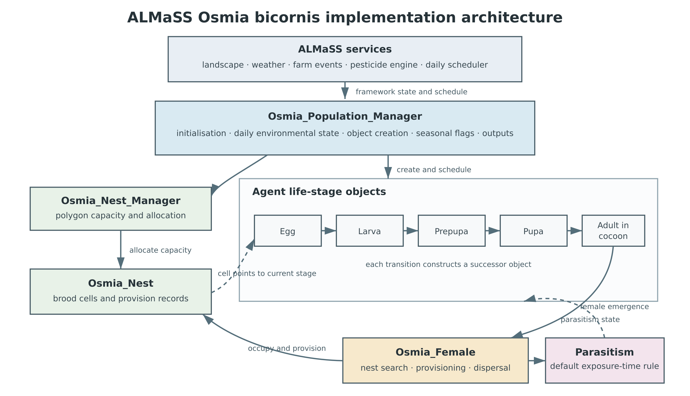

<h1>MIDox implementation of the ALMaSS <i>Osmia bicornis</i> model</h1>

Topping, C. J.*,1, Ziółkowska, E.1,2 & Duan, X.1

1. Social-Ecological Systems Simulation Centre, Department of Agroecology, Aarhus University, Denmark  
2. Institute of Environmental Sciences, Jagiellonian University in Kraków, Poland  

*Corresponding author: Christopher John Topping*

> **Author check before submission:** confirm names, order, affiliations and corresponding-author details.

## Abstract

A formal model describes the intended processes in a simulation, but it cannot by itself establish what the executable code does. We document the post-calibration C++ implementation of an agent-based population model of the red mason bee, *Osmia bicornis*, within ALMaSS (Animal, Landscape and Man Simulation System). The implementation represents development from egg to adult, temperature-dependent phenology, nest-site availability, resource-limited cell provisioning, maternal sex allocation, dispersal, mortality, parasitism and optional pesticide exposure. Life stages are represented by an inheritance chain coordinated by a population manager and linked to persistent nest objects in a dynamic agricultural landscape. The model operates on daily time steps, although hourly weather determines the time available for flight and foraging. Source annotation and Doxygen expose the classes, methods and configuration declarations supporting each process. Comparison with the Formal Model identifies changes in developmental parameterisation, emergence, foraging search, nest-density scaling and several optional or inactive mechanisms. The current source declares 100 unique configuration keys: 72 affect active behaviour, 20 are conditional, and eight have no effect on current behaviour. Fifteen declaration defaults differ from the Formal Model. The account separates implementation from calibration and empirical evaluation: calibration material is used only to identify the provenance of fitted defaults. The annotated source, generated HTML and source-verified parameter appendix provide an auditable version boundary for subsequent testing and use of the model.

**Keywords:** agent-based model; *Osmia bicornis*; solitary bee; pollinator; ALMaSS; implementation documentation; Doxygen; reproducible modelling

## 1. Introduction

Mechanistic ecological models are most useful when their assumptions can be followed from the biological description into the executable program. In practice, that connection is often incomplete. A formal account may define the intended entities and processes, while later corrections, calibration and software development alter the implementation. Conversely, source code may contain inactive alternatives, technical controls and framework dependencies that cannot be understood from equations alone. Reproducibility therefore depends not only on making code available, but on documenting which code implements each biological claim and which version of that code was examined.

The red mason bee, *Osmia bicornis* (Linnaeus, 1758), is a univoltine solitary bee found widely in temperate Europe. Its reproduction depends on the coincidence of suitable nesting cavities, floral resources and weather permitting flight. These processes occur at different spatial and temporal scales and respond to agricultural land use and management. The *O. bicornis* model was developed in ALMaSS so that individual development and behaviour could be coupled to spatially explicit landscape structure, weather, vegetation, farm operations and pesticide exposure (Topping et al. 2003; Topping 2022).

Ziółkowska et al. (2023) presented the Formal Model, defining the intended entities, state variables and processes independently of a programming language. The present MIDox account addresses the next question: how are those processes represented in the current C++ implementation? It is not a second account of model calibration. Values obtained during calibration are relevant here because some became declaration defaults, but the calibration objectives, fitting procedure and evaluation belong to the companion calibration work. This distinction matters because an implementation document should remain true even when the model is applied to a different landscape or is re-evaluated against new observations.

MIDox combines three connected outputs. The source contains Doxygen-compatible comments explaining biological meaning, control flow, units, assumptions and known limitations. Doxygen converts those comments into a searchable HTML reference linked to class, method and source definitions. The present paper supplies the model-level account needed to understand how those parts work together. A source-verified appendix completes the record by listing every configuration declaration, its current default, its Formal Model comparator where available, provenance and implementation status.

The source code is treated as the authority for implemented behaviour. This does not imply that every coded behaviour is biologically justified or fully tested. Rather, it keeps description and evidence separate: the paper states what the reviewed source does, identifies where it differs from the Formal Model, and marks optional or ineffective paths. Calibration and population-level evaluation can then test a defined implementation rather than an inferred one.

## 2. Model overview

### 2.1 Purpose and scope

The model represents the life cycle and reproduction of *O. bicornis* in dynamic agricultural landscapes. It is intended for questions in which nesting habitat, floral resources, weather or agricultural management influence individual survival and reproduction and thereby population dynamics. The implemented life cycle comprises egg, larva, prepupa, pupa, adult in cocoon and free-living adult female. Males are represented among brood but are removed at emergence because they do not provision nests. Mating behaviour and free-living male dynamics are consequently outside the model boundary.

The implementation includes temperature-dependent development, seasonal emergence, stage-specific mortality, nest-site allocation, pollen-limited cell provisioning, maternal effects on offspring sex and mass, dispersal after unsuccessful nest search, parasitism and optional pesticide responses. It does not resolve flower-species preference or mating behaviour. The active foraging path obtains pollen information from the ALMaSS landscape, but does not subtract the collected amount from that resource. A mechanistic parasitoid subsystem is present but disabled by default and is not operationally reliable in its present form.

The *Osmia* code is an ALMaSS component rather than a stand-alone simulation. The framework supplies the landscape, weather, vegetation, farm events, pesticide engine, object management and daily scheduler. Running the model therefore requires the corresponding complete ALMaSS system and inputs. The MIDox repository documents the species component and the precise source snapshot reviewed here.

### 2.2 Architecture

The implementation has three interacting levels (Figure 1). Generic ALMaSS services provide environmental state and the scheduling contract. [`Osmia_Population_Manager`]({{GITHUB_PAGES_URL}}/classOsmia__Population__Manager.html) connects those services to the species model by reading configuration, initialising the population and nests, caching daily environmental quantities, creating agents and recording outputs. Individual bees are represented by life-stage objects, while [`Osmia_Nest_Manager`]({{GITHUB_PAGES_URL}}/classOsmia__Nest__Manager.html) and [`Osmia_Nest`]({{GITHUB_PAGES_URL}}/classOsmia__Nest.html) represent nesting capacity and brood cells.

**Figure 1.** Principal implemented components and the links through which daily scheduling, stage replacement, nest occupancy and parasitism operate. Solid arrows show control, construction or stage succession; the dashed link shows that a brood cell points to its current life-stage object.

[`Osmia_Base`]({{GITHUB_PAGES_URL}}/classOsmia__Base.html) stores the attributes shared by all stages, including position, age, mass, parasitism state, state-machine value and links to the population manager and nest. The developmental classes form an inheritance chain:

`Osmia_Egg -> Osmia_Larva -> Osmia_Prepupa -> Osmia_Pupa -> Osmia_InCocoon -> Osmia_Female`.

This differs from a hierarchy in which all stages are siblings beneath a common base. Ontogenetic inheritance allows a later stage to reuse and override behaviour introduced earlier, but it also means that later classes retain members that are no longer relevant. The meaning of an inherited accumulator can also change: `m_AgeDegrees` stores thermal accumulation in the egg, larval and pupal stages, normalised development in the prepupa, and overwintering degree-days in the adult-in-cocoon stage.

A life-stage transition constructs a successor object rather than changing the C++ type of the current object. Transferable state is copied into [`struct_Osmia`]({{GITHUB_PAGES_URL}}/classstruct__Osmia.html); [`CreateObjects()`]({{GITHUB_PAGES_URL}}/classOsmia__Population__Manager.html#abe8b9a5c8350eed9a78dd0ac6545baaa) then constructs the next stage, redirects the brood-cell pointer and removes the predecessor. The transfer structure therefore defines which attributes persist through ontogeny. Parameters are held largely as static class members, so all individuals in a simulation share one parameterisation.

### 2.3 Nests and spatial organisation

The landscape is polygon based, while individual locations use ALMaSS coordinates in metres. Potential nest capacity is read by habitat type and maintained for each landscape polygon. The implementation multiplies the input densities by 0.001 before converting them into available capacity. This factor is retained operational behaviour and must be included when interpreting the density file, regardless of its original status in source comments.

An individual nest stores its brood cells and their provisioning records. A female occupies one nest at a time and provisions cells sequentially. The nest can persist after the mother dies because each cell points to its developing bee; this pointer is replaced at each stage transition. Capacity is released when the nest is resolved. A 1 km female-density grid is allocated and cleared daily, but the current source does not populate it and it has no effect on behaviour.

Foraging queries use landscape resource data in square search windows. Earlier unused radial forage-mask classes and their three configuration declarations have been removed from the documented implementation. Dispersal uses continuous distance together with one of eight discrete directions, after which ALMaSS corrects coordinates at the landscape boundary.

### 2.4 Temporal organisation

The framework advances the population in daily steps. Hourly weather is nevertheless used to calculate the number of flyable hours available to a female during that day. Development, mortality, provisioning, nest search and seasonal flags are evaluated within this daily schedule. The model can span multiple years, with the in-cocoon stage carrying individuals between reproductive seasons.

Initialisation normally creates adults in cocoons so that the first simulated season begins with spring emergence. This establishes a usable starting state but not an equilibrated population. Analyses of persistence or interannual dynamics therefore require an explicitly justified initialisation and run length.

## 3. Scheduling and control flow

### 3.1 Daily sequence

The order of daily operations is part of the model because environmental values and seasonal flags are not updated at the same point. The current schedule is as follows.

1. [`DoFirst()`]({{GITHUB_PAGES_URL}}/classOsmia__Population__Manager.html#a5241f1f4cde42e5dd8e9df0db920d78e) reads current environmental conditions, calculates flyable hours, refreshes nest availability, clears the female-density grid and calculates the temperature-dependent prepupal development rate.
2. [`DoBefore()`]({{GITHUB_PAGES_URL}}/classOsmia__Population__Manager.html#afa7a76c6300f0a0411e9c6d150fb9e7e) performs pre-step housekeeping and any enabled diagnostic output.
3. The ALMaSS population framework calls `BeginStep()` for each live individual and repeatedly evaluates its `Step()` state machine until the individual reports that its daily action is complete.
4. [`DoAfter()`]({{GITHUB_PAGES_URL}}/classOsmia__Population__Manager.html#a71d80f61b23b3326bcd7702337ad1ba5) has no *Osmia*-specific behaviour in the reviewed implementation.
5. [`DoLast()`]({{GITHUB_PAGES_URL}}/classOsmia__Population__Manager.html#ac26723b9c2f8c9d31d62ef9e6f184185) updates pre-wintering and overwintering flags and writes optional population-dynamics output.

Daily weather and nest availability are therefore established before individuals act, whereas seasonal changes made in `DoLast()` are seen by individuals on the following daily step. The population can be stepped in parallel. Recruitment and mortality counts use thread-specific storage, and nest allocation has separate protection because several females may search the same polygon.

### 3.2 Individual state machines

The immature stages and adult in cocoon follow a common pattern: initialise, develop, transition or die. A `Step()` call can pass through more than one internal state, but stops once the daily-completion flag is set. The principal stage sequence is:

`Egg -> Larva -> Prepupa -> Pupa -> Adult in cocoon -> Adult female`.

The female state machine adds pre-nesting, nest search, reproductive behaviour and dispersal. Failure to obtain a nest moves the female to [`st_Dispersal()`]({{GITHUB_PAGES_URL}}/classOsmia__Female.html#af460f3c67d5a1d5f7ed834f4f9813326). One dispersal movement is then made in a direction drawn uniformly as an integer from 0 to 7. Dispersal increments the adult age counter and consequently consumes part of the lifespan represented by that counter.

State-machine timing requires care in interpreting `OSMIA_LIFESPAN`. The female age counter advances in the development state and during dispersal, but not on every calendar day spent provisioning. It is therefore an upper bound on an internal adult-age counter, not necessarily a 60-day calendar lifespan at the default value.

## 4. Implementation details

### 4.1 Development and emergence

Egg, larval and pupal development use accumulated thermal units. For a stage $s$, the daily increment is

\[
\Delta D_s(t)=\max\{0,T(t)-T_{0,s}\},
\]

where $T(t)$ is the daily temperature and $T_{0,s}$ is the stage-specific threshold. The stage changes when accumulated development exceeds its configured total $D_s^*$. The current defaults are 104.435 degree-days above 0.518 °C for eggs, 305.235 degree-days above 8.834 °C for larvae and 555.907 degree-days above 2.463 °C for pupae. Each pair must be interpreted together because calibration changed both the threshold and total.

Prepupal development is represented differently. The population manager evaluates the quadratic

\[
q(T)=aT^2+bT+c
\]

and normalises it by its value at the configured optimum $T_{opt}$. The daily increment is

\[
r_{pre}(T)=\frac{\max(0,q(T))}{q(T_{opt})}.
\]

This increment accumulates towards an individual target drawn uniformly within ±10% of the configured mean duration, 21.27 days. The default coefficients are $a=0.0149431912$, $b=-0.6679153638$, $c=8.4616334666$, and $T_{opt}=22$ °C. Initialisation checks that the normalising value is valid. This formulation replaced an earlier implementation in which a post-increment added one day in addition to the calculated rate; removing that increment restored the declared duration to its intended meaning.

[`Osmia_InCocoon`]({{GITHUB_PAGES_URL}}/classOsmia__InCocoon.html) separates pre-wintering, overwintering and spring pre-emergence. Degree-days accumulate above the relevant thresholds. Once spring conditions are reached, an emergence counter is constructed from accumulated overwintering warmth:

\[
C=\left\lfloor 13.3685-0.01613D_{winter}\right\rfloor+E+A,
\]

where $E$ is drawn from the configured discrete emergence distribution and $A$ is a random nest-aspect delay from 0 to 35 days. The counter declines when temperature reaches the 10.085 °C emergence threshold. At emergence, males are removed; females become free-living agents. The terms in this expression document the code rather than a new calibration analysis.

Stage-specific background mortality is tested during immature development. Overwinter mortality is tested once, using a linear expression in accumulated pre-winter degree-days. Its coefficients operate on a percentage scale because the result is compared with a uniform integer draw from 0 to 99. Treating them as probabilities from zero to one would therefore remove nearly all intended mortality.

### 4.2 Reproduction, sex allocation and provisioning

[`Osmia_Female`]({{GITHUB_PAGES_URL}}/classOsmia__Female.html) represents the free-living reproductive agent. During initialisation the population manager builds age- and mass-dependent lookup tables for foraging efficiency, sex allocation and the target provision of the first female cell. The tables cover the configured lifespan, with a defensive minimum extent of 60 days, and mass-class indexing is bounded to the supported range.

In [`st_ReproductiveBehaviour()`]({{GITHUB_PAGES_URL}}/classOsmia__Female.html#a29362a24ac3fdb3e0b23d0e50e78e607), a female first obtains or creates a nest and constructs a plan for its cells. `PlanEggsPerNest()` makes an independent calibrated draw for each nest, including the calibrated two-egg shift with probability 0.45. The draw is then reduced by two eggs for every preceding nest, subject to the configured minimum. Maternal mass shifts the upper level of the age-related female proportion, after which a logistic curve describes change with maternal age. With the current negative logistic slope, the age response depends on mass: for sufficiently large mothers, the planned female proportion declines with age, whereas for the smallest mass classes it can rise slightly towards the lower asymptote. The implementation then rounds the product of planned eggs and the female proportion to obtain the number of planned female cells.

The target provision for the first female cell also depends on maternal mass and age. Successive female targets decline by a total amount with individual variation. Male targets start at a derived minimum equal to 95% of the minimum female target. The separately declared `OSMIA_MALEMINTARGETPROVISIONMASS` is not read. If no female eggs are planned, the code avoids dividing the decline by zero and assigns the minimum male target throughout the nest.

Provisioning is limited by flyable hours and pollen returned by the active foraging routine. Accumulated provision is compared with the first planned target and with a hard-coded minimum carry-over of 4.3 days. If the configured maximum construction time is reached, a cell can still be completed when at least the derived male minimum has been collected. A cell planned as female is converted to male when final provision does not exceed the minimum female target. Provision mass is then mapped to offspring mass, subject to sex-specific bounds, and the egg is placed in the current nest cell. Time for which the cell remained open also determines the default parasitism risk.

This sequence links conditions experienced by the mother to the next generation: weather and landscape resources affect provisioning, provisioning affects offspring mass and possibly sex, and female mass later influences her own planned fecundity and allocation. These are implemented causal links; their population-level strength is a matter for separate sensitivity analysis and evaluation.

### 4.3 Nest search, foraging and dispersal

Nest search operates at polygon level through `Osmia_Nest_Manager`. A female makes the configured number of local attempts. If none finds capacity, she disperses. The distance is sampled from the configured distribution and scaled by the upper homing-distance value, while the direction is selected randomly from eight possibilities. Boundary correction is delegated to ALMaSS. Because dispersal advances the age counter, repeated failure to find a nest has a direct reproductive cost.

Foraging is centred on the nest rather than the female's transient position. [`Forage()`]({{GITHUB_PAGES_URL}}/classOsmia__Female.html#a1ee30431d966ead03629bbca153e297c) searches a sequence of square landscape windows and requests the most favourable pollen location. The pollen score is converted to mass using `OSMIA_POLLENSCORETOMG`, capped by `OSMIA_MAXPOLLEN`, and multiplied by age-dependent efficiency and available foraging time. The current routine can retain a usable patch and applies relative and absolute give-up criteria when resource availability falls.

Several declared mechanisms do not form part of this active path. Monthly pollen and nectar threshold arrays are loaded but never consulted. Travel cost is not included when patches are ranked. Although a separate helper can remove pollen, the active reproductive path requests pollen without depleting the landscape resource. The declared density-dependent pollen-removal constant is also not applied. These distinctions are important because configuration keys can otherwise give the appearance of processes that do not influence a run.

### 4.4 Mortality, parasitism and pesticides

Egg, larval, prepupal and pupal agents apply their configured background mortality during development. Adult females are limited by the internal lifespan counter and can also respond to farm events and the optional pesticide engine. Background adult mortality is evaluated in `st_Develop`, so it is state dependent rather than a daily test on every calendar day.

The default parasitism calculation occurs when a brood cell is closed. [`CalcParaistised()`]({{GITHUB_PAGES_URL}}/classOsmia__Female.html#ac752338ee7cb18fd37a15a36c09e901b) multiplies the time that the cell remained open by a configured hourly probability and selects one of two parasitoid outcomes. The probability is not explicitly bounded at one, so at the default rate a cell open for more than about 5.5 days is effectively certain to be parasitised.

An alternative mechanistic subsystem represents parasitoids as continuous densities on a coarse grid. It extends beyond the Formal Model and is selected by `OSMIA_USEMECHANISTICPARASITOIDS`, which is false by default. The path has unresolved problems in initialisation, month indexing, parasitoid-type handling and number conservation during dispersal. It should not be enabled without correction and independent testing. Its associated configuration values are classified as conditional in Appendix A rather than as part of the supported default behaviour.

[`OnFarmEvent()`]({{GITHUB_PAGES_URL}}/classOsmia__Female.html#af5873f4dd8c2eae5739a67693d7792a2) separates a generic response to insecticide or biocide events from detailed pesticide fate and effects. A `product_treat` event invokes overspray only when the ALMaSS pesticide engine is enabled. Other pesticide responses depend on configuration switches, thresholds, absorption settings and compile-time output options. The pesticide block is therefore conditional, not wholly inactive. Conversely, the declared pesticide kill- and recovery-rate variables are not read by the *Osmia* module and have no effect.

## 5. Configuration, inputs and outputs

### 5.1 Configuration and parameter authority

The reviewed source declares 100 unique configuration keys. For this MIDox release, the compiled declaration defaults define the documented post-calibration baseline. A configuration file may override them for a particular experiment, but a separate historical calibrated configuration file is neither required nor treated as the authority for this implementation.

Appendix A reconciles every declaration against the source and the Formal Model. Fifteen defaults differ from the Formal Model and 85 are unchanged. This comparison is independent of provenance: 18 values are identified as calibrated because three fitted values were already present in the Formal Model and therefore do not appear among the 15 differences. The status audit classifies 72 settings as active, 20 as conditional and eight as having no effect on current behaviour. Ninety-five lack a defensible numerical range; the appendix leaves those ranges blank rather than deriving them from a calibration search interval or inventing a plausible bound.

The no-effect category includes variables that are declared but not read, as well as stored controls bypassed by the active algorithm. It is not equivalent to a default switch being off. Conditional settings can affect behaviour when a higher-level engine, response formulation or unsupported mechanistic path is selected.

### 5.2 Inputs

Most environmental information reaches *Osmia* through ALMaSS rather than through files read by the species classes. The component requires spatial landscape and habitat classification, weather, flowering-resource information, farm-management events and an initial population. `Osmia_Nest_Manager` additionally reads the habitat-specific nest-density file selected by `OSMIA_NESTBYLEDATAFILE`, whose declaration default is `OsmiaNestsByHabitat.txt`.

The complete landscape and weather formats belong to the ALMaSS framework. This MIDox record documents the data requested by the species component and how it is used; it does not redefine the upstream ALMaSS input specification. In particular, the source snapshot is insufficient for a stand-alone simulation because the full framework, landscape data and run configuration are external dependencies.

### 5.3 Outputs

Standard population output is supplied by the ALMaSS population framework. The *Osmia* component can additionally write a daily population-dynamics file containing recruitment and mortality counts by life stage. Its declaration default is `OsmiaPopulationDynamics.txt`, and output is disabled unless `OSMIA_STORE_POPULATION_DYNAMICS` is enabled.

Other files support testing, calibration or pesticide tracing, including stage durations, female weights, egg distributions and pesticide contact or intake. Their production depends on run-time switches or compile-time definitions. They are consequently diagnostic paths rather than a guaranteed public output interface. Any analysis should identify the source build, relevant switches and exact output schema used.

## 6. Discussion

### 6.1 What MIDox adds

The Formal Model and the implementation answer different questions. The former makes the biological design explicit; the latter determines the behaviour that can actually occur in a run. Linking the paper to generated class, method and source pages makes discrepancies inspectable rather than leaving them as undocumented development history. This is particularly useful in a framework model, where species behaviour depends on shared scheduling, landscape and pesticide services that are not visible in a species-level equation set.

The exercise also shows why a configuration inventory cannot be produced safely from parameter files alone. Some values are derived at initialisation, some defaults differ from earlier configuration files, and some declarations are never read. The 100-row appendix therefore begins with source declarations and then adds provenance and Formal Model comparison. This approach also prevents calibration search ranges from being mistaken for biologically defensible parameter ranges.

### 6.2 Differences from the Formal Model

The post-calibration source is not identical to the Formal Model. Fifteen declaration defaults differ, principally in developmental thresholds and totals, emergence parameters, maternal allocation and planned nest number. Prepupal development uses a normalised non-linear temperature response and includes individual variation around its declared duration. Adult foraging uses square-window searches; the unused radial-mask implementation has been removed. Nest densities receive the operational factor of 0.001. Dispersal selects one of eight random directions. Defensive bounds have been added around lookup-table dimensions and mass classes.

Some differences concern absence rather than replacement. Monthly pollen and nectar thresholds do not affect the active search, the female-density grid is not populated, and the active provisioning path does not deplete pollen. The mechanistic parasitoid classes are additional to the Formal Model but are not a supported alternative in their current condition. These are implementation boundaries, not calibration findings, and they should be considered when formulating scenarios or interpreting density dependence.

### 6.3 Biological and technical limitations

The model simplifies male biology, mating and flower choice. Adult age does not advance uniformly through all behavioural states, which complicates the interpretation of lifespan and background mortality. The default parasitism rule can exceed a nominal probability of one before its comparison with a random draw. Pesticide effects depend on ALMaSS services and a mixture of run-time and compile-time controls. The current component repository is documentation source rather than a stand-alone executable distribution.

Several retained variables and classes could mislead future developers because their names imply active behaviour. The most direct remedies are either to connect them to tested processes or remove them after compatibility has been considered. The mechanistic parasitoid subsystem requires a more substantial decision: it should be repaired and validated as a distinct model extension or excluded from production builds. These changes should be made in a later development cycle, not silently folded into the documented release.

MIDox verifies correspondence between documentation and reviewed source; it does not verify ecological adequacy. Full-population compilation in the complete framework has been confirmed for the annotated source supplied to the Doxygen stage, but systematic sensitivity analysis, empirical evaluation and application-specific validation remain separate tasks. Claims about population persistence, phenology or landscape response must therefore be supported by those studies rather than inferred from the presence of code.

### 6.4 Reproducibility and maintenance

The documentation has a defined version boundary. The reviewed source package records upstream archive revision `ae3857cc39dc4003742de9e4c9efe6ac70771b25`. Source-level Doxygen references were checked before generation, and the amended returned HTML was accepted only after checking 104 pages and 16,538 local references with no broken file or anchor references and no non-empty warning lines. The repository release should preserve the annotated source, Doxygen configuration, build and verification scripts, generated site, parameter appendix and manuscript together.

Future code changes should trigger the same checks. A changed declaration should update Appendix A; a changed method should be checked against its class documentation and corresponding narrative claim; and regenerated HTML should pass the link checker before release. Calibration or evaluation may justify later parameter changes, but those changes should enter a new documented version rather than altering the archived MIDox retrospectively.

## Data and code availability

The annotated source, Doxygen configuration, generated HTML documentation, verification scripts, manuscript source and supplementary parameter appendix will be released at **{{GITHUB_REPOSITORY_URL}}**. The browsable documentation will be available at **{{GITHUB_PAGES_URL}}**. The archived release will be cited using the version DOI **{{ZENODO_VERSION_DOI}}** and linked to the source tag **{{RELEASE_TAG}}**. These identifiers must be inserted after the Step 4 repository and Zenodo workflow is complete.

The *Osmia* component depends on the full ALMaSS framework and environmental input data; the documentation repository is not by itself a runnable ALMaSS distribution.

## Author contributions

> **To be completed and approved by all authors before submission.**

## Funding

> **To be completed before submission.**

## Acknowledgements

> **To be completed before submission.**

## Competing interests

> **To be completed before submission.**

## References

Topping, C. J. (2022). The Animal, Landscape and Man Simulation System (ALMaSS): a history, design, and philosophy. *Research Ideas and Outcomes*, 8, e89919. https://doi.org/10.3897/rio.8.e89919

Topping, C. J., Hansen, T. S., Jensen, T. S., Jepsen, J. U., Nikolajsen, F. & Odderskær, P. (2003). ALMaSS, an agent-based model for animals in temperate European landscapes. *Ecological Modelling*, 167, 65–82. https://doi.org/10.1016/S0304-3800(03)00173-X

Ziółkowska, E., Bednarska, A. J., Laskowski, R. & Topping, C. J. (2023). The Formal Model for the solitary bee *Osmia bicornis* L. agent-based model. *Food and Ecological Systems Modelling Journal*, 4, e102102. https://doi.org/10.3897/fmj.4.102102
